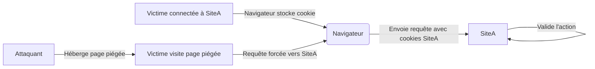

## Schéma d'attaque CSRF

Le flux d'exploitation repose sur l'abus de la confiance du navigateur envers les cookies de session lors de requêtes cross-site.



## Définition
Le **CSRF** (Cross-Site Request Forgery) est une vulnérabilité permettant à un attaquant d'exécuter des actions non désirées sur une application web au nom d'un utilisateur authentifié. L'attaque exploite la gestion automatique des cookies par le navigateur.

## Conditions de vulnérabilité
La présence de la faille dépend de la configuration de l'application cible :

| Condition | Description |
| :--- | :--- |
| Session via cookie | L'application utilise des cookies pour maintenir l'état de session |
| Absence de jeton CSRF | Aucune validation de jeton unique par requête (anti-CSRF token) |
| Requête prévisible | Les paramètres de la requête sont déterministes |
| Cookie SameSite permissif | Le cookie de session n'est pas configuré avec `SameSite=Strict` ou `Lax` |

> [!danger] L'absence de jeton CSRF est la condition sine qua non
> Si l'application implémente des jetons synchronisés (Synchronizer Token Pattern), l'attaque est généralement bloquée.

> [!warning] La présence de SameSite=Strict rend l'attaque inefficace
> L'attribut `SameSite=Strict` empêche le navigateur d'envoyer le cookie lors de requêtes provenant d'un domaine tiers.

## Vecteurs d'attaque
L'attaque nécessite l'hébergement d'un payload sur un serveur externe contrôlé par l'attaquant.

> [!tip] L'hébergement du payload sur un serveur externe est nécessaire pour le test
> L'utilisation d'un serveur web local ou d'un service type **ngrok** est indispensable pour simuler le contexte cross-site.

### Formulaire HTML automatique
```html
<form action="http://target.com/profile" method="POST">
  <input type="hidden" name="email" value="evil@evil.com">
</form>
<script>document.forms[0].submit();</script>
```

### JavaScript furtif
```javascript
fetch("http://target.com/profile", {
  method: "POST",
  credentials: "include",
  headers: { "Content-Type": "application/x-www-form-urlencoded" },
  body: "email=evil@evil.com"
});
```

> [!tip] Le chaînage avec XSS permet de contourner les protections CSRF
> Si une vulnérabilité **XSS** est présente, il est possible de lire le jeton CSRF dans le DOM et de l'inclure dans la requête forgée.

## Utilisation de Burp Suite CSRF PoC Generator
L'outil intégré à **Burp Suite** permet d'automatiser la création de la page d'attaque.
1. Capturer la requête cible dans le **Proxy**.
2. Faire un clic droit sur la requête > **Engagement tools** > **Generate CSRF PoC**.
3. Dans l'interface, configurer les options :
   - **Include auto-submit script** : Active l'exécution automatique.
   - **Use CORS** : Utile si le domaine cible autorise les requêtes cross-origin.
4. Cliquer sur **Copy HTML** et sauvegarder dans un fichier `.html` sur un serveur distant.

## Analyse des headers Origin/Referer
Le serveur peut tenter de valider l'origine via les headers HTTP.
* **Origin** : Envoyé par le navigateur pour les requêtes POST/PUT/DELETE.
* **Referer** : Contient l'URL complète de la page source.
* **Test de contournement** :
    * Supprimer le header (certains serveurs ignorent la validation si le header est absent).
    * Falsifier le header (si le serveur vérifie uniquement si la chaîne contient le domaine cible, ex: `target.com.evil.com`).
    * Utiliser des techniques de **Referer-Policy** (ex: `no-referrer`) pour masquer l'origine.

## Contournement des protections (Bypass CSRF tokens)
* **Token manquant** : Supprimer le paramètre du jeton dans la requête pour voir si le serveur accepte la requête sans validation.
* **Token prévisible** : Si le jeton est basé sur un timestamp ou un hash faible, tenter de le prédire.
* **Token lié à une autre session** : Vérifier si le serveur accepte un jeton valide appartenant à une session différente (souvent le cas si le jeton est lié à l'utilisateur mais pas à la session spécifique).
* **Token dans le cookie** : Si le jeton est présent à la fois dans le cookie et dans le corps de la requête, tenter de définir le cookie via une injection (ex: CRLF injection ou sous-domaine contrôlé).

## Impact sur les applications modernes (SameSite cookies)
Les navigateurs modernes appliquent par défaut `SameSite=Lax`.
* **Lax** : Autorise les cookies sur les requêtes GET sécurisées (liens), mais bloque les POST.
* **Strict** : Bloque les cookies sur toutes les requêtes cross-site.
* **Bypass** : Si l'application utilise des endpoints GET pour effectuer des actions (mauvaise pratique), le CSRF reste possible même avec `SameSite=Lax`.

## Payloads
```html
<!-- Formulaire auto-soumis -->
<form action="http://target.com/profile" method="POST">
  <input type="hidden" name="username" value="test">
  <input type="hidden" name="status" value="on">
</form>
<script>document.forms[0].submit();</script>
```

## Conseils offensifs
* Cibler les fonctions critiques : changement de mot de passe, modification d'email, création d'utilisateur.
* Utiliser des services comme **ngrok** ou **Netlify** pour héberger rapidement le payload.
* Vérifier systématiquement la configuration des cookies via les outils de développement (onglet Application > Cookies).
* Documenter la preuve de concept (PoC) en montrant l'impact concret (ex: changement de l'adresse mail de l'admin).

## Liens associés
* **XSS** : Souvent utilisé pour extraire des jetons CSRF.
* **Web** : Fondamentaux des protocoles HTTP et gestion des sessions.
* **Burp Suite** : Outil principal pour l'interception et la génération de PoC.
* **Payloads** : Techniques de manipulation de requêtes.