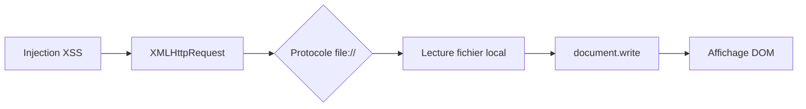

## Flux d'exploitation

Ce diagramme illustre la chaîne d'exécution d'une lecture de fichier local via une injection **XSS**.



## Vulnerability Analysis

La lecture de fichiers locaux via **XSS** repose sur l'utilisation de l'objet **XMLHttpRequest** ou de l'API **Fetch** pour effectuer des requêtes vers le protocole **file://**. Cette technique permet à un attaquant d'accéder au système de fichiers local de la machine cliente si le navigateur autorise l'accès aux ressources locales.

> [!danger] Restrictions de sécurité
> Le protocole **file://** est généralement bloqué par les politiques de sécurité des navigateurs modernes (**CORS**/**Same-Origin Policy**).

> [!warning] Environnement d'exécution
> Nécessite une exécution dans un contexte local ou une configuration permissive du navigateur.

> [!note] Risques techniques
> Risque de plantage du navigateur si le fichier est trop volumineux.

## Environment Constraints

L'exploitation est conditionnée par les facteurs suivants :
* **Configuration du navigateur** : Les navigateurs modernes (Chrome, Firefox) bloquent par défaut les requêtes `file://` depuis des pages web distantes.
* **Contexte d'exécution** : L'attaque est plus efficace dans des environnements de test, des applications Electron mal configurées ou des navigateurs avec des flags de sécurité désactivés (ex: `--allow-file-access-from-files`).
* **Permissions OS** : Le processus du navigateur doit disposer des droits de lecture sur le fichier cible.

## Proof of Concept

Le payload suivant utilise **XMLHttpRequest** pour cibler un fichier spécifique sur le système de fichiers local et injecter son contenu directement dans le **DOM** via **document.write**.

```javascript
<script> 
  x = new XMLHttpRequest; 
  x.onload = function(){ document.write(this.responseText) }; 
  x.open("GET", "file:///etc/passwd"); 
  x.send(); 
</script>
```

## Impact Assessment

L'exploitation réussie permet la lecture arbitraire de fichiers sensibles accessibles par l'utilisateur exécutant le navigateur. Cette vulnérabilité est étroitement liée aux concepts de **Cross-Site Scripting (XSS)**, **Web Application Enumeration** et **File Inclusion Vulnerabilities**.

## Remediation

Pour prévenir ce vecteur d'attaque, les mesures suivantes doivent être appliquées :

*   Implémentation d'une **Content Security Policy (CSP)** stricte interdisant le chargement de ressources via le protocole **file://**.
*   Assainissement des entrées utilisateur pour empêcher l'injection de balises `<script>` ou d'attributs de gestionnaires d'événements.
*   Mise à jour régulière des navigateurs pour bénéficier des dernières protections contre le contournement de la **Same-Origin Policy**.

## Payload

```javascript
<script>
  var x = new XMLHttpRequest();
  x.open("GET", "file:///etc/passwd", false);
  x.send(null);
  document.write(x.responseText);
</script>
```

## Liens associés

* **Cross-Site Scripting (XSS)**
* **Web Application Enumeration**
* **File Inclusion Vulnerabilities**