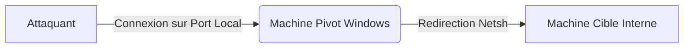

Ce document détaille l'utilisation de **netsh** pour le port forwarding dans le cadre d'opérations de **Pivoting** et de **Lateral Movement**, en complément des techniques de **Windows Post-Exploitation** et de **Network Enumeration**.



> [!danger] Privilèges requis
> Nécessite des privilèges Administrateur pour modifier les règles **netsh** et le pare-feu.

> [!warning] Limitations techniques
> **Netsh** portproxy ne supporte que TCP, pas UDP.

> [!tip] Persistance
> Attention : La création de règles persistantes via **schtasks** peut être détectée par les solutions EDR.

> [!info] Nettoyage
> Penser à supprimer les règles après l'exercice pour éviter de laisser des backdoors actives.

## Gestion des privilèges (nécessite admin)

L'exécution des commandes **netsh** pour la configuration du `portproxy` nécessite un contexte d'exécution élevé. Si vous avez obtenu un shell via une exploitation, vérifiez vos privilèges avant toute manipulation :

```powershell
whoami /priv
```

Si `SeDebugPrivilege` ou `SeLoadDriverPrivilege` sont présents, ou si vous êtes dans le groupe `Administrators`, vous pouvez procéder. Dans le cas contraire, une élévation de privilèges est nécessaire au préalable.

## Ajout de règle

```powershell
netsh interface portproxy add v4tov4 listenport=<PORT_LOCAL> listenaddress=<IP_LOCAL> connectport=<PORT_DISTANT> connectaddress=<IP_CIBLE>
```

Exemple de redirection du trafic entrant sur le port 8080 vers le port 3389 d'une cible interne :

```powershell
netsh interface portproxy add v4tov4 listenport=8080 listenaddress=10.129.15.150 connectport=3389 connectaddress=172.16.5.25
```

## Vérification des règles

```powershell
netsh interface portproxy show v4tov4
```

Sortie attendue :

```text
Listen on ipv4:             Connect to ipv4:
------------------------------------------------
10.129.15.150   8080        172.16.5.25     3389
```

## Suppression de règle

```powershell
netsh interface portproxy delete v4tov4 listenport=<PORT_LOCAL> listenaddress=<IP_LOCAL>
```

## Configuration pare-feu

Par défaut, **netsh** ne crée pas de règle de pare-feu. Il est nécessaire de l'ajouter manuellement :

```powershell
netsh advfirewall firewall add rule name="Port Forwarding" dir=in action=allow protocol=TCP localport=<PORT_LOCAL>
```

## Persistance

Pour maintenir la règle après un redémarrage, il est possible d'utiliser **schtasks** :

```powershell
schtasks /create /tn "Netsh Forwarding" /tr "cmd /c netsh interface portproxy add v4tov4 listenport=8080 listenaddress=10.129.15.150 connectport=3389 connectaddress=172.16.5.25" /sc onstart /ru System
```

## Test de connexion

Exemple de test via **xfreerdp** :

```bash
xfreerdp /v:10.129.15.150:8080 /u:admin /p:password
```

## Dépannage (troubleshooting)

Si la connexion échoue, vérifiez les points suivants :

1. **Service IP Helper** : Le service `iphlpsvc` doit être en cours d'exécution.
   ```powershell
   sc query iphlpsvc
   ```
2. **Conflits de ports** : Vérifiez qu'aucun autre processus n'écoute déjà sur le `listenport`.
   ```powershell
   netstat -ano | findstr :<PORT_LOCAL>
   ```
3. **Pare-feu** : Vérifiez que la règle ajoutée est bien active et non bloquée par une GPO ou une règle prioritaire.
4. **Connectivité** : Assurez-vous que la machine pivot peut atteindre la machine cible sur le `connectport`.

## Nettoyage des traces (logs)

L'utilisation de **netsh** génère des événements dans le journal de sécurité Windows. Pour minimiser les traces après une opération de **Windows Post-Exploitation**, supprimez les règles créées :

```powershell
netsh interface portproxy reset
netsh advfirewall firewall delete rule name="Port Forwarding"
```

Il est également recommandé de supprimer la tâche planifiée si elle a été créée :

```powershell
schtasks /delete /tn "Netsh Forwarding" /f
```

## Récapitulatif des commandes

| Commande | Description |
| :--- | :--- |
| `netsh interface portproxy add v4tov4` | Ajoute une règle de port forwarding |
| `netsh interface portproxy show v4tov4` | Affiche les règles de port forwarding actives |
| `netsh interface portproxy delete v4tov4` | Supprime une règle de port forwarding |
| `netsh advfirewall firewall add rule` | Ajoute une règle de pare-feu Windows |
| `schtasks /create` | Rend une règle persistante après reboot |

## Cas d'usage

**Netsh** permet d'accéder à des services internes (RDP, SSH, SMB) depuis une machine compromise ne disposant pas d'outils tiers comme **Metasploit** ou **socat**.

## Avantages et limitations

*   **Avantages** : Outil natif Windows, faible empreinte, utile en environnement restreint.
*   **Limitations** : Ne persiste pas nativement, pas de serveur SOCKS (contrairement à un tunnel SSH), nécessite des privilèges élevés, laisse des traces dans les logs système.