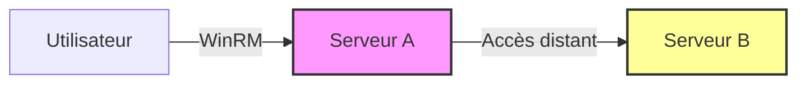

Le problème du **Double Hop Kerberos** survient lors de l'utilisation de **WinRM** : le jeton d'authentification Kerberos n'est pas transmis au-delà du premier saut (Serveur A), empêchant l'accès aux ressources sur le Serveur B.

> [!danger] Risque de détection
> Le redémarrage du service **WinRM** peut alerter les équipes de défense (EDR/SIEM).

> [!warning] Limitations
> La plupart des solutions nécessitent des privilèges d'administrateur local sur la machine source.

> [!tip] Vérification
> Vérifier toujours le cache des tickets avec **klist** avant de tenter une élévation ou un saut.

## Problème du Double Hop Kerberos

Lorsqu'une session **WinRM** est établie, le jeton Kerberos est limité à la machine distante. Toute tentative d'accès à une ressource tierce depuis cette session échouera par défaut.

## Analyse de la configuration de délégation (Constrained vs Unconstrained)

Il est crucial d'identifier le type de délégation configuré sur les comptes machines ou services via les attributs AD (`msDS-AllowedToDelegateTo` pour la délégation contrainte).

```powershell
# Vérifier la délégation non restreinte
Get-ADComputer -Filter 'TrustedForDelegation -eq $true' -Properties TrustedForDelegation

# Vérifier la délégation contrainte
Get-ADComputer -Filter 'msDS-AllowedToDelegateTo -like "*"' -Properties msDS-AllowedToDelegateTo
```

## Solution 1 : PSCredential

Cette méthode consiste à fournir explicitement des identifiants à chaque commande distante.

```powershell
$SecPassword = ConvertTo-SecureString 'MotDePasse123!' -AsPlainText -Force
$Cred = New-Object System.Management.Automation.PSCredential('DOMAIN\User', $SecPassword)

Get-DomainUser -SPN -Credential $Cred | Select samaccountname
```

## Solution 2 : Register-PSSessionConfiguration

Cette méthode permet de créer une configuration de session persistante utilisant des identifiants spécifiques.

### Enregistrement de la session
```powershell
Register-PSSessionConfiguration -Name MaSession -RunAsCredential "DOMAIN\User"
```

### Redémarrage du service
```powershell
Restart-Service WinRM
```

### Connexion
```powershell
Enter-PSSession -ComputerName ServeurA -Credential "DOMAIN\User" -ConfigurationName MaSession
```

## Solution 3 : CredSSP

**CredSSP** permet de déléguer les identifiants de l'utilisateur vers la machine distante.

> [!danger] Exposition des identifiants
> L'activation de **CredSSP** expose les identifiants en clair sur le réseau si la connexion n'est pas chiffrée.

### Configuration côté client
```powershell
Enable-WSManCredSSP -Role Client -DelegateComputer "*.domaine.local"
```

### Configuration côté serveur
```powershell
Enable-WSManCredSSP -Role Server
```

### Lancement de la session
```powershell
$SecPassword = ConvertTo-SecureString 'MotDePasse123!' -AsPlainText -Force
$Cred = New-Object System.Management.Automation.PSCredential('DOMAIN\User', $SecPassword)

Enter-PSSession -ComputerName ServeurA -Credential $Cred -Authentication CredSSP
```

## Solution 4 : Délégation Kerberos

Si le serveur est configuré avec une délégation non restreinte, il est possible de réutiliser le ticket transmis.

```powershell
Get-ADComputer -Filter {TrustedForDelegation -eq $true}
```

## Utilisation de Rubeus pour l'injection de tickets (Pass-the-Ticket)

Le **Pass-the-Ticket** permet d'injecter un ticket TGT ou TGS en mémoire pour s'authentifier sans mot de passe. Voir la note **Pass-the-Ticket**.

```bash
# Lister les tickets disponibles
.\Rubeus.exe triage

# Injecter un ticket .kirbi dans la session courante
.\Rubeus.exe ptt /ticket:ticket.kirbi
```

## Utilisation de Mimikatz pour l'export/import de tickets

**Mimikatz** est l'outil standard pour manipuler les tickets Kerberos en mémoire.

```bash
# Exporter les tickets de la session courante
mimikatz # sekurlsa::tickets /export

# Importer un ticket spécifique
mimikatz # kerberos::ptt C:\temp\ticket.kirbi
```

## Risques liés à la délégation Kerberos (Abus de comptes de service)

La délégation Kerberos est une cible majeure pour le mouvement latéral. Un compte de service configuré avec une délégation non restreinte peut être compromis pour usurper l'identité de tout utilisateur s'y connectant. Voir **Kerberos Delegation**.

## Solution 5 : RDP ou PSExec

Ces méthodes contournent les limitations de **WinRM** en utilisant des protocoles gérant différemment le stockage des identifiants en mémoire.

### RDP
```powershell
mstsc /v:ServeurA
```

### PSExec
```powershell
psexec \\ServeurA cmd.exe
```

## Vérification des tickets Kerberos

La commande **klist** permet d'inspecter le cache des tickets Kerberos sur la machine distante.

```powershell
klist
```

## Récapitulatif des solutions

| Solution | Facilité | Sécurité | Cas d'usage |
| :--- | :--- | :--- | :--- |
| **PSCredential** | Élevée | Élevée | Commande isolée |
| **Register-PSSessionConfiguration** | Moyenne | Risquée | Accès admin requis |
| **CredSSP** | Moyenne | Risquée | Sauts multiples via WinRM |
| **Délégation Kerberos** | Faible | Risquée | Délégation non restreinte |
| **RDP / PSExec** | Élevée | Élevée | Accès admin requis |

## Automatisation

Injection de session automatisée pour éviter la saisie répétitive :

```powershell
$SecPassword = ConvertTo-SecureString "MonMotDePasse123!" -AsPlainText -Force
$Cred = New-Object System.Management.Automation.PSCredential ("DOMAIN\User", $SecPassword)

Enter-PSSession -ComputerName ServeurA -Credential $Cred
```

Voir également : **Kerberos Delegation**, **WinRM Enumeration**, **Pass-the-Ticket**, **Active Directory Lateral Movement**
```