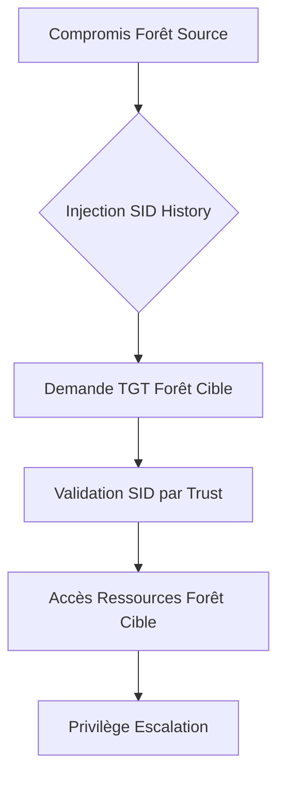

## Contexte et Théorie

Une relation d'approbation (Trust) entre deux forêts Active Directory permet aux utilisateurs d'une forêt (Forest A) d'accéder aux ressources d'une autre forêt (Forest B). Dans un environnement multi-forêts, le **SID Filtering** et le **SID History** sont les vecteurs d'attaque principaux.

L'objectif est d'obtenir des privilèges dans la forêt cible (Target Forest) en exploitant une confiance bidirectionnelle ou unidirectionnelle. Si le SID Filtering n'est pas activé, un attaquant peut injecter des SIDs de groupes à hauts privilèges (ex: Enterprise Admins) dans le champ `SIDHistory` d'un compte compromis dans la forêt source, permettant une élévation de privilèges lors de l'authentification dans la forêt cible.

> [!info]
> Le SID History est un attribut utilisé pour la migration d'utilisateurs entre domaines. Il permet à un objet de conserver ses accès après un changement de domaine. Si une forêt fait confiance à une autre sans filtrage, elle honorera les SIDs présents dans cet attribut.

## Flux d'attaque



## Prérequis

- Accès initial sur un contrôleur de domaine (DC) ou un compte avec privilèges `WriteProperty` sur l'attribut `sIDHistory` d'un objet utilisateur dans la forêt source.
- Relation d'approbation (Trust) active entre les deux forêts.
- SID Filtering désactivé ou mal configuré sur la relation de confiance.

> [!danger]
> L'injection de SID History nécessite des privilèges élevés (Domain Admin ou `WriteProperty` sur l'attribut `sIDHistory`). Sans ces droits, l'attaque est impossible.

## Méthodologie d'attaque (Linux)

### Étape 1 : Énumération des Trusts
Utiliser `bloodhound-python` ou `impacket-findobjects` pour identifier les relations de confiance.

```bash
bloodhound-python -d source.local -u user -p password -c All -dc dc.source.local
```

### Étape 2 : Injection de SID History
Si le compte compromis possède les droits, utiliser `secretsdump.py` ou des scripts PowerShell (via `evil-winrm` si disponible) pour modifier l'attribut. Sous Linux, l'utilisation de `impacket-ntlmrelayx` ou de scripts personnalisés est nécessaire.

```bash
# Exemple via impacket pour modifier l'attribut si les droits sont présents
python3 modify_sidhistory.py -target-domain source.local -user-to-modify target_user -sid-to-add S-1-5-21-TARGET-519
```

### Étape 3 : Exploitation (Golden Ticket / Silver Ticket)
Une fois le SID injecté, générer un ticket Kerberos pour la forêt cible.

```bash
# Génération du ticket avec le SID History injecté
python3 ticketer.py -nthash <NT_HASH> -domain-sid <TARGET_DOMAIN_SID> -domain <TARGET_DOMAIN> -extra-sid <SID_OF_ENTERPRISE_ADMINS> administrator
```

> [!warning]
> Le SID injecté doit correspondre à un groupe de la forêt cible (ex: Enterprise Admins de la forêt cible).

### Étape 4 : Accès aux ressources
Utiliser le ticket généré pour interagir avec les services de la forêt cible.

```bash
export KRB5CCNAME=/tmp/administrator.ccache
python3 psexec.py -k -no-pass target-dc.target.local
```

## Cas d'usage courants

1. **Cross-Forest Lateral Movement** : Utiliser un compte compromis dans une forêt "filiale" pour compromettre la forêt "racine" (Parent/Child ou Forest Trust).
2. **Persistence** : L'injection de SID History permet de maintenir un accès privilégié même si le mot de passe de l'utilisateur compromis est réinitialisé.

## Contre-mesures et OPSEC

### Contre-mesures
- **SID Filtering** : Activer le filtrage SID sur toutes les relations de confiance (activé par défaut sur les forêts Windows Server 2003+).
- **Quarantaine de domaine** : Utiliser `netdom trust <TrustingDomainName> /domain:<TrustedDomainName> /quarantine:yes` pour forcer le filtrage.
- **Audit** : Surveiller les événements ID 4738 (changement de compte utilisateur) et ID 4768 (TGT request) pour détecter des anomalies dans les SIDs.

### OPSEC
- **Détection** : L'injection de SID History génère des logs d'audit massifs sur le DC source.
- **Bruit réseau** : L'utilisation de tickets Kerberos avec des SIDs inhabituels peut être détectée par des solutions EDR/SIEM analysant les tickets Kerberos (PAC validation).
- **Limitation** : Éviter d'injecter des SIDs trop évidents (ex: Domain Admins) et privilégier des groupes moins surveillés mais possédant des droits suffisants.

> [!tip]
> Toujours vérifier la présence de `SID Filtering` avant de lancer l'attaque. Si le filtrage est actif, l'injection de SID History sera ignorée par le contrôleur de domaine de la forêt cible.